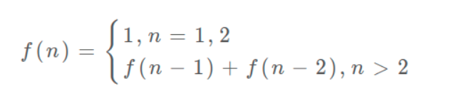
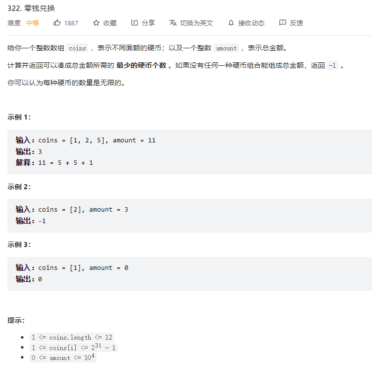

# 1. 概述

- 题目类型：
  - 方法数：**这类问题没有最优子结构，但是有重叠子问题**
    - 518.零钱兑换2；求有多少总方法
    - 91.编码方法；求有多少总编码方法
  - 求最值
    - 300.最长递增子序列
    - 1143.最长公共子序列

- **特点（动态规划三要素）**：
  - 存在 **「重叠子问题」**
  - 具备 **「最优子结构」**：通过子问题的最值得到原问题的最值，**子问题间必须互相独立**
  - 存在 **「状态转移方程」**：只有列出正确的「状态转移方程」，**才能正确地穷举**
    - **写出状态转移方程是最困难的**
    - 方法：**遇到DP时，可以将所有维度的量都列出来，一般不恶心人的题目都是将题目的解对应的维度作为dp的结果；然后按 状态(dp的维度) 和 结果(dp的值)，进行多种排列组合来思考，考虑哪种情况比较合理**
      - **注意 同一个维度作为 状态/结果 可能有不同解释，比如 是当前该操作的次数还是该操作的限制 / 是[1..i]该区间下的最优解还是以 i 为结尾的最优解**
      - **所以是先确定要哪种状态和结果组合，再确定状态是该维度的量的何种含义**

- 时间复杂度：子问题个数乘以解决一个子问题需要的时间
- 遍历方向：
  - **自顶向下（所求层层依赖未知，直到base case）**：一个规模较大的原问题比如说 f(20)，向下逐渐分解规模，直到 f(1) 和 f(2) 这两个 **base case**，然后逐层返回答案，这就叫 **「自顶向下」**。
    - 只能通过 **dp函数** 来实现
  - **自底向上（从base case触发，尾递归到所求）**：从问题规模最小的  **base case** f(1) 和 f(2) 开始往上推，直到推到我们想要的答案 f(20)，**这就是动态规划的思路**，`这也是为什么动态规划一般都脱离了递归，而是由循环迭代完成计算`。

- dp数组的遍历方向，记住两点
  - **过程**：遍历的过程中，所需的状态必须是已经计算出来的。
  - **终点**：遍历的终点必须是存储结果的那个位置。

## 1.1 状态转移方程

- **写出状态转移方程是最困难的**，以下是思考状态转移方程的思维框架：
  - 前提：已经明确谁应该是状态和dp结果
  - labuladong：明确 base case -> 明确「状态」-> 明确「选择」 -> 定义 dp 数组/函数的含义
- 找状态转移需要归纳思维，说白了就是如何**从已知的结果推出未知的部分**。
- 框架代码：

```python
# 初始化 base case
dp[0][0][...] = base
# 进行状态转移
for 状态1 in 状态1的所有取值：
    for 状态2 in 状态2的所有取值：
        for ...
            dp[状态1][状态2][...] = 求最值(选择1，选择2...)
```

- 列出「状态转移方程」的重要性，它是**解决问题的核心**。而且很容易发现，**其实状态转移方程直接代表着暴力解法**。
  - 注：将 dp 用 dp函数 表示。就是一个自顶向下过程。
  - 通过状态转移方程，写出暴力的代码
  - 剩下的也就是优化递归树，消除重叠子问题而已。


## 1.2 最优子结构

- 参考：https://mp.weixin.qq.com/s/qvlfyKBiXVX7CCwWFR-XKg

### 1.2.1 最优子结构失效：改造问题

- 符合最优子结构

```
我先举个很容易理解的例子：假设你们学校有 10 个班，你已经计算出了每个班的最高考试成绩。那么现在我要求你计算全校最高的成绩，你会不会算？当然会，而且你不用重新遍历全校学生的分数进行比较，而是只要在这 10 个最高成绩中取最大的就是全校的最高成绩。
```

- 不符合最优子结构

```
假设你们学校有 10 个班，你已知每个班的最大分数差（最高分和最低分的差值）。那么现在我让你计算全校学生中的最大分数差，你会不会算？可以想办法算，但是肯定不能通过已知的这 10 个班的最大分数差推到出来。因为这 10 个班的最大分数差不一定就包含全校学生的最大分数差，比如全校的最大分数差可能是 3 班的最高分和 6 班的最低分之差。
这次我给你提出的问题就不符合最优子结构，因为你没办通过每个班的最优值推出全校的最优值，没办法通过子问题的最优值推出规模更大的问题的最优值。前文 动态规划详解 说过，想满足最优子结，子问题之间必须互相独立。全校的最大分数差可能出现在两个班之间，显然子问题不独立，所以这个问题本身不符合最优子结构。
```

- **遇到这种最优子结构失效情况，怎么办？策略是：`改造问题`。**

```
改造问题，也就是把问题等价转化：最大分数差，不就等价于最高分数和最低分数的差么，那不就是要求最高和最低分数么，不就是我们讨论的第一个问题么，不就具有最优子结构了么？那现在改变思路，借助最优子结构解决最值问题，再回过头解决最大分数差问题，是不是就高效多了？
```

### 1.2.2 最优子结构并不是动态规划独有的一种性质

- 例子:求一棵二叉树的最大值，不难吧（简单起见，假设节点中的值都是非负数）：

```
int maxVal(TreeNode root) {
    if (root == null)
        return -1;
    int left = maxVal(root.left);
    int right = maxVal(root.right);
    return max(root.val, left, right);
}
```


# 2. 入门例子

## 2.1 斐波那契数列

- 注：
  - **「最优子结构」没有涉及，不是严格的动态规划，但是很好的说明了消除重叠子问题的方法**。
  - 求方法数的DP题目，一般也没有涉及「最优子结构」

<div align="center" style="zoom:60%"></div>

- 过程：
  - 写出状态转移方程。使用「暴力」求解
  - 画出递归树，时间复杂度o(2^n)，发现「重叠子结构」。使用「备忘录」剪枝
  - 时间复杂度o(n)，发现是自顶向下。可以使用「自底向上」

> 分析：

- 状态：
  - 状态1：数列的最后一个数
  - dp结果：斐波那契数列结果
- 选择：选择前面的两个的斐波那契数(n-1 & n-2)，从而可以获得当前的dp结果
  - 注：选择是明确的，所以该子问题处理的时间复杂度是O(1)
- base case：`dp[1] =1, dp[2] = 1`
- 状态转移方程，如上所示
  - dp(n)：当数列的最后一个数为n，其斐波那契数列结果为dp(n)

## 2.2 凑零钱

- 注
  - **符合 「最优子结构」**，比如你想求 `amount = 11` 时的最少硬币数（原问题），如果你知道凑出 `amount = 10` 的最少硬币数（子问题），你只需要把子问题的答案加一（再选一枚面值为 1 的硬币）就可能是原问题的答案。因为硬币的数量是没有限制的，所以子问题之间没有相互制，是互相独立的


<div align="center" style="zoom:60%"></div>

> 分析

- 状态：也就是原问题和子问题中会变化的变量
  - 状态1：目标金额
  - dp结果：最少硬币数
- 选择：当前状态下，选择哪个硬币，使得性价比最高
  - **选择当前状态下做什么选择，会使得性价比最高，所做的选择也就是导致「状态」产生变化的行为**。
  - 目标金额为什么变化呢，因为你在选择硬币，你每选择一枚硬币，就相当于减少了目标金额。所以说所有硬币的面值，就是你的「选择」。
  - 注：
    - 对于 最值问题 和 求方法数问题 ，他们的选择理解不太一样
    - 该选择下需要遍历所能够的选择情况（假设为K种），则子问题的时间复杂度为O(K)
- base case：目标金额 amount 为 0 时 `dp` 返回 0，即 `dp[0] = 0`
- 状态转移方程
  - dp(n)：目标金额为n时，其凑出目标金额n所需的最少硬币数为dp(n)

<div align="center" style="zoom:60%"></div>

# 3. 经典例题

## 3.1 leetcode887_鸡蛋掉落
<div align="center" style="zoom:60%"></div>

> 题目解析

- 求解的问题：**最坏**情况下，你**至少**要扔几次鸡蛋，才能**确定**这个楼层 `F` 呢？
  - 题目的问题实际上隐藏了最坏情况这个前提。
- **理解何为最坏情况下至少扔几次鸡蛋是关键**
  - （1个鸡蛋）**线性扫描**：**现在先不管鸡蛋个数的限制**（**假设只有一个**），比如有7层楼，线性扫描的方式就是一层层依次试，最坏情况就是 `F == 7`，**则最坏情况下至少扔7次**
    - **实际上只有一个鸡蛋的时候，就只能这样，这个情况将作为后面dp 的 *base case***
    - **最坏情况是**：**如果鸡蛋会碎，鸡蛋破碎一定发生在搜索区间穷尽时**
  - （无限个鸡蛋）**二分扫描**：**假设有无穷个鸡蛋**，二分查找是最好的，这个时候结果为最终  | [lo, hi] | == 1 时，扫描的次数
    - **最坏情况是**：**如果鸡蛋会碎，鸡蛋破碎一定发生在搜索区间穷尽时**
  - （限制K个鸡蛋）怎么办呢？
    - 二分肯定不行，那二分之后剩下一个就线性可以吗？
      - 不行，比如说把楼层变高一些，100 层，给你 2 个鸡蛋，你在 50 层扔一下，碎了，那就只能线性扫描 1～49 层了，最坏情况下要扔 50 次
    - 最优解其实是 14 次。最优策略非常多，而且并没有什么规律可言。

### 3.1.1 解法1：自顶向下的DP（函数表示DP）

- 状态：**当前拥有的鸡蛋数 `K` 和需要测试的楼层数 `N`**
  - 注意是楼层数
  - 可见是一个 **二维DP**
- 选择：**（可供选择和最终选择）在当前状态（总楼层数）下，去选择哪层楼扔鸡蛋，选择性价比最高的那一层楼扔**
  - **特殊点：**
    - **这里的选择和其他题目有点不同(其他题目可能是根据题意选出几个符合的选择来判断)，其需要遍历(需要for)所有可能的选择（假选择），最终选择一个性价比最高的（真选择）**
    - **而且选择后还会出现两种情况（简单的DP题目选择后只会出现一种情况），选择这两种情况（碎与没碎）中最坏的情况**
- base case：
  - K=1，N=i：线性扔，穷尽区间后才能最终确定 F
  - K=i，N=0：第0层一定不会碎

```python
def dp(K, N):
    if K == 1: return N
    if N == 0: return 0
```

- 状态转移方程：假设在第 i 层扔（做假设的选择），会出现两种情况：碎与不碎，选这两种情况中最坏的情况（**max**，由题意可知，正确的答案永远会在逃避我们的选择）

  - **如果鸡蛋碎了**，那么鸡蛋的个数 `K` 应该**减一**，搜索的楼层区间应该从 `[1..N]` 变为 `[1..i-1]` 共 `i-1` 层楼；
  
  - **如果鸡蛋没碎**，那么鸡蛋的个数 `K` 不变，搜索的楼层区间应该从 `[1..N]` 变为 `[i+1..N]` 共 `N-i` 层楼。
  
  - 最终的 `dp[K][N]` 为在所有能做的选择中，最坏情况下性价比最高的一个（**min**）
  
  - 
  
  - 代码体现：
  
    ```python
    def dp(K, N):
        for 1 <= i <= N:
            # 最坏情况下的最少扔鸡蛋次数
            res = min(res, 
                      max( 
                            dp(K - 1, i - 1), # 碎
                            dp(K, N - i)      # 没碎
                         ) + 1 # 在第 i 楼扔了一次
                     )
        return res
    
    ```
  


<div align="center"></div>


- 综上：加上备忘录，就是DP的解了，代码如下
  - **备忘录的Key 就是 DP 的状态，所以DP数组就是天然备忘录**
  - dp 函数：返回值为其表示值，参数为状态，内部代码做选择

```c++
def superEggDrop(K: int, N: int):
    memo = dict()
    def dp(K, N) -> int:
        # base case
        if K == 1: return N
        if N == 0: return 0
        # 避免重复计算
        if (K, N) in memo:
            return memo[(K, N)]

        res = float('INF')
        # 穷举所有可能的选择
        for i in range(1, N + 1):
            res = min(res, 
                      max(
                            dp(K, N - i), 
                            dp(K - 1, i - 1)
                         ) + 1
                  )
        # 记入备忘录
        memo[(K, N)] = res
        return res
    
    return dp(K, N)

```


- 时间复杂度：**动态规划算法的时间复杂度就是子问题个数 × 函数本身的复杂度**
  - 这里 `dp` 函数中有一个 for 循环，所以函数本身的复杂度是 O(N)
  - 子问题个数也就是不同状态组合的总数，显然是两个状态的乘积，也就是 O(KN)
  - 算法的总时间复杂度是 O(K*N^2), 空间复杂度 O(KN)


- 注：

  - 可能会将循环 `[1..N]` 和线性扫描混为一谈

    - 比方说你有 2 个鸡蛋，面对 10 层楼，你这次选择去哪一层楼扔呢？不知道，那就把这 10 层楼全试一遍。至于下次怎么选择不用你操心，有正确的状态转移，递归会算出每个选择的代价，我们取最优的那个就是最优解。

      


### 3.1.2 解法1：解法1的二分优化


- 为什么可以二分优化：
  - dp(K, N) 如果固定K，那么将是一个单调递增的函数，N越大，dp越大。
  - 那么注意 `dp(K - 1, i - 1)` 和 `dp(K, N - i)` 这两个函数，其中 `i` 是从 1 到 `N` 单增的，如果我们固定 `K` 和 `N`，**把这两个函数看做关于 `i` 的函数，前者随着 `i` 的增加应该也是单调递增的，而后者随着 `i` 的增加应该是单调递减的**：
  - **综上，满足二分查找应用到函数的性质**


<div align="center" style="zoom:60%"></div>


```python
def superEggDrop(self, K: int, N: int) -> int:
        
    memo = dict()
    def dp(K, N):
        if K == 1: return N
        if N == 0: return 0
        if (K, N) in memo:
            return memo[(K, N)]
                            
        # for 1 <= i <= N:
        #     res = min(res, 
        #             max( 
        #                 dp(K - 1, i - 1), 
        #                 dp(K, N - i)      
        #                 ) + 1 
        #             )

        res = float('INF')
        # 用二分搜索代替线性搜索
        lo, hi = 1, N
        while lo <= hi:
            mid = (lo + hi) // 2
            broken = dp(K - 1, mid - 1) # 碎
            not_broken = dp(K, N - mid) # 没碎
            # res = min(max(碎，没碎) + 1)
            if broken > not_broken:
                hi = mid - 1
                res = min(res, broken + 1)
            else:
                lo = mid + 1
                res = min(res, not_broken + 1)

        memo[(K, N)] = res
        return res
    
    return dp(K, N)
```

- 时间复杂度：总时间复杂度是 O(K*N*logN), 空间复杂度 O(KN)


### 3.1.3 解法2：不一样的状态定义

- **DP问题，不同的状态定义，解法不同**：动态规划的状态转移本就是见仁见智，比较玄学的事情，不同的状态定义可以衍生出不同的解法，其解法和复杂程度都可能有巨大差异

- 解法1的DP如下：
  - 按照这个定义，就是**确定当前的鸡蛋个数和面对的楼层数，就知道最小扔鸡蛋次数**。最终我们想要的答案就是 `dp(K, N)` 的结果
  - **这种思路下，肯定要穷举所有可能的扔法的，用二分搜索优化也只是做了「剪枝」，减小了搜索空间，但本质思路没有变，还是穷举**

```python
def dp(k, n) -> int
# 当前状态为 k 个鸡蛋，面对 n 层楼
# 返回这个状态下最少的扔鸡蛋次数
```

```python
dp[k][n] = m
# 当前状态为 k 个鸡蛋，面对 n 层楼
# 这个状态下最少的扔鸡蛋次数为 m	
```

- 稍微修改 `dp` 数组的定义，**确定当前的鸡蛋个数和最多允许的扔鸡蛋次数，就知道能够确定 `F` 的最高楼层数**
  - 个人总结：当DP难以理解，可以用实例来实例化DP
  - 个人总结：**遇到DP时，是不是可以将所有维度的量，列出来；然后按 状态和结果，进行多种排列组合来思考，这样感觉结果就会自然显现**
    - **注意 同一个状态可能有不同解释，比如 是当前该操作的次数还是该操作的限制 / 是[1..i]该区间下的最优解还是以 i 为结尾的最优解**
    - **所以是先确定要哪种状态和结果组合，再确定状态是该维度的量的何种含义。**
  - 题目所要的结果变成了状态。题目不是**给你 `K` 鸡蛋，`N` 层楼，让你求最坏情况下最少的测试次数 `m`** 吗？`while` 循环结束的条件是 `dp[K][m] == N`，也就是**给你 `K` 个鸡蛋，测试 `m` 次，最坏情况下最多能测试 `Ni` 层楼，只要Ni刚好大于 N，则m就为结果值**。
    - 楼层固定，求最少的投递数 ===> 投递数固定，求最多可以检验的楼层数

```python
dp[k][m] = n
# 当前有 k 个鸡蛋，可以尝试扔 m 次鸡蛋
# 这个状态下，最坏情况下最多能确切测试一栋 n 层的楼

# 比如说 dp[1][7] = 7 表示：
# 现在有 1 个鸡蛋，允许你扔 7 次;
# 这个状态下最多给你 7 层楼，
# 使得你可以确定楼层 F 使得鸡蛋恰好摔不碎
# （一层一层线性探查嘛）
```


<div align="center" style="zoom:60%"></div>

- base case：
  - `dp[0][i]`：全为0
  - `dp[i][0]`：全为0
- 状态转移方程：
  - 基于两个事实：
    - **无论你在哪层楼扔鸡蛋，鸡蛋只可能摔碎或者没摔碎，碎了的话就测楼下，没碎的话就测楼上**
    - **无论你上楼还是下楼，总的楼层数 = 楼上的楼层数 + 楼下的楼层数 + 1（当前这层楼）**
  - `dp[k][m] = dp[k][m - 1] + dp[k - 1][m - 1] + 1`
    - **`dp[k][m - 1]` 就是楼上的楼层数**，因为鸡蛋个数 `k` 不变，也就是鸡蛋没碎，扔鸡蛋次数 `m` 减一；
    - **`dp[k - 1][m - 1]` 就是楼下的楼层数**，因为鸡蛋个数 `k` 减一，也就是鸡蛋碎了，同时扔鸡蛋次数 `m` 减一。


- 综上，代码如下所示

```java
int superEggDrop(int K, int N) {
    // m 最多不会超过 N 次（线性扫描）
    int[][] dp = new int[K + 1][N + 1];
    // base case:
    // dp[0][..] = 0
    // dp[..][0] = 0
    // Java 默认初始化数组都为 0
    int m = 0;
    while (dp[K][m] < N) {
        m++;
        for (int k = 1; k <= K; k++)
            dp[k][m] = dp[k][m - 1] + dp[k - 1][m - 1] + 1;
    }
    return m;
}
```


## 3.2 子序列类型问题

### 3.2.1 leetcode72_编辑距离


<div align="center" style="zoom:60%"></div>


> 题目解析

- 思路大方向：**解决两个字符串的动态规划问题，一般都是用两个指针 i,j 分别指向两个字符串的最后，然后一步步往前走，缩小问题的规模**
  - 假设两个字符串为 `s1` 和 `s2`

- 可能的操作：
  - 替换
  - 删除
  - 插入
  - skip：如果两个字符相等，什么都不做
-  `s1` 为了匹配 `s2` ，删除一个字母 <====>   `s2` 为了匹配 `s1` ，添加一个字母
  - 设两个字符串分别为 `"rad"` 和 `"apple"`，为了把 `s1` 变成 `s2`，算法会这样进行
  - **所以只需要想象s1为了匹配s2需要做哪些操作就行了，不用管s2的变化**


<div align="center">

</div>
<div align="center">

</div>


> 分析

- 状态：
  - 状态1：s1 的最尾下标，设为i
  - 状态2：s2 的最尾小标，设为j
  - `dp[i][j]` : 从 s1 变化到 s2 至少需要 `dp[i][j]` 步
- 选择：有以下可数的4种**可选选择**（常数），**最终选择**性价比最高的一种（**min**，需要步数最少）
  - `s1[i] == s2[j]`: 直接跳过不改， `dp[i-1][j-1]` 为该选择下的结果
  - `s1[i] != s2[j]`:
    - 增：`dp[i][j-1]+1` 为该选择下的结果
      - 由于 s2 中第 j 个字符被增加的字符所匹配了， +1 是因为增加操作本身耗费 1 步
    - 删：`dp[i-1][j]+1`  为该选择下的结果
    - 改：`dp[i-1][j-1]+1`  为该选择下的结果
  - 注：可见子问题处理的时间复杂度为o(1)
- base case：
  - `dp[i][0]` = i
  - `dp[0][j]` = j
- 状态转移方程：综上，可以写出
  - `s1[i] != s2[j]`时：`dp[i][j] = min(s1[i] != s2[j] 时的三种选择)`
  - `s1[i] == s2[j]`时：`dp[i][j] = dp[i-1][j-1]`

> 代码

- 如果不放心，可以将 4 种选择产生的结果一起取最小，也是可以的。但是实际上 `s1[i] == s2[j]` 情况下，直接 skip 就是最优解了

```cpp
class Solution {
public:
    int minDistance(string word1, string word2) {
        vector<vector<int>> dp(505,vector<int>(505,1000));
        // 初始化
        for(int i = 0; i < 505; ++i){
            dp[i][0] = i;
            dp[0][i] = i;
        }
        // 状态1
        for(int i = 1; i <= word2.size(); ++i){
            // 状态2
            for(int j = 1; j <= word1.size(); ++j){
                if(word1[j-1] == word2[i-1])
                    dp[i][j] = min(dp[i-1][j-1],dp[i][j]); // skip
                else
                    dp[i][j] = min(dp[i-1][j-1]+1,dp[i][j]); // 换
                dp[i][j] = min(dp[i][j-1]+1,dp[i][j]); // 删
                dp[i][j] = min(dp[i-1][j]+1,dp[i][j]); // 增
            }
        }
        return dp[word2.size()][word1.size()];
    }
};
```

### 3.2.2 最长递增子序列（Longes Increasing Subsequence， LIS）

#### 3.2.2.1 leetcode300_最长递增子序列

<div align="center" style="zoom:70%"></div>


> 分析

- 状态：
  - 状态1：递增子序列以 num[i] 为结尾
  - dp[i]： 以num[i]为结尾时的最大递增子序列长度 dp[i]
- 选择：当状态为 i 时，设 [0..j..i]（**for**），则有
  - 可供选择：`nums[i] > nums[j]`，dp[j]+1 为结果
  - 最终选择：选择性价比最高的一个，即最长的（max）
  - 注：存在for循环，可见子问题时间复杂度为 o(n)
- base case：`dp[0] = 1`
- 状态转移方程：
  - dp[i] = max(1,...,dp[i]) +1

```cpp
class Solution {
public:
    int lengthOfLIS(vector<int>& nums) {
        // 以num[i]为结尾时的最大递增子序列长度
        // base case = 1
        vector<int> dp(3000,1);
        for(int i = 0; i < nums.size(); ++i){
            for(int j = 0; j < i; ++j){
                if(nums[i] > nums[j])
                    dp[i] = max(dp[j]+1,dp[i]);
            }
        }

        int res = 0;
        for(int i = 0; i < nums.size(); ++i)
            res = res < dp[i] ? dp[i] : res;
        return res;
    }
};
```

#### 3.2.2.2 leetcode354_俄罗斯套娃信封问题


<div align="center" style="zoom:70%"></div>

> 题目解析

- 区间问题的味道
- 关键在于转化为 ： **最长递增子序列LIS**
- 这个解法的关键在于，对于宽度 w 相同的数对，**要对其高度 h 进行降序排序**。因为两个宽度相同的信封不能相互包含的，**逆序排序保证在 w 相同的数对中最多只选取一个**


