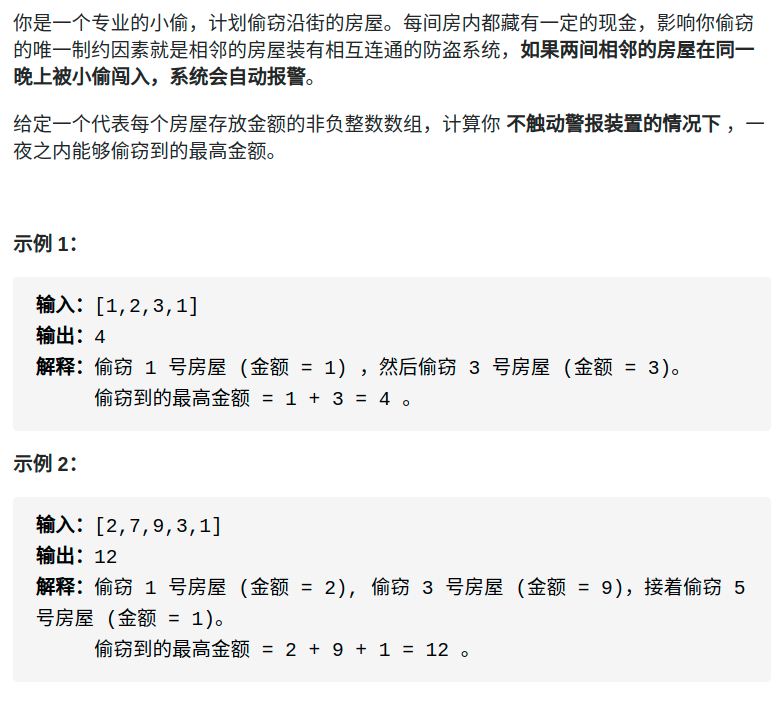
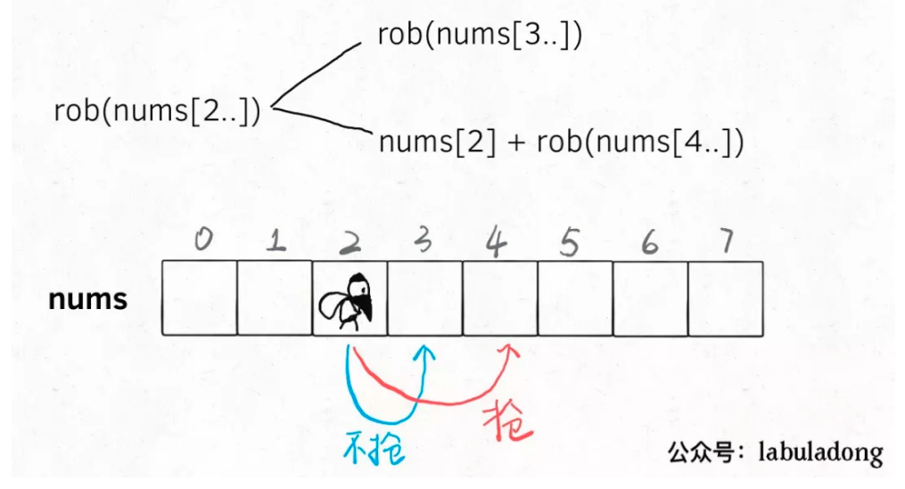
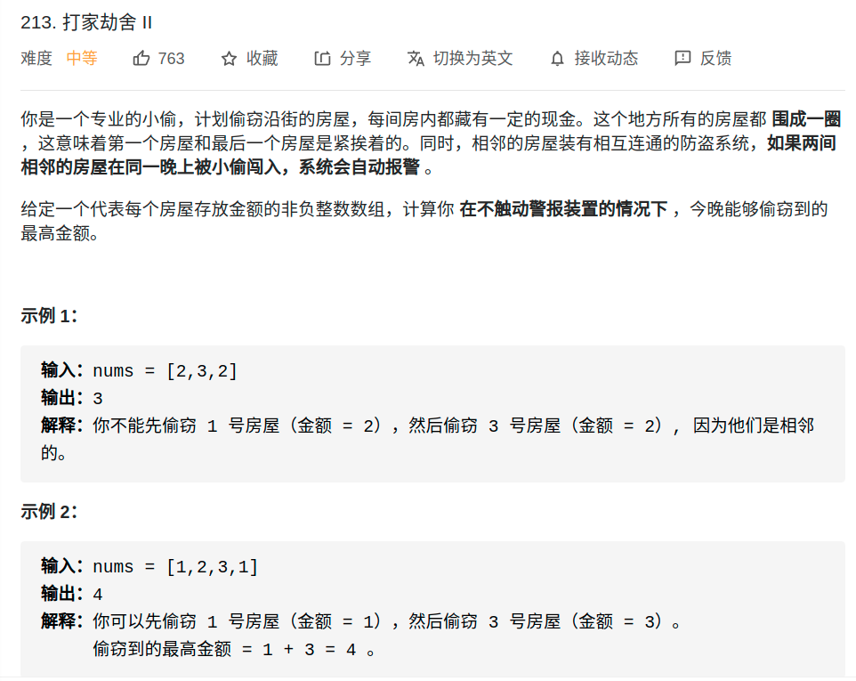
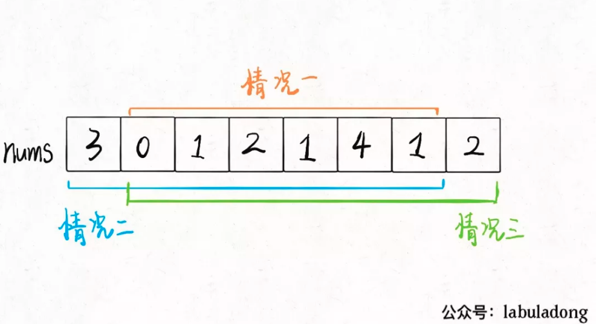
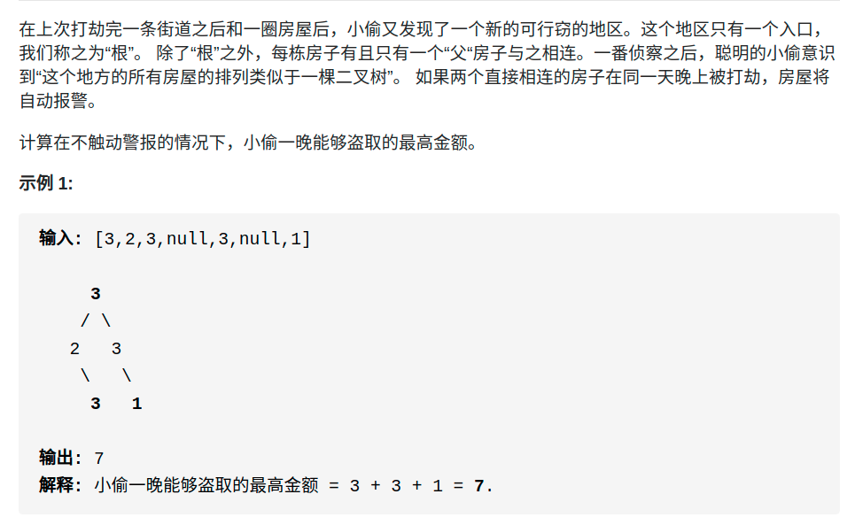

- https://mp.weixin.qq.com/s/z44hk0MW14_mAQd7988mfw


# 题目
## 198. 打家劫舍
- https://leetcode-cn.com/problems/house-robber/

<div align="center" style="zoom:80%"></div>


> 代码1

- DP：能够偷窃到的最高金额
- 状态
  - 状态1：房间号
  - 状态2：是否被偷了
  - dp[n][2]
- 选择（偷，不偷）
  - dp[i][0] = min{dp[i-1][0], dp[i-1][1]}
  - dp[i][1] = min{dp[i-1][0], dp[i-2][1]}
- basecase: `dp[0][0] = 0; dp[0][1] = 0`

```cpp
class Solution {
public:
    int rob(vector<int>& nums) {
        if(nums.size() == 0) return 0;
        vector<vector<int>> dp(nums.size()+1, vector<int>(2,0));
        // base case 0 0 ;
        for(int i = 0; i < nums.size(); ++i){
            dp[i+1][0] = max(dp[i][1], dp[i][0]);
            if(i != 0){
                dp[i+1][1] = max(dp[i][0] + nums[i], dp[i-1][1] + nums[i]);
            }else{
                dp[i+1][1] = dp[i][0] + nums[i];
            }
        }
        return  max(dp[nums.size()][0], dp[nums.size()][1]);
    }
};

```

> 代码2
- 从最后一间开始算，从后推到前
- 定义DP[i]：从第 i 间房子开始抢劫，最多能抢到的钱为 x
- 状态：从第i间房子开始
- 选择：偷还是不偷


<div align="center" style="zoom:80%"></div>

```cpp
 int rob(int[] nums) {
    int n = nums.length;
    // dp[i] = x 表示：
    // 从第 i 间房子开始抢劫，最多能抢到的钱为 x
    // base case: dp[n] = 0
    int[] dp = new int[n + 2];
    for (int i = n - 1; i >= 0; i--) {
        dp[i] = Math.max(dp[i + 1], nums[i] + dp[i + 2]);
    }
    return dp[0];
}
```
- 状态压缩
```cpp
class Solution {
public:
    int rob(vector<int>& nums) {
        int dpi1 = 0;
        int dpi2 = 0;
        int dp;
        for(int i = nums.size()-1; i >= 0; --i){
            dp = max(dpi1, dpi2 + nums[i]);
            dpi2 = dpi1;
            dpi1 = dp;
        }
        return dp;
    }
};
```

## 213. 打家劫舍 II

<div align="center" style="zoom:80%"></div>


- 分三种情况
  - 要么都不被抢；要么第一间房子被抢最后一间不抢；要么最后一间房子被抢第一间不抢。
  - 这三种情况，哪种的结果最大，就是最终答案呗！不过，其实我们不需要比较三种情况，**只要比较情况二和情况三就行了，因为这两种情况对于房子的选择余地比情况一大呀，房子里的钱数都是非负数，所以选择余地大，最优决策结果肯定不会小。**
<div align="center" style="zoom:80%"></div>

> 代码

```cpp
class Solution {
public:
    int rob(vector<int>& nums) {
        if(nums.size() == 1) return nums[0];
        return max(robRange(nums, 0, nums.size()-2), robRange(nums, 1, nums.size()-1));
    }
    int robRange(vector<int>& nums, int start, int end){
        int dpi1 = 0, dpi2 = 0;
        int dp = 0;
        for(int i = end; i >= start; --i){
            dp = max(dpi1, dpi2 + nums[i]);
            dpi2 = dpi1;
            dpi1 = dp;
        }
        return dp;

    }
};
```
```
执行用时：0 ms, 在所有 C++ 提交中击败了100.00%的用户
内存消耗：7.5 MB, 在所有 C++ 提交中击败了89.50%的用户
```

## 337. 打家劫舍 III

<div align="center" style="zoom:80%"></div>

- 前面的思想：从叶子往根推进（后序遍历）
```cpp
class Solution {
public:
    int rob(TreeNode* root) {
        auto rtn = dfs(root);
        return max(rtn.first, rtn.second);
    }
    // first,以其为根的最大。 second，不以其为根的最大
    pair<int, int> dfs(TreeNode* root){
        // basecase
        if(root == nullptr) return{0,0};

        // 后序遍历
        auto leftrtn = dfs(root->left);
        auto rightrtn = dfs(root->right);

        // 处理
        pair<int,int > res;
        // 以当前节点为根所能达到的最大值
        res.first = leftrtn.second + rightrtn.second + root->val;
        // 不以当前节点为根所能达到的最大值。
        res.second = max(leftrtn.second,leftrtn.first) + max(rightrtn.second, rightrtn.first);
        return res;

    }
};
```