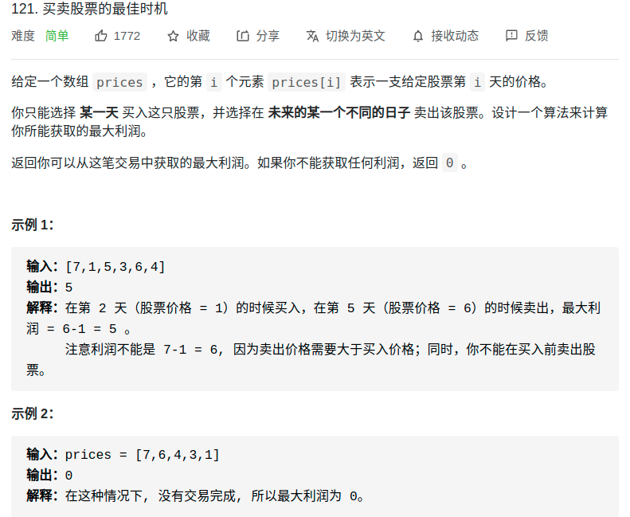

- https://labuladong.gitbook.io/algo/mu-lu-ye/tuan-mie-gu-piao-wen-ti


# 分析
- 拒绝奇技淫巧，学习最通用的
- 解法：三维DP

> 先看穷举
```py
for 状态1 in 状态1的所有取值：
    for 状态2 in 状态2的所有取值：
        for ...
            dp[状态1][状态2][...] = 择优(选择1，选择2...)
```
- **每天都有三种「选择」**：买入、卖出、无操作，我们用 `buy, sell, rest` 表示这三种选择。
- 并不是每天都可以任意选择这三种选择的，因为 `sell` 必须在 `buy` 之后，`buy` 必须在 `sell` 之后。
- 而且别忘了，我们还有交易次数 `k` 的限制，就是说你 `buy` 还只能在 `k > 0` 的前提下操作
- **这个问题的「状态」有三个**，第一个是**天数**，第二个是**允许交易的最大次数**，第三个是**当前的持有状态**（即之前说的 rest 的状态，我们不妨用 1 表示持有，0 表示没有持有）。然后我们用一个三维数组就可以装下这几种状态的全部组合
  - 比如说 dp[3][2][1] 的含义就是：今天是第三天，我现在手上持有着股票，至今最多进行 2 次交易。再比如 dp[2][3][0] 的含义：今天是第二天，我现在手上没有持有股票，至今最多进行 3 次交易。
```py
dp[i][k][0 or 1]
# 0 <= i <= n-1, 1 <= k <= K
# n 为天数，大 K 为最多交易数
# 此问题共 n × K × 2 种状态，全部穷举就能搞定。

for 0 <= i < n:
    for 1 <= k <= K:
        for s in {0, 1}:
            dp[i][k][s] = max(`buy`, `sell`, `rest`)
```
<div align="center" style="zoom:80%"></br><span style="font-size:18px">选择和状态转移</span></div>

- **状态转移方程**
```py
# 可买状态时
dp[i][k][0] = max(dp[i-1][k][0], dp[i-1][k][1] + prices[i])
#  max( 选择 `rest`, 选择 `sell`)

# 可卖状态时
dp[i][k][1] = max(dp[i-1][k][1], dp[i-1][k-1][0] - prices[i])
#  max(选择 `rest` , 选择 `buy`)
```
- **base case**:
  - 第0天，还有k轮交易机会，没有持有股票：`dp[-1][k][0] = 0`
  - 第0天，还有k轮交易机会，有持有股票（不可能出现）：`dp[-1][k][0] = INT_MAX`

# 题目
- 121.买卖股票的最佳时机（简单）
- 122.买卖股票的最佳时机 II（简单）
- 123.买卖股票的最佳时机 III（困难）
- 188.买卖股票的最佳时机 IV（困难）
- 309.最佳买卖股票时机含冷冻期（中等）
- 714.买卖股票的最佳时机含手续费（中等）
## 121.买卖股票的最佳时机
- 这道题用单调栈来做是最快的，但是用通用做法普适一点
<div align="center" style="zoom:80%"></div>


```cpp
class Solution {
public:
    int maxProfit(vector<int>& prices) {
        int i =0;
        int k = 0;
        // 天数，可买入次数，是否持有
        vector<vector<vector<int>>> dp(prices.size() + 1, vector<vector<int>>(2, vector<int>(2,0)));
        for(int i = 0; i <= prices.size(); ++i){
            for(k = 0; k < 2; ++k){
                if(i == 0){
                    dp[i][k][0] = 0;
                    dp[i][k][1] = -INT32_MAX;
                }else{
                    // 没持有状态
                    dp[i][k][0] = max(dp[i-1][k][0], dp[i-1][k][1] + prices[i-1]);
                    // 持有状态
                    if(k != 0)
                        dp[i][k][1] = max(dp[i-1][k][1], dp[i-1][k-1][0] - prices[i-1]);
                    else
                        dp[i][k][1] = dp[i-1][k][1];
                }
            }
        }
        int res;
        res = max(dp[prices.size()][0][0],dp[prices.size()][1][0]);
        return res;
    }
};
```


## 122.买卖股票的最佳时机 II（简单）
- 解法1：直接根据题意来。找出递增头和递增尾。
```cpp
class Solution {
public:
    int maxProfit(vector<int>& prices) {
        int pre = 0;
        int res = 0;
        for(int i = 1; i < prices.size(); ++i){
            if(prices[i-1] < prices[i] && pre == -1){
                pre = i-1;
            }else if(prices[i-1] > prices[i] && pre != -1){
                res += prices[i-1] - prices[pre];
                pre = -1;
            }
        }
        // 补丁,直到最后一个还是递增的情况
        if(pre != -1){
            res += prices[prices.size()-1] -  prices[pre];
        }
        return res;
    }
};

```

```
执行用时：4 ms, 在所有 C++ 提交中击败了92.52%的用户
内存消耗：12.5 MB, 在所有 C++ 提交中击败了96.35%的用户
```

- 解法2：在上一道基础上改变了k的范围而已。

```cpp
class Solution {
public:
    int maxProfit(vector<int>& prices) {
        int i = 0;
        int k = 0, kend = prices.size()/2;
        int res = 0;
        vector<vector<vector<int>>> dp(prices.size() + 1, vector<vector<int>>(prices.size()/2+1, vector<int>(2,0)));
        for(i = 0; i <= prices.size(); ++i){
            for(k = 0; k <= kend; ++k){
                if( i == 0){
                    dp[i][k][0] = 0;
                    dp[i][k][1] = -INT32_MAX;
                }else{
                    dp[i][k][0] = max(dp[i-1][k][0], dp[i-1][k][1] + prices[i-1]);
                    if(k > 0)
                        dp[i][k][1] = max(dp[i-1][k][1], dp[i-1][k-1][0] - prices[i-1]);
                    else
                        dp[i][k][1] = dp[i-1][k][1];
                }
            }
        }
        for(k = 0; k <= kend; ++k){
            res = max(dp.at(i-1).at(k).at(0), res);
        }
        return res;
    }
};
```
```
超时了
```

## 123.买卖股票的最佳时机 III（困难）
- 动态规划
```cpp
class Solution {
public:
    int maxProfit(vector<int>& prices) {
        int i = 0;
        int k = 0, kend = 2;
        int res = 0;
        vector<vector<vector<int>>> dp(prices.size() + 1, vector<vector<int>>(3, vector<int>(2,0)));
        for(i = 0; i <= prices.size(); ++i){
            for(k = 0; k <= kend; ++k){
                if( i == 0){
                    dp[i][k][0] = 0;
                    dp[i][k][1] = -INT32_MAX;
                }else{
                    dp[i][k][0] = max(dp[i-1][k][0], dp[i-1][k][1] + prices[i-1]);
                    if(k > 0)
                        dp[i][k][1] = max(dp[i-1][k][1], dp[i-1][k-1][0] - prices[i-1]);
                    else
                        dp[i][k][1] = dp[i-1][k][1];
                }
            }
        }
        for(k = 0; k <= kend; ++k){
            res = max(dp.at(i-1).at(k).at(0), res);
        }
        return res;
    }
};
```
```
执行用时：836 ms, 在所有 C++ 提交中击败了5.41%的用户
内存消耗：266.4 MB, 在所有 C++ 提交中击败了5.06%的用户
```

## 188.买卖股票的最佳时机 IV（困难）
- 相同的动归套路

```cpp
class Solution {
public:
    int maxProfit(int k, vector<int>& prices) {
        vector<vector<vector<int>>> dp(prices.size()+1, vector<vector<int>>(k+1, vector<int>(2,0)));
        int day = prices.size();
        int i = 0;
        int ki = 0;
        for( i = 0; i <= day; ++i){
            for( ki = 0; ki <= k; ++ki){
                if(i == 0){
                    dp[0][ki][0] = 0;
                    dp[0][ki][1] = -INT32_MAX;
                }else{
                    dp[i][ki][0] = max(dp[i-1][ki][0], dp[i-1][ki][1] + prices[i-1]);
                    if(ki != 0){
                        dp[i][ki][1] = max(dp[i-1][ki][1], dp[i-1][ki-1][0] - prices[i-1]);
                    }else{
                        dp[i][ki][1] = dp[i-1][ki][1];
                    }
                }
            }
        }
        int res;
        for(int ki = 0;ki <=k; ++ki){
            res = max(dp[day][ki][0],res);
        }
        return res;
    }
};
```

```
执行用时：32 ms, 在所有 C++ 提交中击败了14.14%的用户
内存消耗：20.6 MB, 在所有 C++ 提交中击败了6.97%的用户
```