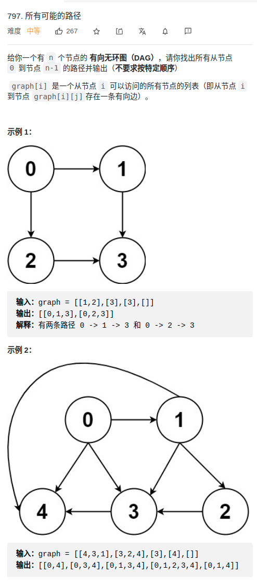
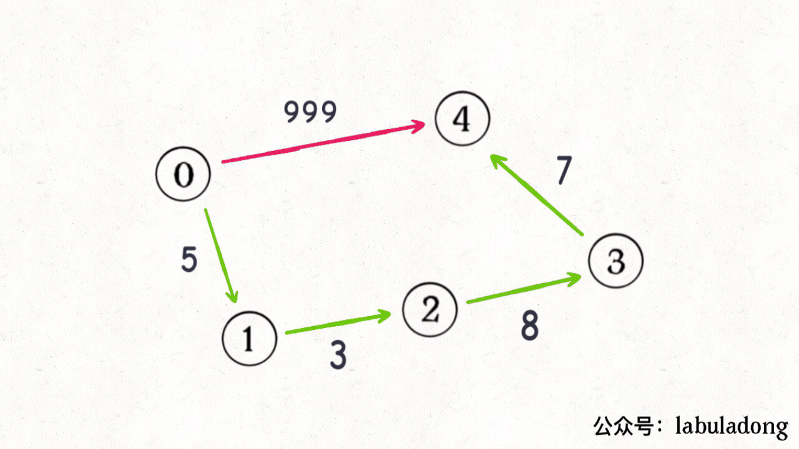
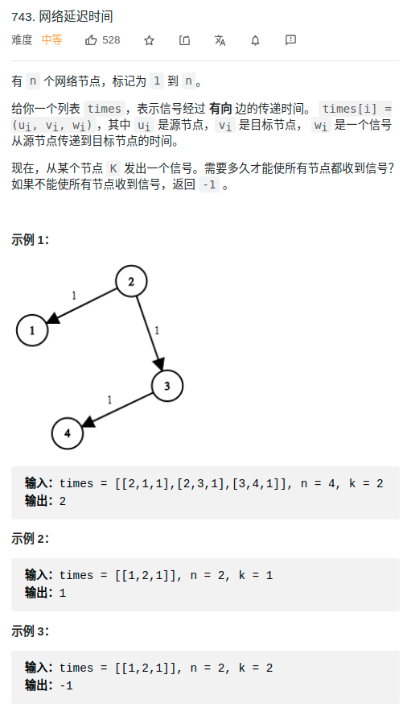

# 概述
## 图表示
> 逻辑结构
- 图的**逻辑结构**，如下所示
<div align="center" style="zoom:80%"></div>

- **根据这个逻辑结构**，我们可以认为每个节点的实现如下
  - 图的表示法1：
    - 注：实际上和多叉树一样，只不过有环
```cpp
/* 图节点的逻辑结构 */
class Vertex {
    int id;
    vector<Vertex> neighbors;
}
```

> 邻接图，邻接表
- 实际上我们很少用这个 `Vertex` 类实现图，而是用常说的**邻接表和邻接矩阵**(图的表示法2/3)来实现
  - 邻接表：省空间，无法快速判断两个节点是否相邻
  - 邻接矩阵：相反
  - 注：在常规的算法题中，邻接表的使用会更频繁一些，主要是因为操作起来较为简单，但这不意味着邻接矩阵应该被轻视

<div align="center" style="zoom:80%"></div>

```cpp
// 邻接表
// graph[x] 存储 x 的所有邻居节点
vector<vector<int> > graph;

// 邻接矩阵
// matrix[x][y] 记录 x 是否有一条指向 y 的边
// 使用 bool 省空间
vector<vector<bool>> matrix;
```

> 无向图如何表示

- 如果连接无向图中的节点 x 和 y，把 `matrix[x][y] 和 matrix[y][x]` 都变成 true 不就行了；
- 邻接表也是类似的操作，在 x 的邻居列表里添加 y，同时在 y 的邻居列表里添加 x


## 度
- 在**无向图**中，「度」就是每个节点相连的边的条数
- **有向图**的边有方向，所以有向图中每个节点「度」被细分为**入度（indegree）和出度（outdegree）**
  - 如下所示：其中节点 3 的入度为 3（有三条边指向它），出度为 1（它有 1 条边指向别的节点）


<div align="center" style="zoom:80%"></div>


## 权值
- 表示：
  - 邻接表：int 该 int[](size = 2) 即可
  - 邻接矩阵：bool 转 int即可

```cpp
// 邻接表
// graph[x] 存储 x 的所有邻居节点以及对应的权重
vector<vector<int[2]>> graph;

// 邻接矩阵
// matrix[x][y] 记录 x 指向 y 的边的权重，0 表示不相邻
int[][] matrix;
```

## 遍历
- 由多叉树框架转变，多叉树框架如下：

```cpp
/* 多叉树遍历框架 */
void traverse(TreeNode root) {
    if (root == null) return;

    for (TreeNode child : root.children) {
        traverse(child);
    }
}
```

- 图可能有环，因此需要记录遍历过的节点 `visited` ；对于某些题目的解答，还需要记录从起点当当前点的路径 `onPath` 。代码如下：
```cpp
// 记录被遍历过的节点
boolean[] visited;
// set<int> visited;

// 记录从起点到当前节点的路径
boolean[] onPath;
// vector<int> onPath;


/* 图遍历框架 */
void traverse(Graph graph, int s) {
    if (visited[s]) return;
    // 经过节点 s，标记为已遍历
    visited[s] = true;
    // 做选择：标记节点 s 在路径上
    onPath[s] = true;
    for (int neighbor : graph.neighbors(s)) {
        traverse(graph, neighbor);
    }
    // 撤销选择：节点 s 离开路径
    onPath[s] = false;
}
```


<div align="center" style="zoom:80%"></div>


> 与回溯区别

- 这个 onPath 数组的操作很像 回溯算法核心套路 中做「做选择」和「撤销选择」，区别在于位置：**回溯算法的「做选择」和「撤销选择」在 for 循环里面，而对 onPath 数组的操作在 for 循环外面**
  - 为什么回溯算法框架会用后者？因为回溯算法关注的不是节点，而是树枝

```java
void traverse(TreeNode root) {
    if (root == null) return;
    System.out.println("enter: " + root.val);
    for (TreeNode child : root.children) {
        traverse(child);
    }
    System.out.println("leave: " + root.val);
}

void traverse(TreeNode root) {
    if (root == null) return;
    for (TreeNode child : root.children) {
        System.out.println("enter: " + child.val);
        traverse(child);
        System.out.println("leave: " + child.val);
    }
}
```

<div align="center" style="zoom:80%"></div>


### 797. 所有可能的路径(图遍历)

<div align="center" style="zoom:80%"></div>

- 注意：明确无环
```cpp
class Solution {
public:
    vector<vector<int>> res;
    vector<int> path;
    // 明确无环
    vector<vector<int>> allPathsSourceTarget(vector<vector<int>>& graph) {
        traverse(graph, 0);
        return res;
    }
    void traverse(vector<vector<int>>& graph, int cur){
        if(cur == graph.size()-1){
            path.push_back(cur);
            res.push_back(path);
            path.pop_back();
            return;
        }
        path.push_back(cur);
        for(auto a : graph[cur]){
            traverse(graph, a);
        }
        path.pop_back();
    }

};
```

# 最短路径：DIJKSTRA 算法
- https://labuladong.gitee.io/algo/2/21/55/
- 输入一幅图和一个起点 start，计算 start 到其他节点的最短距离
- 本质：BFS加强版
  - **队列编程优先队列**
- 注：并不是步数少就是好，重点是看权重和
- 思路：`优先队列 + record[i](记录起点到i的的最小权重)`
  - 当节点从 `priority_queue` 弹出时，说明是此时队列中，权值和最小的，**弹出时**，也就是 start 到 该顶点的最小路径和。
  - 入队列判断：能否得到更小的 record，能就入队列（如果之前该顶点已经入队列一次，也没关系，因为是优先队列，record更小的情况先出队列）

<div align="center" style="zoom:80%"></div>


- 如果你想把一个问题抽象成「图」的问题，那么首先要实现一个 API `adj`：
  - `adj(s)` 就是计算一个节点 s 的相邻节点

```cpp
// 输入节点 s 返回 s 的相邻节点
vector<int> adj(int s);
```

- 对于用**邻接表**表示「图」的方式，adj 函数就可以这样表示：

```cpp
vector<vector<int> > graph;

// 输入节点 s，返回 s 的相邻节点
vector<int> adj(int s) {
    return graph[s];
}
```

- 对于「加权图」，我们需要知道两个节点之间的边权重是多少，所以还可以抽象出一个 `weight` 方法
```cpp
// 返回节点 from 到节点 to 之间的边的权重
int weight(int from, int to);
```

## 743. 网络延迟时间

<div align="center" style="zoom:80%"></div>

- 首先需要对题目的信息做初始化，转换为 dijkstra 能处理的结构
  - 需要 `adj` 和 `weigth`
- dijkstra：计算从起始到**所有节点**的最短路径（累加最小）
- merge：根据题意从 结果中取最大的最短路径


```cpp
class Solution {
public:
    vector<int> record; // 记录从 n 到 i 的最小的距离
    vector<vector<pair<int,int>>> graph; // to weight
    struct State{
        int vetex;
        int curPath;
        State(int v, int c) : vetex(v), curPath(c){}
    };
    struct cmp{
        bool operator()(State& s1, State& s2){
            return s1.curPath > s2.curPath;
        }
    };

    int networkDelayTime(vector<vector<int>>& times, int n, int k) {
        /// 1. init
        record = vector<int>(n+1, INT32_MAX); // 由于从1开始
        record[k] = 0;// 起点处设置为0

        /// 1.1 生成图
        graph = vector<vector<pair<int,int>>>(n+1);
        for(auto &t : times){
            graph[t[0]].push_back({t[1],t[2]});
        }

        // 2. dijkstra
        priority_queue<State,vector<State>, cmp> pqs;
        pqs.push(State(k,0));   // add for start, 从 k 出发
        while(!pqs.empty()){
            auto v = pqs.top();
            pqs.pop();

            /// 2-1 遍历当前节点v的所有边
            for(auto &e : graph[v.vetex]){
                // 判断curPath，是否可以加入队列
                if(v.curPath + e.second < record[e.first]){
                    // 入队列
                    record[e.first] = v.curPath + e.second;
                    pqs.push(State{e.first, record[e.first]});
                }
            }

        }

        /// 3 获取结果
        // 算出最大的record
        int res = 0;
        for(int i = 1; i < record.size(); ++i){

            res = record[i] > res ? record[i] : res;
        }
        return res != INT32_MAX ? res : -1;
    }

};

```

## 1514. 概率最大的路径

<div align="center" style="zoom:80%"></div>

- 首先需要对题目的信息做初始化，转换为 dijkstra 能处理的结构
  - 需要 `adj` 和 `weigth`
- dijkstra：计算从起始到**目标节点**的概率最大路径（累乘最大）


```cpp
class Solution {
public:
    struct  State{
        int vertex;
        double prob;
        State(int v, double p): vertex(v), prob(p){}
    };
    struct cmp{
        bool operator()(State &s1, State &s2){ return s1.prob < s2.prob;}
    };

    double maxProbability(int n, vector<vector<int>>& edges, vector<double>& succProb, int start, int end) {
        /// 1. 初始化
        // 初始化图
        vector<vector<pair<int, double>>> graph(n);
        for(int i = 0; i < edges.size(); ++i){
            graph[edges[i][0]].push_back({edges[i][1], succProb[i]});
            graph[edges[i][1]].push_back({edges[i][0], succProb[i]});
        }
        // 初始化 record， record[i]记录start 到 i 的最大概率
        vector<double> record(n,0);

        /// 2. dijkstra
        priority_queue<State, vector<State>, cmp> pqs;
        pqs.push({start,1});
        while (!pqs.empty()){
            auto s = pqs.top();
            pqs.pop();
            /// 2-1 是否为结果
            if(s.vertex == end) return s.prob;
            /// 2-2 判断是否入栈
            for(auto &e : graph[s.vertex]){
                if(s.prob * e.second > record[e.first]){
                    record[e.first] = s.prob * e.second;
                    pqs.push({e.first, record[e.first]});
                }
            }
        }
        return 0;

    }
};
```

## 1631. 最小体力消耗路径 

# 最小生成树
- https://mp.weixin.qq.com/s/dJ9gqR3RVoeGnATlpMG39w

