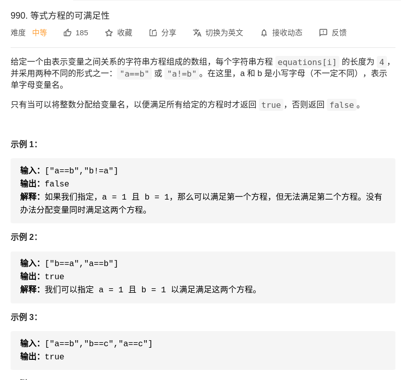

> 难度：中等
- 并查集
  - 先处理`==`再处理`!=`

> 题目

<div align="center" style="zoom:80%"></div>

> 代码

```cpp
class UF {
public:
    int count; // 连通分量数量
    // 记录x节点指向的父亲（相当于指针）
    vector<int> parent;
    // 记录x节点为根的树的大小
    vector<int> size;
public:
    UF(int n) {
        count = n;
        parent.resize(n);
        size.resize(n);
        for (int i = 0; i < n; ++i) {
            parent[i] = i;
            size[i] = 1;
        }
    }

    void Union(int p, int q) {
        int proot = Find(p);
        int qroot = Find(q);
        if (proot == qroot)
            return;
        // 将小树接到大树那
        if (size[proot] > size[qroot]) {
            parent[qroot] = proot;
            size[proot] += size[qroot];
        } else {
            parent[proot] = qroot;
            size[qroot] += size[proot];
        }
        --count;
    }

    bool IsConnect(int p, int q) {
        int proot = Find(p);
        int qroot = Find(q);
        if (proot == qroot)
            return true;
        return false;
    }

    int Find(int x) {
        // 压缩树，顺便减少该节点这一路的高度
        while (parent[x] != x) {
            size[parent[x]] -= size[x];
            size[parent[parent[x]]] += size[x];
            parent[x] = parent[parent[x]];
            x = parent[x];
        }
        return x;
    }

    int Count() {
        return count;
    };

};
class Solution {
public:


    bool equationsPossible(vector<string> &equations) {
        vector<string> noEqual;
        UF uf(26);
        const int base = 'a';
        for (auto e : equations) {
            if (e[1] == '!')
                noEqual.push_back(e);
            else
                uf.Union(e[0] - base, e[3] - base);
        }
        for (auto n : noEqual) {
            if (uf.IsConnect(n[0] - base, n[3] - base))
                return false;
        }
        return true;

    }
};
```

```
执行用时：8 ms, 在所有 C++ 提交中击败了53.25%的用户
内存消耗：11.6 MB, 在所有 C++ 提交中击败了5.06%的用户
```