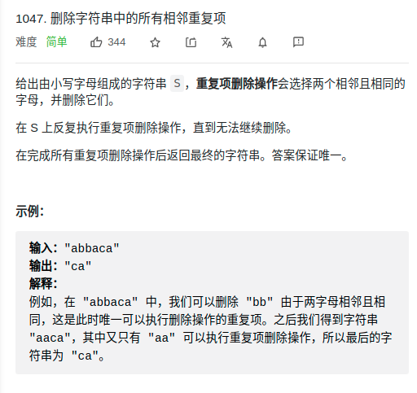

> 难度:简单
- 思路：
  - 栈（字符串string本身就可以当栈使用）
> 题目

<div align="center" style="zoom:80%"></div>

> 代码

```cpp
class Solution {
public:
    string removeDuplicates(string s) {
        string res = s.substr(0,1);
        for(int i = 1; i < s.size(); ++i){
            if(!res.empty() && res.back() == s[i]){
                res.pop_back();
            }else
                res.push_back(s[i]);
        }
        return res;
    }
};
```