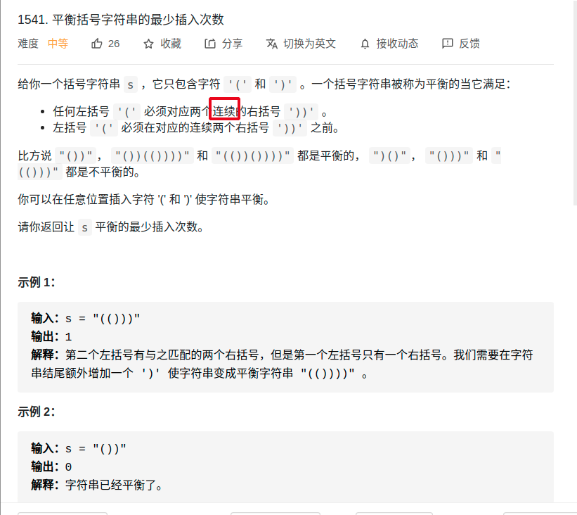

> 难度：中等
- 通过一个 need 变量记录对右括号的需求数，根据 need 的变化来判断是否需要插入
- 当 need == -1 时，意味着我们遇到一个多余的右括号，显然需要插入一个左括号。
- 当遇到左括号时，若对右括号的需求量为奇数，需要插入 1 个右括号。
- 注意题目需要连续的右括号匹配一个左括号

> 题目
<div align="center" style="zoom:60%"></div>


> 代码

```cpp
class Solution {
public:
    int minInsertions(string s) {
        int need = 0;
        int res = 0;
        for(int i = 0; i < s.size(); ++i){
            if(s[i] == '('){
                if(need % 2 == 1){
                    ++res;
                    --need;
                }
                need+=2;
            }
            else if(s[i] == ')'){
                --need;
                if(need == -1){
                    ++res;
                    need = 1;
                }
            }
        }
        res += need;
        return res;
    }
};
```