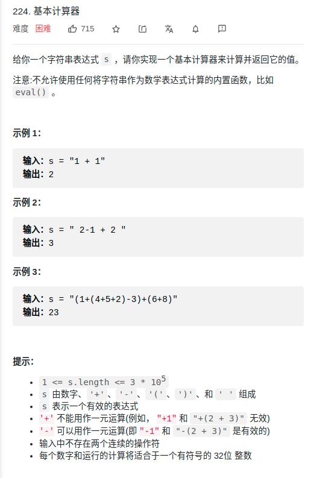

> 难度：简单
- 就是细节比较多，烦。
  - 注意：运算符弹栈时，应该是while而不是if
  - 注意如何区分负数，这里使用了一个flag来辨别


> 题目

<div align="center" style="zoom:80%"></div>


> 代码

```cpp
class Solution {
public:
int cal(int a, int b, char op){
    switch (op) {
    case '+':
        return a + b;
    case '-':
        return a - b;
    case '*':
        return a * b;
    case '/':
        return a / b;
    default:
        assert(false);
    }
}

// return 1, iff op1_pri > op2_pri;
// return 0, iff op1_pri == op2_pri;
// return -1, iff op1_pri < op2_pri;
int priCmp(char op1, char op2){
    map<char,int> pri{{'+',0},{'-',0},{'*',1}, {'/',1}};
    if(pri[op1] > pri[op2])
        return 1;
    else if(pri[op1] == pri[op2]){
        return 0;
    }else{
        return -1;
    }
}

int calculate(string s) {
    stack<int> stnum;
    stack<char> stop;
    bool subFlag = false;
    int i = 0;
    auto tfun = [&](){
        // 注意顺序
        int b = stnum.top(); stnum.pop();
        int a = stnum.top(); stnum.pop();
        auto res = cal(a,b,stop.top());
        stnum.push(res);
        stop.pop();
    };

    while(i < s.size()){
        if( s[i] == ' ') {
            // pass
            ++i;
        }else if(s[i] <= '9' && s[i] >= '0'){
            // while读取数字，压栈
            int num = 0;
            num = s[i]-'0';
            ++i;
            while(i < s.size() && s[i] <= '9' && s[i] >= '0'){
                // 要先-'0'，否则对于 "2147483647" 的情况要报错
                num = num*10 -'0'+ s[i];
                ++i;
            }
            stnum.push(num);

            subFlag = true;
        }else if(s[i] == '+' || s[i] == '-' || s[i] == '*' || s[i] == '/'){
            if(s[i] == '-' && subFlag == false){
                stnum.push(0);
            }

            subFlag = true;
            // 栈中是否有优先级更高的或者相等的，执行运算
            // 注意：需要while，而不是if
            while(!stop.empty() && stop.top() != '('&& priCmp(stop.top(), s[i]) >= 0){
                tfun();
            }
            stop.push(s[i]);
            ++i;
        }else if(s[i] == '('){
            subFlag = false;
            stop.push(s[i]);
            ++i;
        }else if(s[i] == ')') {
            while(stop.top() != '('){
                tfun();
            }
            stop.pop();
            ++i;
        }else{
            assert(false);
        }
    }

    // 清空 stop
    while(!stop.empty()){
        tfun();
    }
    return stnum.top();
}
};
```