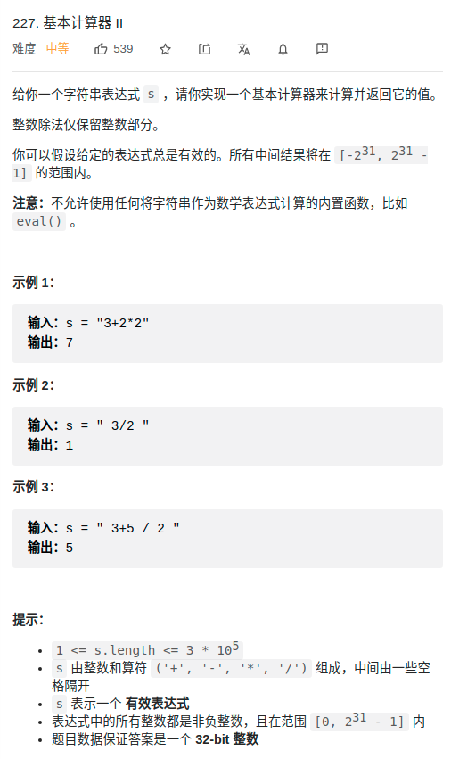

> 难度:简单
- 就是细节比较多，烦。
  - 注意：运算符弹栈时，应该是while而不是if

> 题目
<div align="center" style="zoom:80%"></div>
> 代码

```cpp
class Solution {
public:
int cal(int a, int b, char op){
    switch (op) {
    case '+':
        return a + b;
    case '-':
        return a - b;
    case '*':
        return a * b;
    case '/':
        return a / b;
    default:
        assert(false);
    }
}

// return 1, iff op1_pri > op2_pri;
// return 0, iff op1_pri == op2_pri;
// return -1, iff op1_pri < op2_pri;
int priCmp(char op1, char op2){
    map<char,int> pri{{'+',0},{'-',0},{'*',1}, {'/',1}};
    if(pri[op1] > pri[op2])
        return 1;
    else if(pri[op1] == pri[op2]){
        return 0;
    }else{
        return -1;
    }
}

int calculate(string s) {
    stack<int> stnum, stop;
    int i = 0;
    auto tfun = [&](){
        // 注意顺序
        int b = stnum.top(); stnum.pop();
        int a = stnum.top(); stnum.pop();
        auto res = cal(a,b,stop.top());
        stnum.push(res);
        stop.pop();
    };

    while(i < s.size()){
        if( s[i] == ' ') {
            // pass
            ++i;
        }else if(s[i] <= '9' && s[i] >= '0'){
            // while读取数字，压栈
            int num = 0;
            num = s[i]-'0';
            ++i;
            while(i < s.size() && s[i] <= '9' && s[i] >= '0'){
                num = num*10 -'0'+ s[i];
                ++i;
            }
            stnum.push(num);
        }else if(s[i] == '+' || s[i] == '-' || s[i] == '*' || s[i] == '/'){
            // 运算符弹栈时，应该是while而不是if
            // 栈中是否有优先级更高的或者相等的，执行运算
            while(!stop.empty() && priCmp(stop.top(), s[i]) >= 0){

                tfun();
            }
            stop.push(s[i]);
            ++i;
        } else{
            assert(false);
        }
    }
    // 清空 stop
    while(!stop.empty()){
        tfun();
    }
    return stnum.top();
}
};
```