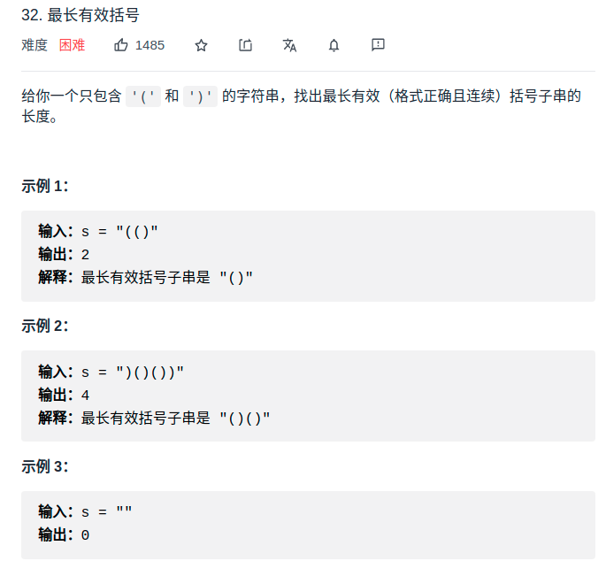

> 难度：简单
- 思路：
  - 最长，想到
    - 动态规划
    - 滑动窗口
  - 括号，想到
    - 括号的性质
> 题目
<div align="center" style="zoom:80%"></div>


> 代码

```cpp
class Solution {
public:
    int longestValidParentheses(string s) {
        int slow, fast;
        slow = 0;
        fast = 0;

        int valid = 0;
        int res = 0;
        while(fast < s.size()){
            if(s[fast++] == '(')
                valid++;
            else
                valid--;
            if(valid < 0){
                slow = fast;
                valid = 0;
            } else if(valid == 0){
                res = max(res,fast-slow);
            }
        }

        // 处理类似这种情况，valid>0,但是fast已经到最后了。情况：(()。反过来再算一遍，就好。
        slow = s.size()-1;
        fast = s.size()-1;
        valid = 0;
        while(fast >= 0){
            if(s[fast--] == ')')
                valid++;
            else
                valid--;
            if(valid < 0){
                slow = fast;
                valid = 0;
            } else if(valid == 0){
                res = max(res,slow-fast);
            }
        }

        return res;
    }
};
```