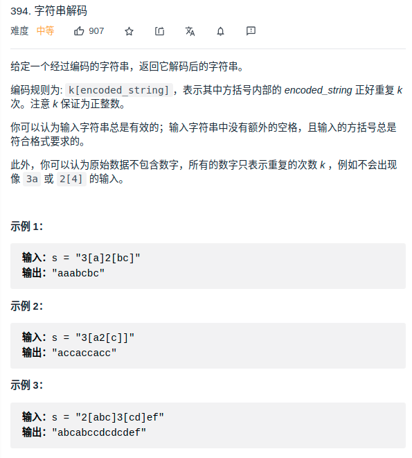

> 难度：简单
- 思路：就是判断
> 题目
<div align="center" style="zoom:80%"></div>

> 代码
```cpp
class Solution {
public:
    string decodeString(string s) {
        map<int,string> record; // <left,record>
        stack<int> stn;     // 暂存n值
        int left = 0;   // 表示当前是第几个[内
        int i = 0;
        int n = 0;
        for(i = 0; i < s.size(); ++i){

            // 如果是数字，注意考虑两位数
            if(s[i] < '9' && s[i] > '0'){
                if(n != 0){
                    stn.push(n);
                    n = 0;
                }
                while(s[i] <= '9' && s[i] >= '0'){// 循环读取完
                    n = n*10 + s[i] - '0';
                    ++i;
                }
            }
            if(s[i] == '['){
                ++left;
            }else if(s[i] == ']'){
                while (n--)
                    record[left-1] += record[left];
                if(!stn.empty()){
                    n = stn.top();
                    stn.pop();
                }
                else
                    n = 0;
                record[left] = "";
                --left;
            }else{
                record[left] += s[i];
            }
        }
        return record[0];

    }
};

```