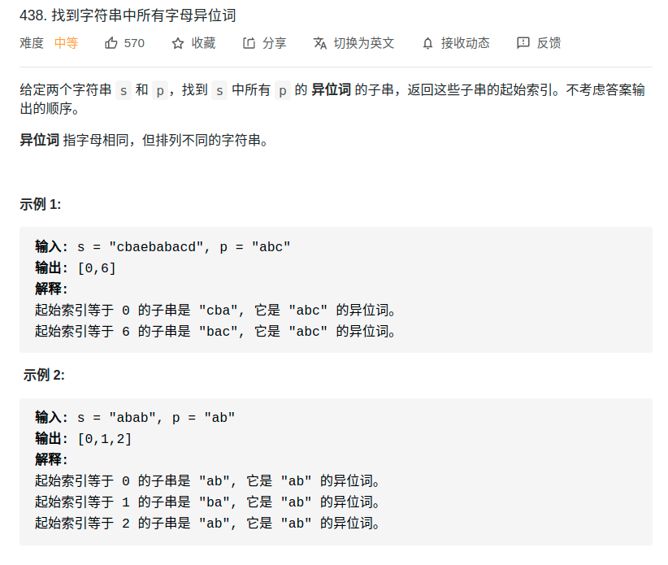

> 难度：简单
- 滑动窗口。
  - 直接框架
> 题目

<div align="center" style="zoom:80%"></div>


> 代码

```cpp
class Solution {
public:
    vector<int> findAnagrams(string s, string p) {
        int left, right;
        vector<int> res;
        unordered_map<char, int> need, window;
        int valid = 0;

        left = 0;
        right = 0;
        for (auto it : p) {
            ++need[it];
        }

        while (right < s.size()) {
            char c = s[right];
            ++right;
            // update
            ++window[c];
            if (need.find(c) != need.end() && window[c] == need[c])
                ++valid;

            // cout << "[" << left << ", " << right << "]" <<endl;
            while (need.size() == valid) {
                if (p.size() == right - left)
                    res.push_back(left);
                char c = s[left];
                ++left;
                if (need.find(c) != need.end() && window[c] == need[c]) {
                    --valid;
                }
                --window[c];
            }

        }
        return res;
    }
};

```

```
执行用时：20 ms, 在所有 C++ 提交中击败了48.70%的用户
内存消耗：8.6 MB, 在所有 C++ 提交中击败了40.42%的用户
```