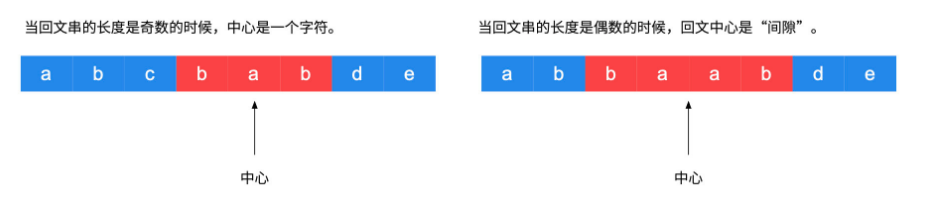

> 难度：中等，多种方法，暴力简单但超时

- 解法：
  - 暴力：直接遍历每种子字符串的可能，写一个check来检查是否是回文字符串，然后根据长度来判断是否更新当前结果。

- 参考：https://leetcode-cn.com/problems/longest-palindromic-substring/solution/zhong-xin-kuo-san-dong-tai-gui-hua-by-liweiwei1419/


> 题目描述

给定一个字符串 s，找到 s 中最长的回文子串。你可以假设 s 的最大长度为 1000。  

示例 1：
```
输入: "babad"
输出: "bab"
```
注意: "aba" 也是一个有效答案。  
示例 2：
```
输入: "cbbd"
输出: "bb"
```
> 解题

# 暴力

- 结果正确但是超时了。

```cpp

class Solution {
public:
    bool check(string s,int start,int end){
        while(start < end){
            if(s[start] != s[end]) break;
            ++start;
            --end;
        }
        if(start < end) return false;
        return true;
    }


    string longestPalindrome(string s) {
        string res;
        int max = 1;
        res = s[0];
        for(int i = 0; i < s.size(); ++i){
            for(int j = i+1; j < s.size(); ++j){
                if(check(s,i,j) && j-i+1 > max){
                    res = s.substr(i,j-i+1);
                    max = j-i+1;
                }
            }
        }
        return res;
    }
};

```

# dp
- 参考的那个教程里，有很有帮助的如何解dp问题的套路
- 这道题代码中原来用的是vector来定义二位数组，但是用了后代码居然超时，原因是在resize的时候用了太多时间
- 这道题知道了怎么new和delete一个二维数组。

<div align="center" style="zoom:80%">

</div>


```cpp
class Solution {
public:
    string longestPalindrome(string s) {
        if(s.size() < 2)
            return s;
        bool **dp = nullptr;

        // 二维数组创建
        dp = new bool*[s.size()];
        for(int i = 0;i < s.size();i++){
            dp[i] = new bool[s.size()];
        }

        int maxsize = 1;
        int maxi=0;
        string res;
        for(int j = 1;j < s.size();j++){
            for(int i = 0; i < j;i++){
                if(j-i < 3)
                    dp[i][j] = (s[i] == s[j]);
                else
                    dp[i][j] = (s[i] == s[j]) && dp[i+1][j-1];
                if(dp[i][j]&&maxsize < j-i+1) {
                    maxi = i;
                    maxsize = j - i + 1;
                }
            }
        }
        res = s.substr(maxi,maxsize);
        // 二维数组销毁
        for(int i = 0;i < s.size();i++)
            delete []dp[i];
        delete []dp;
        return res;
    }
};
```

# 中心扩散法
- 由中心扩向四周

<div align="center" style="zoom:80%">

</div>

1. 如果传入重合的索引编码，进行中心扩散，此时得到的回文子串的长度是奇数；

2. 如果传入相邻的索引编码，进行中心扩散，此时得到的回文子串的长度是偶数。

```
执行用时：
228 ms, 在所有 C++ 提交中击败了53.22%的用户
内存消耗：
241.5 MB, 在所有 C++ 提交中击败了5.19%的用户
```


```cpp
class Solution {
public:
    string check(string s,int left, int right){
        while(left >= 0 && right < s.length()){
            if(s[left] != s[right]){
                break;
            }
            else{
                --left;
                ++right;
            }
        }

        return left + 1 == right?"":s.substr(left+1,right-left-1);
    }

    string longestPalindrome(string s) {
        if(s.length() < 2)return s;
        string res;
        string tmp;
        // 最后一个字符可以不遍历
        for(int i = 0;i < s.length()-1;i++){
            tmp = check(s,i,i);
            if(tmp.length() > res.length()) res = tmp;
            tmp = check(s,i,i+1);
            if(tmp.length() > res.length()) res = tmp;
        }
        return res;
    }
};
```