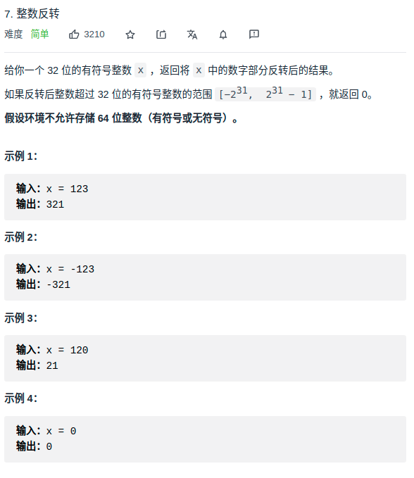

> 难度：简单

> 题目


<div align="center" style="zoom:80%"></div>

> 代码
```cpp
class Solution {
public:
    int reverse(int x) {
        bool flag = false;
        int res = 0;
        // 避免-x的时候越界
        if(x == INT32_MIN) return 0;
        if(x < 0){
            flag = true;
            x = -x;
        }
        while(x != 0){
            // 判断是否会越界，根据题目的要求，不能用64位整型
            if(INT32_MAX/10 < res )
                return 0;
            else if(INT32_MAX/10 == res && INT32_MAX%10 < x%10)
                return 0;
            res = res * 10 + (x % 10);
            x /= 10;
        }
        return flag ? -res: res;
    }
};
```