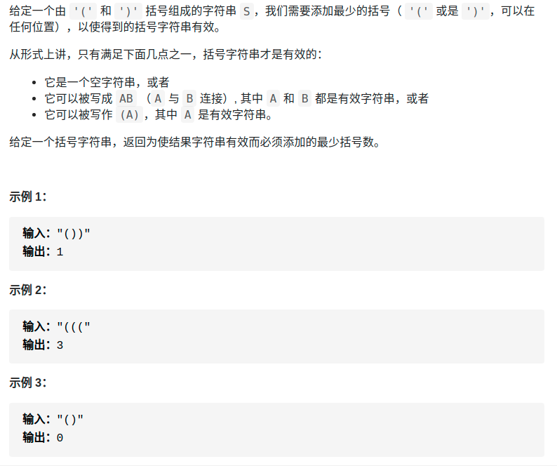

> 难度：简单
- 性质：左边的括号数量大于等于右边
- 思路：
  - 如果出现没有被匹配到的`)`，则需要补一个`(`。
  - 到了最后结算有多少`(`没被匹配。
> 题目

<div align="center" style="zoom:60%"></div>

> 代码

```cpp
class Solution {
public:
    int minAddToMakeValid(string s) {
        int need=0; // 需要的右括号数
        int res = 0;
        for(int i = 0; i <s.size();++i){
            if(s[i] == '('){
                ++need;
            }else if(s[i] == ')'){
                --need;
                if(need == -1){
                    ++res;
                    need = 0;   // 补了一个左括号
                }
            }
        }
        if(need > 0)
            res += need;
        return res;
    }
};
```