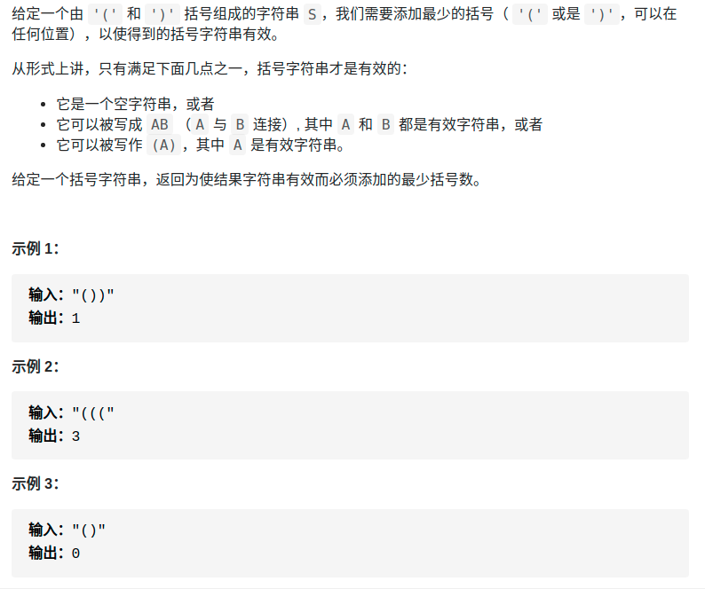
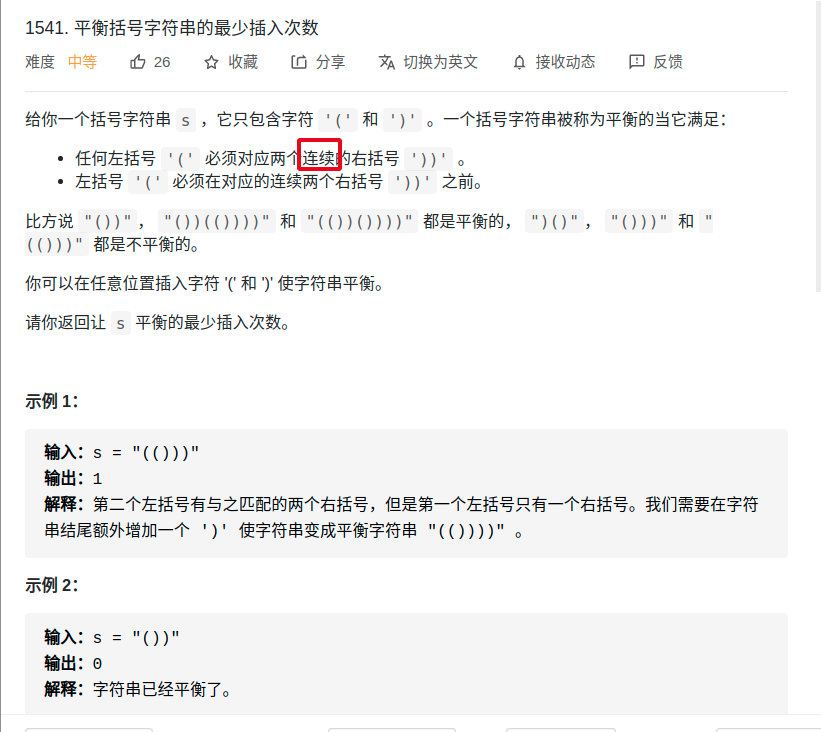

# 手算乘法
- https://labuladong.gitbook.io/algo/mu-lu-ye-4/zi-fu-chuan-cheng-fa

- 思路：将小学乘法流程机械化

<div align="center" style="zoom:60%"></div>

- 上面的手算方式还是太高级了，处理起来很复杂。比如要考虑的有：乘法进位、加法进位、错位相加等等。可以实现但是太复杂。现在要将其简单化

<div align="center" style="zoom:30%"></div>

- 过程：有两个指针 i，j 在 num1 和 num2 上游走，计算乘积，同时将乘积叠加到 res 的正确位置
- **num1[i] 和 num2[j] 的乘积对应的就是 res[i+j] 和 res[i+j+1] 这两个位置**。

```cpp
class Solution {
public:
    string multiply(string num1, string num2) {
        if(num1 =="0" || num2 == "0") return "0";
        vector<int> res(num1.size()+num2.size(), 0);
        for(int i = num1.size()-1; i >= 0; --i){
            for(int j = num2.size()-1; j >= 0; --j){
                int mul = (num1[i]-'0') * (num2[j]-'0');
                int p1 = i + j;
                int p2 = p1 + 1;
                int sum = res[p2] + mul;
                res[p2] = sum%10;
                res[p1] += sum/10;
                // 注：这里不用计算p1的进位，后面的操作中会自动被处理。这个算法的特点、
                // 因为最后一个乘出来相加res[p1]肯定不用进位
            }
        }
        int pos = 0;
        // 找到第一个不为0的
        while(res[pos] == 0){
            ++pos;
        }

        // vector<int> 转字符串
        string rtn;
        while(pos < res.size()){
            rtn += res[pos++]+'0';
        }
        return rtn;
    }
};
```

# 括号问题
- 一个「合法」括号组合的左括号数量一定等于右括号数量
- 对于一个「合法」的括号字符串组合 p，必然对于任何 `0 <= i < len(p)` 都有：子串 `p[0..i]` 中左括号的数量都大于或等于右括号的数量
- 都是通过上面两个性质变来变去。


## 生成有效的括号组合
- 题目如下
```
数字 n 代表生成括号的对数，请你设计一个函数，用于能够生成所有可能的并且 有效的 括号组合。

示例 1：
输入：n = 3
输出：["((()))","(()())","(())()","()(())","()()()"]

示例 2：
输入：n = 1
输出：["()"]


```

- 有关括号问题，你只要记住以下性质，思路就很容易想出来：
  - **一个「合法」括号组合的左括号数量一定等于右括号数量，这个很好理解**。
  - 对于一个「合法」的括号字符串组合 p，必然对于任何 `0 <= i < len(p)` 都有：子串 `p[0..i]` 中左括号的数量都大于或等于右括号的数量


- 算法输入一个整数 n，让你计算 n 对儿括号能组成几种合法的括号组合，可以改写成如下问题：
  - **现在有 2n 个位置，每个位置可以放置字符 `(` 或者 `)`，组成的所有括号组合中，有多少个是合法的？**


```cpp
class Solution {
public:
    void generator(string ins,int lnum, int rnum){
        if(rnum == 0 && lnum == rnum ){
            res.push_back(ins);
            return;
        }
        if(lnum > 0)
            generator(ins+'(', lnum-1, rnum);
        if(rnum > lnum)
            generator(ins+')', lnum, rnum-1);
    }
    vector<string> generateParenthesis(int n) {
        generator("", n, n);
        return res;
    }
private:
    vector<string> res;

};
```


## 判断合法括号串（leetcode20）
- 该题目不能通过`(`数量和`)`数量来判断，因为有多种括号。而且`"([)]"`是不合法的
  - 解决：通过一个左括号栈解决
> 题目
```
给定一个只包括 '('，')'，'{'，'}'，'['，']' 的字符串 s ，判断字符串是否有效。

有效字符串需满足：

左括号必须用相同类型的右括号闭合。
左括号必须以正确的顺序闭合。

示例 1：
输入：s = "()"
输出：true

示例 2：
输入：s = "()[]{}"
输出：true

示例 3：
输入：s = "(]"
输出：false

示例 4：
输入：s = "([)]"
输出：false
```

## 平衡括号(leetcode921)
- 性质：左边的括号数量大于等于右边
- 思路：
  - 如果出现没有被匹配到的`)`，则需要补一个`(`。
  - 到了最后结算有多少`(`没被匹配。
- 通过维护对右括号的需求数 need，来计算最小的插入次数
<div align="center" style="zoom:60%"></div>

```cpp
class Solution {
public:
    int minAddToMakeValid(string s) {
        int need=0; // 需要的右括号数
        int res = 0;
        for(int i = 0; i <s.size();++i){
            if(s[i] == '('){
                ++need;
            }else if(s[i] == ')'){
                --need;
                if(need == -1){
                    ++res;
                    need = 0;   // 补了一个左括号
                }
            }
        }
        if(need > 0)
            res += need;
        return res;
    }
};
```

## 平衡括号2（leetcode1541）
- 通过一个 need 变量记录对右括号的需求数，根据 need 的变化来判断是否需要插入
- 当 need == -1 时，意味着我们遇到一个多余的右括号，显然需要插入一个左括号。
- 当遇到左括号时，若对右括号的需求量为奇数，需要插入 1 个右括号。
- 注意题目需要连续的右括号匹配一个左括号

<div align="center" style="zoom:60%"></div>

> 代码

```cpp
class Solution {
public:
    int minInsertions(string s) {
        int need = 0;
        int res = 0;
        for(int i = 0; i < s.size(); ++i){
            if(s[i] == '('){
                if(need % 2 == 1){
                    ++res;
                    --need;
                }
                need+=2;
            }
            else if(s[i] == ')'){
                --need;
                if(need == -1){
                    ++res;
                    need = 1;
                }
            }
        }
        res += need;
        return res;
    }
};
```