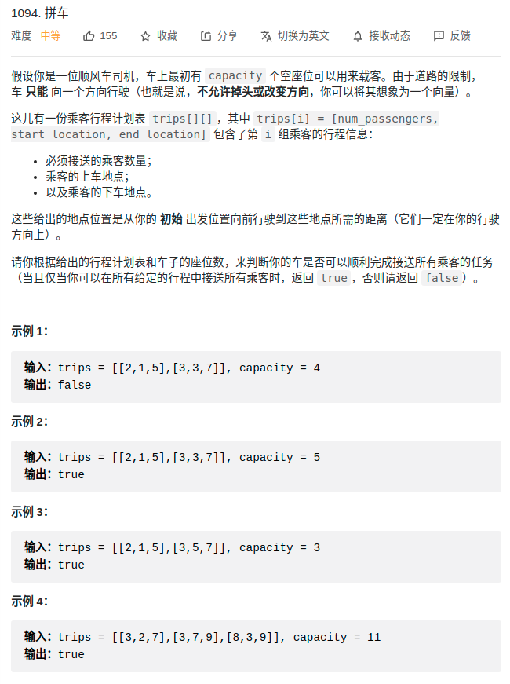

> 难度：简单
- 思路：差分数组
  - 注意其区间为 `[first, second)`

- 差分数组：存储与上一个元素的差，而差分数组第一个元素存储元素本身。
  - 可以从第一个元素以此推导到任何一个元素
> 题目
<div align="center" style="zoom:80%">

</div>


> 代码

```cpp

class Solution {
public:
    bool carPooling(vector<vector<int>>& trips, int capacity) {
        // 需判断的距离区间
        int lo = trips[0][1], hi = trips[0][2];
        diff_.resize(1000+1);


        // 构造差分数组
        for(int i = 0; i < trips.size(); ++i){
            if(trips[i][1] < lo) lo = trips[i][1];
            if(trips[i][2] > hi) hi = trips[i][2];
            diff_[trips[i][1]] += trips[i][0];
            diff_[trips[i][2]] -= trips[i][0];
        }

        // 还原数组，并不需要存储，只需一个变量来迭代
        int t = diff_[lo];
        if(t > capacity) return false;
        for(int i = lo+1; i < hi+1; ++i){
            t  = t + diff_[i];
            if(t > capacity) return false;
        }
        return true;
    }
private:
    vector<int> diff_;
};
```