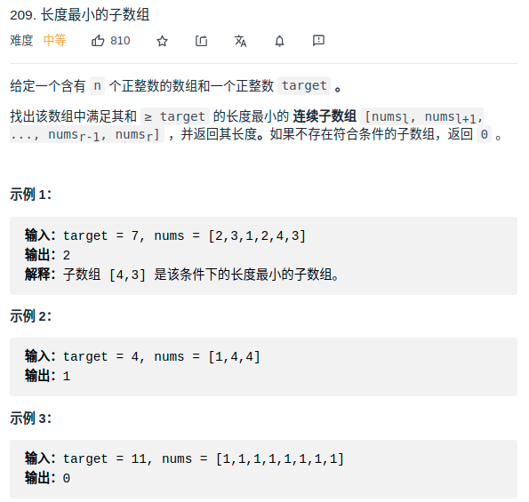

> 难度：简单
- 思路：滑动窗口

> 题目
<div align="center" style="zoom:80%"></div>

> 代码
```cpp
class Solution {
public:
    int minSubArrayLen(int target, vector<int>& nums) {
        if(nums.size() == 0) return 0;
        int left = 0, right = 0;
        int cur = 0;
        int res = nums.size() + 1;
        while(right < nums.size()){
            // 左移，cur < target情况
            cur += nums[right];
            while(cur >= target){
                res = min(res, right-left+1);                
                cur -= nums[left];
                ++left;
            }
            ++right;
        }
        return res == nums.size() + 1? 0 :res;
    }
};
```