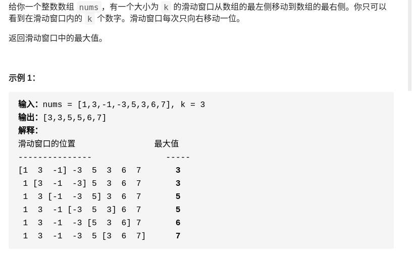

> 难度：中等
- https://labuladong.gitbook.io/algo/mu-lu-ye-1/mu-lu-ye-2/dan-tiao-dui-lie
- 这道题不复杂，难点在于如何在 O(1) 时间算出每个「窗口」中的最大值，使得整个算法在线性时间完成。
- 思路：单调队列。见note
> 题目

<div align="center" style="zoom:60%"></div>

> 代码

```cpp
class MonotonicQueue{
public:
    // 从队尾插入，如果小于它的都弹出
    void push(int n){
        while(!data.empty()&&data.back() < n){
            data.pop_back();
        }
        data.push_back(n);
    }
    // 如果对头是n，则弹出
    void pop(int n){
        if(data.front() == n)
            data.pop_front();
    }

    // 对头是最大的
    int getMax(){
        return data.front();
    }
private:
    list<int> data;
};
class Solution {
public:
    vector<int> maxSlidingWindow(vector<int>& nums, int k) {
        int lo,hi;
        vector<int> res;
        MonotonicQueue mq;
        // [lo, hi）
        lo = 0;
        hi = 0;
        while(hi < nums.size()){
            if(hi-lo != k){
                mq.push(nums[hi]);
                ++hi;
            }else{
                res.push_back(mq.getMax());
                mq.push(nums[hi]);
                ++hi;
                mq.pop(nums[lo]);
                ++lo;
            }
        }
        res.push_back(mq.getMax());
        return res;
    }
};

```

```
执行用时：396 ms, 在所有 C++ 提交中击败了10.67%的用户
内存消耗：185.1 MB, 在所有 C++ 提交中击败了5.01%的用户
```