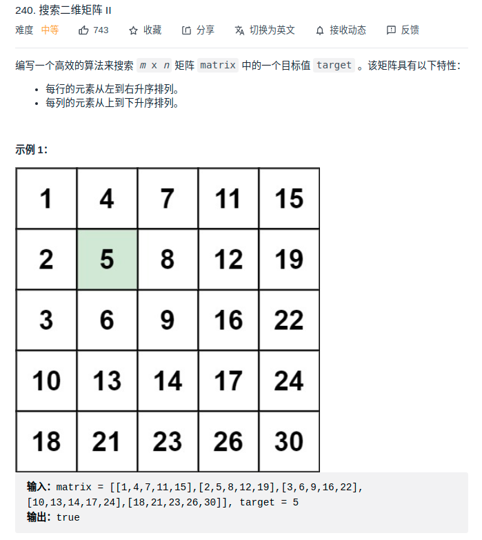

> 难度：简单
- 思路1：暴力
- 思路2：二分
- 思路3：从左小角开始，一步步走
> 题目
<div align="center" style="zoom:80%"></div>

> 代码
- 思路3
```cpp
class Solution {
public:
    bool searchMatrix(vector<vector<int>>& matrix, int target) {
        int m = matrix.size();
        int n = matrix[0].size();
        pair<int, int> pos;
        pos.first = m-1;
        pos.second = 0;
        while(pos.first >= 0 && pos.second < n){
            if(matrix[pos.first][pos.second] < target){
                ++pos.second;
            }else if(matrix[pos.first][pos.second] > target){
                --pos.first;
            }else{
                return true;
            }
        }
        return false;
    }
};
```