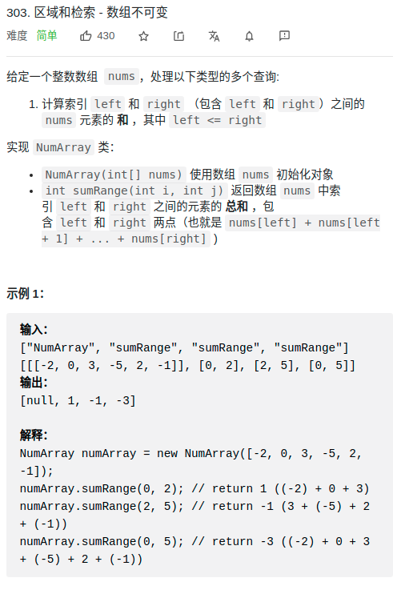

> 难度：简单
- 思路：前缀数组


> 题目


<div align="center" style="zoom:80%">

</div>


> 代码

```cpp
class NumArray {
public:
    NumArray(vector<int>& nums) {
        pres_.resize(nums.size()+1);
        pres_[0] = 0;
        for(int i = 0; i < pres_.size()-1; ++i){
            pres_[i+1] = nums[i] + pres_[i];
        }
    };

    int sumRange(int left, int right) {
        return pres_[right+1] - pres_[left];
    }

private:
    vector<int64_t> pres_;
};

```