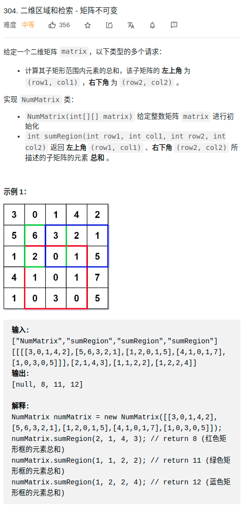

> 难度：简单
- 思路：前缀数组的变种
- 维护一个二维 preSum 数组，专门记录以原点为顶点的矩阵的元素之和，就可以用几次加减运算算出任何一个子矩阵的元素和

> 题目

<div align="center" style="zoom:80%">

</div>

> 代码

```cpp
class NumMatrix {
public:
    NumMatrix(vector<vector<int>>& matrix) {
        // 初始化前缀矩阵
        for(int i = 0; i < matrix.size(); ++i){
            for(int j = 0; j < matrix[0].size(); ++j){
                if (i == 0 && j == 0) continue;
                else if(i == 0) matrix[i][j] = matrix[i][j-1] + matrix[i][j];
                else if(j == 0) matrix[i][j] = matrix[i-1][j] + matrix[i][j];
                else
                    matrix[i][j] = matrix[i-1][j]+matrix[i][j-1]+matrix[i][j]-matrix[i-1][j-1];
            }
        }
        matrix_ = matrix;
    }

    int sumRegion(int row1, int col1, int row2, int col2) {
        // 分四种情况，取决与左上角(row1,col1)的点
        if(row1 == 0 && col1 == 0) // 1. 直接和矩阵左上角重合
            return matrix_[row2][col2];
        else if(row1 == 0) // 2. 左上角在矩阵上边界
            return matrix_[row2][col2] - matrix_[row2][col1-1];
        else if(col1 == 0)  // 3. 左上角再矩阵左边界
            return matrix_[row2][col2] - matrix_[row1-1][col2];
        else{   // 其他情况
            return matrix_[row2][col2] - matrix_[row2][col1-1] - matrix_[row1-1][col2] + matrix_[row1-1][col1-1];
        }
    }

private:
    vector<vector<int>> matrix_;
};
```