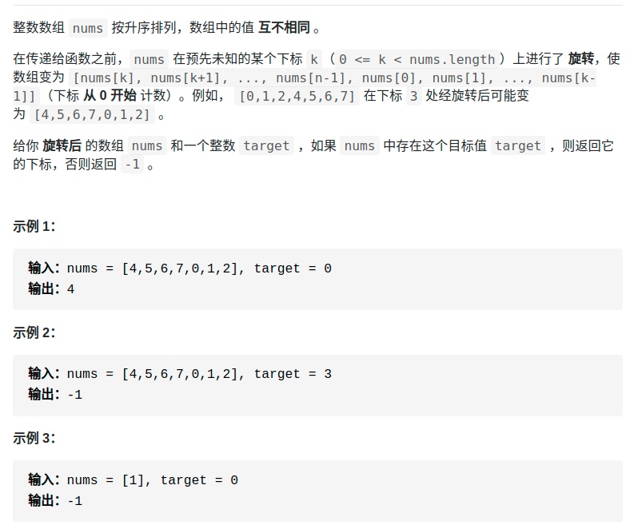

> 难度：简单
- 二分法变种。考虑情况变多了
> 题目
<div align="center" style="zoom:60%"></div>

- https://leetcode-cn.com/problems/search-in-rotated-sorted-array/

> 代码

```cpp
class Solution {
public:
    int search(vector<int>& nums, int target) {
        int lo = 0;
        int hi = nums.size();
        while(lo < hi){
            int mid = lo +(hi - lo)/2;
            // 处理特殊情况，后面就简洁了
            if(target == nums[mid])
                return mid;
            else if(target == nums[lo])
                return lo;
            else if(target == nums[hi-1])
                return hi-1;

            if(nums[mid] > nums[lo]){
                // lo 和mid没断裂
                if(target < nums[mid] && target > nums[lo]){
                    hi = mid;
                }else{
                    lo = mid+1;
                }
            }else{
                // 断裂了
                if(target > nums[mid] && target < nums[hi-1]){
                    lo = mid+1;
                }else{
                    hi = mid;
                }
            }
        }
        return -1;
    }
};
```

```
执行用时：8 ms, 在所有 C++ 提交中击败了25.52%的用户
内存消耗：10.7 MB, 在所有 C++ 提交中击败了86.96%的用户
```