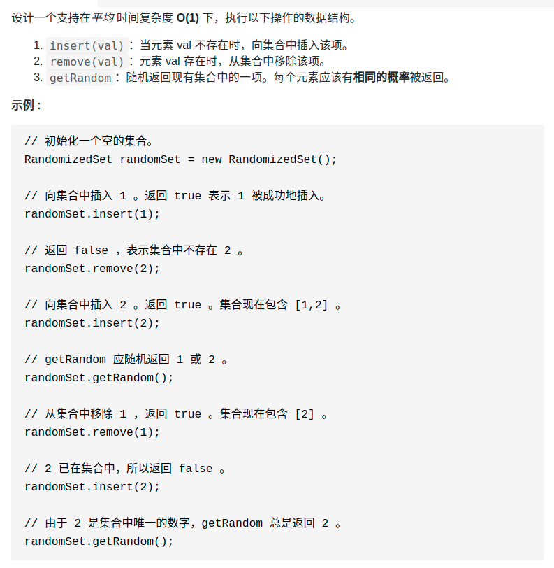

> 难度：简单
- 参考：https://labuladong.gitbook.io/algo/mu-lu-ye-1/mu-lu-ye-3/sui-ji-ji-he

- 难点：
  - 插入，删除，获取随机元素这三个操作的时间复杂度必须都是 **O(1)**。
  - `getRandom` 方法返回的元素必须**等概率**返回随机元素

- 数据结构选中
  - HashSet：不能在 O(1) 的时间内实现 `getRandom` 函数。因为元素是分散的，且还有解决冲突问题的拉链法等解决哈希冲突机制，基本做不到 O(1) 时间等概率随机获取元素。
  - 数组：
    - 如果想「等概率」且「在 O(1) 的时间」取出元素，一定要满足：底层用数组实现，且数组必须是紧凑的
    - 新问题：如何解决插入和删除时间复杂度是O（1）——**对数组尾部进行插入和删除操作不会涉及数据搬移，时间复杂度是 O(1)。**
    - **如果我们想在 O(1) 的时间删除数组中的某一个元素 val，可以先把这个元素交换到数组的尾部，然后再 pop 掉。**

- 解决：数组+map
> 题目
<div align="center" style="zoom:80%"></div>


> 代码
```cpp
class RandomizedSet {
public:
    vector<int> data;
    unordered_map<int, int> record;
    /** Initialize your data structure here. */
    RandomizedSet() {
    }

    /** Inserts a value to the set. Returns true if the set did not already contain the specified element. */
    bool insert(int val) {
        if(record.find(val) != record.end())
            return false;

        data.push_back(val);
        record[val] = data.size()-1;
        return true;
    }

    /** Removes a value from the set. Returns true if the set contained the specified element. */
    bool remove(int val) {
        if(record.find(val) == record.end())
            return false;

        record[data.back()] = record[val];
        data[record[val]] ^= data.back();
        data.back() ^= data[record[val]];
        data[record[val]] ^= data.back();

        data.pop_back();
        record.erase(val);
        return true;
    }

    /** Get a random element from the set. */
    int getRandom() {
        return data[rand()%data.size()];
    }
};
```

```
执行用时：252 ms, 在所有 C++ 提交中击败了20.89%的用户
内存消耗：94.7 MB, 在所有 C++ 提交中击败了32.80%的用户
```
