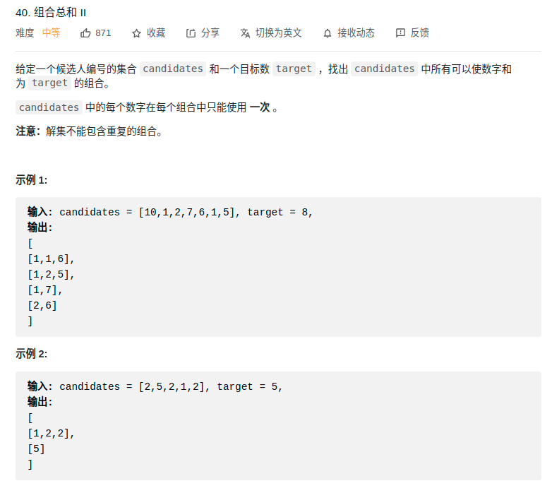

> 难度：中等
- 与39题有区别：
  - 不可以重复选取某一个元素
    - 所以dfs时区间要变小
  
- 做法还是基本一致
  - 同样通过排序来带来更好的剪枝

> 题目
<div align="center" style="zoom:80%"></div>

> 代码


```cpp
class Solution {
public:

vector<vector<int>> res;
vector<int> record;

// void show(vector<int>::iterator it1, vector<int>::iterator it2){
//     while(it1 != it2){
//         cout << *it1++ << " ";
//     }
//     cout << endl;
// }

void dfs(vector<int>& candidates, int target, int base){
    if(target == 0){
        res.push_back(record);
        // cout << "符合条件的结果: ";
        // show(record.begin(),record.end());
        return;
    }
    // 剪枝
    if(base >= candidates.size() || candidates[base] > target)
        return;
    int it = base;
    while(it < candidates.size()){
        record.push_back(candidates[it]);
//        cout << "进入递归：";
//        show(record.begin(),record.end());

        // it+1，因为不可重复取
        dfs(candidates, target-candidates[it],it+1);
        record.pop_back();
//        cout << "退出递归：";
//        show(record.begin(),record.end());
        // 防止重复
        while(it+1 < candidates.size() &&candidates[it+1] == candidates[it]){
            ++it;
        }
        ++it;
    }

}
vector<vector<int>> combinationSum2(vector<int>& candidates, int target) {
    // 排序，方便剪枝
    sort(candidates.begin(), candidates.end());
    dfs(candidates, target, 0);
    return res;
}
};
```

```
执行用时： 4 ms , 在所有 C++ 提交中击败了 89.63% 的用户 
内存消耗： 10.3 MB , 在所有 C++ 提交中击败了 84.65% 的用户
```