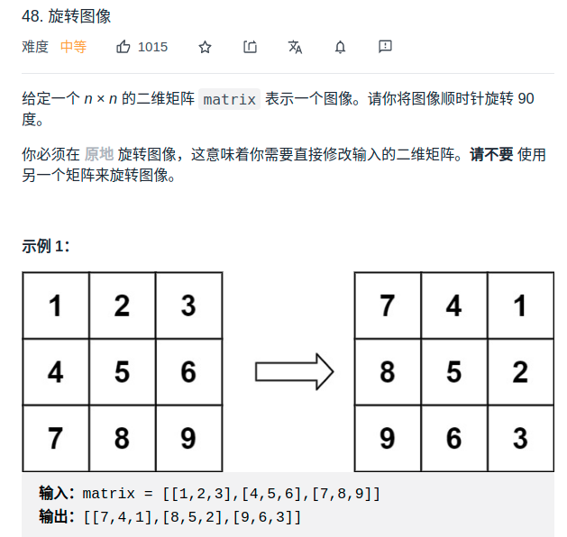

> 难度：中等
- 主要是在于思路怎么变现，比较多细节
- 比较困难的点在如何旋转90度。**画图，构造实例，就显现出来了**
  - (x,y)旋转90度后-----> (y,r-1-x)，其中r为正方形的长

- 思路：
  - 一圈圈处理，由外到内
  - 在每一圈中的最上边界，从左到右选一个点开始，开始后旋转90度4次

- 其他思路：官方思路比上述思路更加简洁
  - https://leetcode-cn.com/problems/rotate-image/solution/xuan-zhuan-tu-xiang-by-leetcode-solution-vu3m/

> 题目
<div align="center" style="zoom:60%"></div>

> 代码

```cpp
class Solution {
public:
    void rotate(vector<vector<int>>& matrix) {

        int round = matrix.size()/2;    // 旋转圈数
        int lx,ly,rx,ry;    // 边界，左上角和左下角
        lx = 0;
        ly = 0;
        rx = matrix.size()-1;
        ry = matrix.size()-1;
        while(--round>=0){
            // 边界
            for(int i = lx, j = ly; j < ry; ++j){
                int t;
                int posx = i;
                int posy = j;
                t = matrix[posx][posy];
                int n = 4;
                // 4次
                do{
                    int pt = posx;
                    posx = posy;
                    posy = matrix.size()-1-pt;
                    matrix[posx][posy] ^= t;
                    t ^= matrix[posx][posy];
                    matrix[posx][posy] ^= t;
                    --n;
                }while(n != 0);
            }
            ++lx;
            ++ly;
            --rx;
            --ry;
        }
    }
};
```