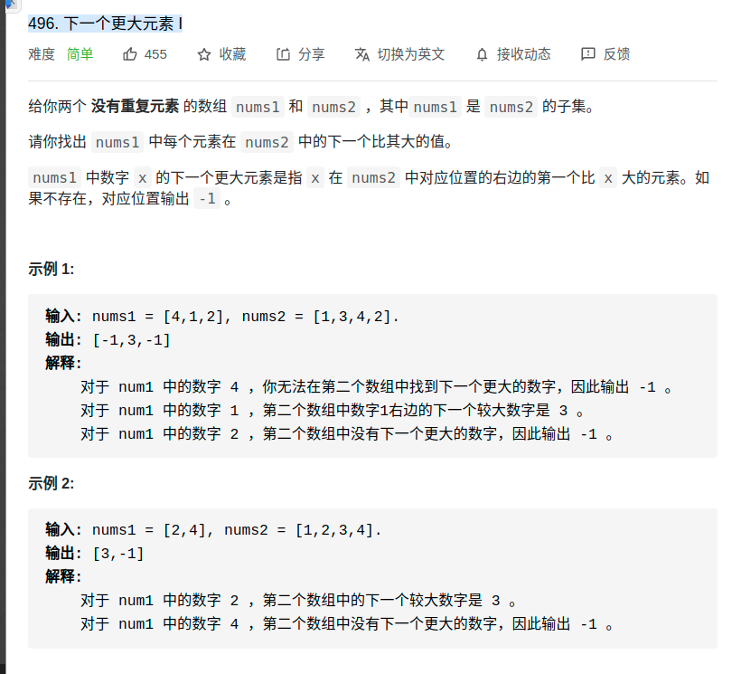

> 难度：简单
- 思路：单调栈+hash

- 先利用单调栈，解决nums2数组的问题。用hahs表记录，之后遍历一遍nums1解决问题。


> 题目

<div align="center" style="zoom:80%"></div>

> 代码
```cpp
class Solution {
public:
    vector<int> nextGreaterElement(vector<int>& nums1, vector<int>& nums2) {

        map<int, int> valToRes;
        stack<int> st;
        // 每一个需要知道后面的情况，所以从后面遍历
        for(int i = nums2.size()-1; i >= 0; --i){
            // 被挡到了，已经没用了，弹开
            while(!st.empty() && nums2[i] > st.top()){
                st.pop();
            }
            valToRes[nums2[i]] = st.empty() ? -1 : st.top();
            st.push(nums2[i]);
        }

        for(int i = 0; i < nums1.size(); ++i){
            nums1[i] = valToRes[nums1[i]];
        }
        return nums1;

    }
};
```

```
执行用时：8 ms, 在所有 C++ 提交中击败了59.30%的用户
内存消耗：8.7 MB, 在所有 C++ 提交中击败了28.98%的用户
```