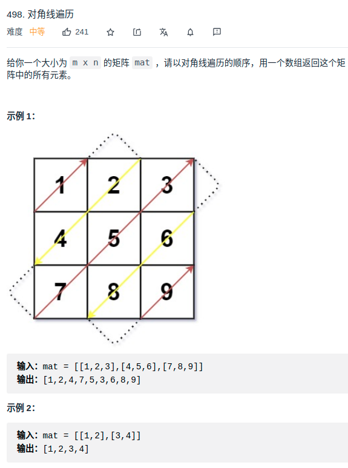

> 难度：中等
- 思路：见note
> 题目

<div align="center" style="zoom:60%"></div>

> 代码
```cpp
class Solution {
public:
    vector<int> findDiagonalOrder(vector<vector<int>>& mat) {
        if(mat.empty())
            return {};
        int m,n;
        int status = 0;
        int x,y;
        vector<int> res;
        m = mat.size();
        n = mat[0].size();
        while(status < m+n-1){
            // 奇数轮
            x = status < m-1 ? status : m-1;
            y = status - x;
            while(x >= 0 && y < n){
                res.push_back(mat[x][y]);
                --x;
                ++y;
            }
            ++status;
            if(status >= m+n-1)
                break;

            // 偶数轮
            y = status < n-1 ? status : n-1;
            x = status - y;
            while(x < m && y >= 0){
                res.push_back(mat[x][y]);
                ++x;
                --y;
            }
            ++status;
        }
        return res;
    }
};
```