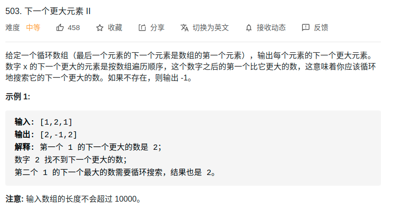

> 难度：中等
- 思路：https://mp.weixin.qq.com/s/KYfjBejo84AmajnPZNs5nA
- 最简单的实现方式当然可以把这个双倍长度的数组构造出来，然后套用算法模板。但是，我们可以不用构造新数组，而是利用循环数组的技巧来模拟数组长度翻倍的效果

> 题目
<div align="center" style="zoom:60%"></div>

> 代码

```cpp
vector<int> nextGreaterElements(vector<int>& nums) {
    int n = nums.size();
    vector<int> res(n);
    stack<int> s;
    // 假装这个数组长度翻倍了
    for (int i = 2 * n - 1; i >= 0; i--) {
        // 索引要求模，其他的和模板一样
        while (!s.empty() && s.top() <= nums[i % n])
            s.pop();
        res[i % n] = s.empty() ? -1 : s.top();
        s.push(nums[i % n]);
    }
    return res;
}
```