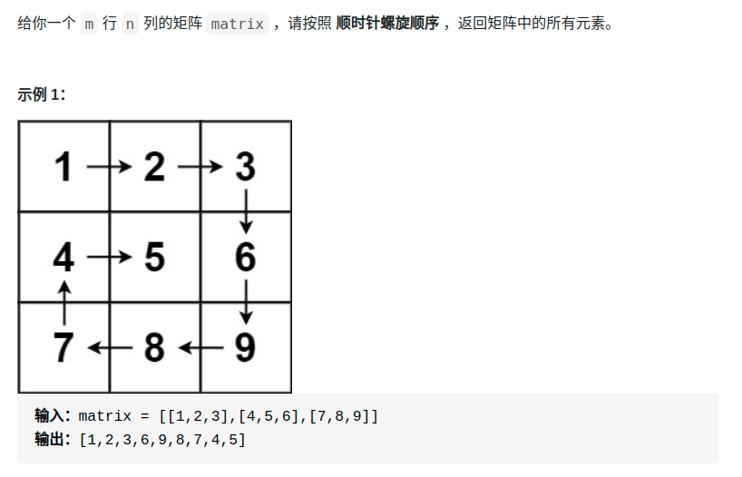

> 难度：简单

- 这道题挺考编码能力，不复杂，但是最好把他写的简洁好懂
- 建议多看看
- 主要思路：分别定义上下左右的边界，把`左->右` `上->下` `右->左` `下->上` 写成并列的循环可以更加简洁。而不用flag来判断

----
- 边界：l,r,t,b
  - 初始化：`l = 0; r = n; t = 0; b = n;`
- 退出条件：`l == r || t == b`
- 分四种状况
  - 左移：
    - 过程：i++
    - 状态变化：t++
  - 下移：
    - 过程：j++
    - 状态变化：r--
  - 右移：
    - 过程：i--
    - 状态变化：b--
  - 上移：
    - 过程：j--
    - 状态变化：l++


> 题目
<div align="center" style="zoom:60%"></div>


> 代码

```cpp
class Solution {
public:
    vector<int> spiralOrder(vector<vector<int>>& matrix) {
        vector<int> res;
        int u = 0;
        int r = matrix[0].size()-1;
        int b = matrix.size()-1;
        int l = 0;
        int i = 0, j = 0;
        while(u <= b && l <= r){
            // 左---》右
            for(int i = u,j = l; j <= r;++j){
                res.push_back(matrix[i][j]);
            }
            if(++u > b) break;

            // 上---》下
            for(int i = u, j = r; i <= b; ++i){
                res.push_back(matrix[i][j]);
            }
            if(--r < l) break;

            // 右----》左
            for(int i = b, j = r; j >= l; --j){
                res.push_back(matrix[i][j]);
            }
            if(--b < u) break;

            // 下---》上
            for(int i = b, j = l; i >= u; --i){
                res.push_back(matrix[i][j]);
            }
            if(++l > r) break;
        }
        return res;
    }
};
```
```
执行用时：0 ms, 在所有 C++ 提交中击败了100.00%的用户
内存消耗：6.5 MB, 在所有 C++ 提交中击败了95.04%的用户
```