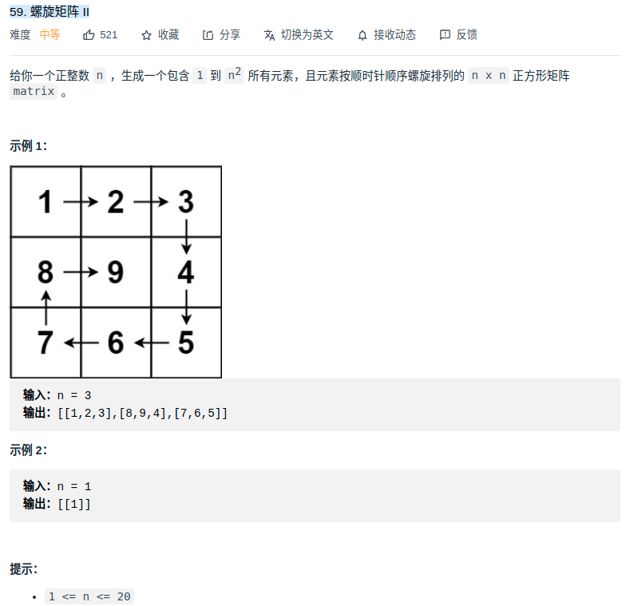

> 难度：简单
- 边界：l,r,t,b
  - 初始化：`l = 0; r = n; t = 0; b = n;`
- 退出条件：`l == r || t == b`
- 分四种状况
  - 左移：
    - 过程：i++
    - 状态变化：t++
  - 下移：
    - 过程：j++
    - 状态变化：r--
  - 右移：
    - 过程：i--
    - 状态变化：b--
  - 上移：
    - 过程：j--
    - 状态变化：l++

> 题目
<div align="center" style="zoom:60%"></div>

> 代码
```cpp
class Solution {
public:
    vector<vector<int>> generateMatrix(int n) {
        vector<vector<int>> res(n, vector<int>(n,0));
        int l,r,t,b;
        l = 0; r = n; t = 0; b = n; // 边界

        int i = 0, j = 0;
        int flag = 0;       // 分四种情况
        int status = 0;
        while(l <= r && t <= b){
            if(flag == 0){
                while(i < r){
                    res[j][i] = ++status;
                    ++i;
                }
                --i; ++j; ++t; ++flag;      // 状态变化
            }else if(flag == 1){
                while(j < b){
                    res[j][i] = ++status;
                    ++j;
                }
                --j; --i; --r; ++flag;
            }else if(flag == 2){
                while(i >= l){
                    res[j][i] = ++status;
                    --i;
                }
                ++i; --j; --b; ++flag;
            }else if(flag == 3){
                while(j >= t){
                    res[j][i] = ++status;
                    --j;
                }
                ++j; ++i; ++l; ++flag;
            }
            flag %= 4;
        }
        return res;
    }
};

```