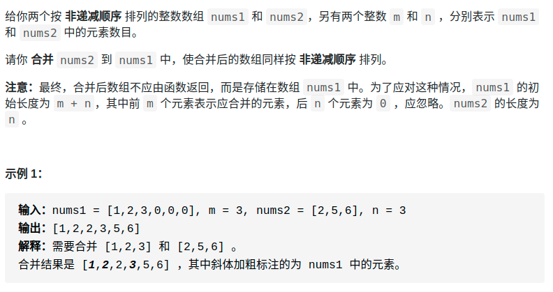

> 难度：简单
- 简单，不用多说

> 题目
<div align="center" style="zoom:80%"></div>

> 代码
```cpp
class Solution {
public:
    void merge(vector<int>& nums1, int m, vector<int>& nums2, int n) {
        int i = m-1, j = n-1;
        int pos = m+n-1;
        while(i >= 0 && j >= 0){
            if(nums1[i] > nums2[j]){
                nums1[pos--] = nums1[i--];
            }else{
                nums1[pos--] = nums2[j--];
            }
        }

        while(j >= 0){
            nums1[pos--] = nums2[j--];
        }
        while(i >= 0){
            nums1[pos--] = nums1[i--];
        }

    }
};

```