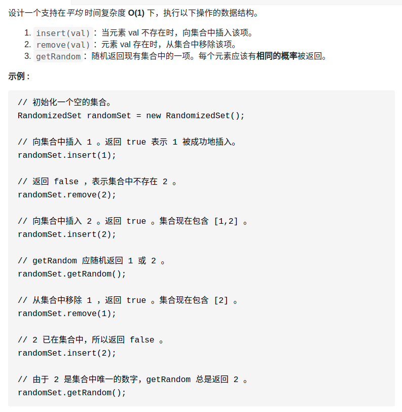

- [双指针技巧总结](#双指针技巧总结)
  - [快慢指针](#快慢指针)
    - [环型链表：只判断不记录](#环型链表只判断不记录)
    - [环型链表：记录起点](#环型链表记录起点)
    - [原地修改数组](#原地修改数组)
      - [删除有序数组中重复的](#删除有序数组中重复的)
  - [左右指针](#左右指针)
    - [二分查找](#二分查找)
    - [twoSum](#twosum)
    - [反转数组](#反转数组)
  - [滑动窗口](#滑动窗口)
    - [最小覆盖子串](#最小覆盖子串)
    - [最长无重复子串](#最长无重复子串)
  - [双指针思想](#双指针思想)
    - [349. 两个数组的交集](#349-两个数组的交集)
    - [870. 优势洗牌](#870-优势洗牌)
- [哈希表](#哈希表)
  - [twosum问题](#twosum问题)
- [单调栈](#单调栈)
  - [Leetcode96：「下一个更大元素 I」](#leetcode96下一个更大元素-i)
  - [最难去重题（去重后要字典序最小）](#最难去重题去重后要字典序最小)
- [常数时间下 删除/等概论查找/添加](#常数时间下-删除等概论查找添加)
  - [380. O(1) 时间插入、删除和获取随机元素](#380-o1-时间插入删除和获取随机元素)
  - [710 黑名单中的随机数](#710-黑名单中的随机数)
- [单调队列](#单调队列)
  - [239. 滑动窗口最大值](#239-滑动窗口最大值)
- [遍历与检索](#遍历与检索)
  - [搜索二维矩阵](#搜索二维矩阵)
  - [498. 对角线遍历](#498-对角线遍历)
- [峰值](#峰值)
  - [162. 寻找峰值](#162-寻找峰值)
- [洗牌算法：384. 打乱数组](#洗牌算法384-打乱数组)
- [前缀数组与差分数组](#前缀数组与差分数组)
  - [前缀数组](#前缀数组)
    - [案例：560.和为 k 的子数组](#案例560和为-k-的子数组)
  - [差分数组](#差分数组)
    - [demo: 1109. 航班预订统计](#demo-1109-航班预订统计)
# 双指针技巧总结
- https://labuladong.gitbook.io/algo/mu-lu-ye-1/mu-lu-ye-3/shuang-zhi-zhen-ji-qiao
## 快慢指针
- 应用
  - 主要解决链表中的问题，比如典型的判定链表中是否包含环。或者判断回文链表
    - leetcode141
    - leetcode234
  - 除此之外还用在**原地修改数组**上
    - leetcode26.删除有序数组中的重复项
    - 参考：https://labuladong.gitbook.io/algo/mu-lu-ye-1/mu-lu-ye-3/yuan-di-xiu-gai-shu-zu

- 思路：快慢指针一般都初始化指向链表的头结点 head，前进时快指针 fast 在前，慢指针 slow 在后，巧妙解决一些链表中的问题。
- 一般：（用在链表时）快指针的速度为慢指针两倍
  - 例外:删除链表的倒数第n个节点

> 模板
```cpp
Type hasCycle(ListNode head) {
    ListNode fast, slow;
    fast = slow = head;
    while (fast != null && fast.next != null) {
        fast = fast.next.next;
        slow = slow.next;
        // ...
    }
    return ...;
}
```


### 环型链表：只判断不记录
<div align="center" style="zoom:80%"></div>

```cpp
class Solution {
public:
    bool hasCycle(ListNode *head) {
        ListNode* fast, *slow;
        fast = head;
        slow = head;
        while(fast != nullptr && fast->next != nullptr){
            fast = fast->next->next;
            slow = slow->next;
            // 快和慢遇到了，说明有环的存在
            if(fast == slow)
                return true;
        }
        return false;
    }
};
```
### 环型链表：记录起点
- **fast 一定比 slow 多走了 k 步，这多走的 k 步其实就是 fast 指针在环里转圈圈，所以 k 的值就是环长度的「整数倍」**
- 设相遇点距环的起点的距离为 m，那么环的起点距头结点 head 的距离为 k - m，也就是说如果从 head 前进 k - m 步就能到达环起点。
- 巧的是，如果从相遇点继续前进 k - m 步，也恰好到达环起点。你甭管 fast 在环里到底转了几圈，反正走 k 步可以到相遇点，那走 k - m 步一定就是走到环起点了：

<div align="center" style="zoom:60%"></div>

- 只要我们把快慢指针中的任一个重新指向 head，然后两个指针同速前进，k - m 步后就会相遇，相遇之处就是环的起点了

```cpp
class Solution {
public:
    ListNode *detectCycle(ListNode *head) {
        if(head == nullptr) return nullptr;
        ListNode* fast, *slow;
        fast = head;
        slow = head;
        while(fast->next != nullptr && fast->next->next != nullptr){
            fast = fast->next->next;
            slow = slow->next;
            if(fast == slow)
                break;
        }

        slow = head;
        while(fast->next != nullptr && fast->next->next != nullptr){
            if(slow == fast) return slow;
            else{
                slow = slow->next;
                fast = fast->next;
            }
        }
        return nullptr;
    }
};
```

### 原地修改数组
- 下面四道题，一样的套路
  - 26.删除排序数组中的重复项（简单）
  - 83.删除排序链表中的重复元素（简单）
  - 27.移除元素（简单）
  - 283.移动零（简单）

#### 删除有序数组中重复的
> 题目
```
给你一个有序数组 nums ，请你 原地 删除重复出现的元素，使每个元素 只出现一次 ，返回删除后数组的新长度。

不要使用额外的数组空间，你必须在 原地 修改输入数组 并在使用 O(1) 额外空间的条件下完成。

```
> 思路
- 慢指针 slow 走在后面，快指针 fast 走在前面探路，找到一个不重复的元素就告诉 slow 并让 slow 前进一步。这样当 fast 指针遍历完整个数组 nums 后，nums[0..slow] 就是不重复元素
```cpp
int removeDuplicates(int[] nums) {
    if (nums.length == 0) {
        return 0;
    }
    int slow = 0, fast = 0;
    while (fast < nums.length) {
        if (nums[fast] != nums[slow]) {
            slow++;
            // 维护 nums[0..slow] 无重复
            nums[slow] = nums[fast];
        }
        fast++;
    }
    // 数组长度为索引 + 1
    return slow + 1;
}
```


## 左右指针
- 思路：
  - 只要数组有序，就应该想到双指针技巧。比如二分法
  - 还有一个就是数据分区，比如partiton（快排核心）
  - 反转。比如反转数组
- 应用：
  - 左右指针在数组中实际是指两个索引值，一般初始化为 `left = 0, right = nums.length - 1 `。


> 框架
```cpp
void reverseString(vector<char>& s) {
    int left,right;
    left = 0;
    right = s.size()-1;
    while(left < right){
        // ...
    }
}
```
### 二分查找
```cpp
int binarySearch(int[] nums, int target) {
    int left = 0; 
    int right = nums.length - 1;
    while(left <= right) {
        int mid = (right + left) / 2;
        if(nums[mid] == target)
            return mid; 
        else if (nums[mid] < target)
            left = mid + 1; 
        else if (nums[mid] > target)
            right = mid - 1;
    }
    return -1;
}
```

### twoSum
<div align="center" style="zoom:70%"></div>

- https://leetcode-cn.com/problems/two-sum-ii-input-array-is-sorted/solution/yi-zhang-tu-gao-su-ni-on-de-shuang-zhi-zhen-jie-fa/
  - 这个题解很好解释，为什么可以用左右指针

```cpp
class Solution {
public:
    vector<int> twoSum(vector<int>& numbers, int target) {
        int left, right;
        left = 0;
        right = numbers.size()-1;
        while(left < right){
            if(numbers[left] + numbers[right] == target){
                return {left+1,right+1};
            } else if(numbers[left] + numbers[right] < target) {
                ++left;
            } else if (numbers[left] + numbers[right] > target){
                --right;
            }
        }
        return {left+1,right+1};
    }
};
```


### 反转数组
<div align="center" style="zoom:70%"></div>

```cpp
class Solution {
public:
    void reverseString(vector<char>& s) {
        int left,right;
        left = 0;
        right = s.size()-1;
        while(left < right){
            s[left] ^= s[right];
            s[right] ^= s[left];
            s[left] ^= s[right];
            ++left;
            --right;
        }
    }
};
```

## 滑动窗口
- 参考：https://labuladong.gitbook.io/algo/mu-lu-ye-1/mu-lu-ye-4/hua-dong-chuang-kou-ji-qiao-jin-jie


- 应用：
  - 一大类子字符串匹配的问题，eg：
    - 76.最小覆盖子串（困难）
    - 567.字符串的排列（中等）
    - 438.找到字符串中所有字母异位词（中等）
    - 3.无重复字符的最长子串（中等）
- 类型
  - 双字符串
    - unordered_map<char, int> need, window;
  - 单字符串
    - unordered_map<char, int>  window;
> 套模板时，应该考虑的问题
1. 当移动 right 扩大窗口，即加入字符时，应该更新哪些数据？
2. 什么条件下，窗口应该暂停扩大，开始移动 left 缩小窗口？
3. 当移动 left 缩小窗口，即移出字符时，应该更新哪些数据？
4. 我们要的结果应该在扩大窗口时还是缩小窗口时进行更新？

> 模板
- [left, right)
```cpp
void slidingWindow(string s, string t){
    unordered_map<char, int> need, window;
    // 初始化
    for(char c : t) need[c]++;

    int left = 0, right = 0;
    int valid = 0;
    while(right < s.size()){
        // 将移入窗口的字符
        char c = s[right];
        // 右移窗口
        right++;
        // 进行窗口内数据的一系列更新
        ...

        /* debug位置*/
        printf("window:[%d,%d]", left, right);

        while(windows needs shrink){
            // 将移出窗口的字符
            char d = s[left];
            // 左移窗口
            left++;
            // 进行窗口内数据的一系列更新
            ...
        }
    }
}
```
### 最小覆盖子串
<div align="center" style="zoom:70%"></div>


- 注意这里是覆盖的子串。而不是要求子序列
> 代码
```cpp
class Solution {
public:
string minWindow(string s, string t) {
    map<char, int> need, window;
    int left = 0;
    int right = 0;
    int valid = 0;

    // 重点：记录所需要要满足的条件
    for(auto it:t)
        ++need[it];

    constexpr int MAX=1000000;
    int start,len = MAX;
    while(right < s.size()){
        char c = s[right];
        ++right;
        // 重点：扩大窗口，更新数据
        ++window[c];
        if(need.find(c) != need.end() && window[c] == need[c])
            ++valid;

        while(valid == need.size()){// 重点：窗口收缩的时机
            // 重点：记录结果
            if(right - left < len){
                len = right - left;
                start = left;
            }
            char c = s[left];
            ++left;
            // 重点:缩小窗口，更新数据
            if(need.find(c) != need.end() && window[c] == need[c])
                --valid;
            --window[c];
        }
    }
    return len== MAX? "":s.substr(start, len);
}
};
```

> 字符串的排列

- 同样也是涉及子串，而不是子序列
<div align="center" style="zoom:70%"></div>

> 找所有字母异位词

<div align="center" style="zoom:70%"></div>


### 最长无重复子串
- 只有一个子串的题型，处理起来其实更简单
<div align="center" style="zoom:70%"></div>

```cpp
int lengthOfLongestSubstring(string s) {
    unordered_map<char, int> window;

    int left = 0, right = 0;
    int res = 0; // 记录结果
    while (right < s.size()) {
        char c = s[right];
        right++;
        // 进行窗口内数据的一系列更新
        window[c]++;
        // 判断左侧窗口是否要收缩
        while (window[c] > 1) {
            char d = s[left];
            left++;
            // 进行窗口内数据的一系列更新
            window[d]--;
        }
        // 在这里更新答案
        res = max(res, right - left);
    }
    return res;
}
```

## 双指针思想
### 349. 两个数组的交集
> 题目
<div align="center" style="zoom:70%"></div>

> 思路
- 方法1：使用两个集合装`nums1`，`nums2`。遍历nums1，判断是否该元素在nums2中，是的话就添加到结果中
- 方法2：双指针。
  - 先对数组排序，最初用两个双指针指向两个数组头部；
  - 判断指针所指位置的值，对于较小的数，指针++。如果相等，则加入到结果集合中，改变双指针，使其指向第一个比该值大的数。

> 代码
```cpp
class Solution {
public:
    vector<int> intersection(vector<int>& nums1, vector<int>& nums2) {
        sort(nums1.begin(), nums1.end());
        sort(nums2.begin(), nums2.end());
        int x,y;
        int preVal;
        vector<int> res;
        x = 0;
        y = 0;

        preVal = min(nums1[0], nums2[0]) - 1;
        while(x < nums1.size() && y < nums2.size()){
            // 判断之前是否已经加入，其是感觉可以不用preVal
            if(nums1[x] == nums2[y] && nums1[x] != preVal){
                res.push_back(nums1[x]);
                preVal = nums1[x];
                while(x < nums1.size() && nums1[x] == preVal)
                    ++x;
                while(y < nums2.size() && nums2[y] == preVal)
                    ++y;
            }else if(nums1[x] < nums2[y]){
                ++x;
            }else if (nums1[x] > nums2[y]){
                ++y;
            }
        }
        return res;
    }
};
```

### 870. 优势洗牌
- 田忌赛马思路
- 先排序，但是要记住排序前索引(构造一个`vector<pair>`解决,first 位原Index，second 为 value )
- 双指针解出出战策略


<div align="center" style="zoom:70%"></div>

```cpp
class Solution {
public:
    vector<int> advantageCount(vector<int>& nums1, vector<int>& nums2) {
        sort(nums1.begin(), nums1.end());
        vector<pair<int, int>> nums2Ex;
        for(int i = 0; i < nums2.size(); ++i){
            nums2Ex.push_back(make_pair(i,nums2[i]));
        }
        sort(nums2Ex.begin(),nums2Ex.end(),[](pair<int,int> &p1, pair<int, int> &p2)->bool {
            return p1.second < p2.second;
        });
        int lo = 0;
        int hi = nums1.size()-1;
        int pos = nums2Ex.size()-1;
        vector<int> res(nums1.size(),0);

        while(lo <= hi){
            // 如果 n1 中 最大的都被 n2 的最大还大，用最弱的对战
            if(nums1[hi] <= nums2Ex[pos].second){
                res[nums2Ex[pos--].first] = nums1[lo++];
            }else{
                res[nums2Ex[pos--].first] = nums1[hi--];
            }
        }
        return res;
    }
};
```

# 哈希表
## twosum问题
- hash表的应用，减少时间复杂度
- 注：数组未排序

> 题目
```
给定一个整数数组 nums 和一个整数目标值 target，请你在该数组中找出 和为目标值 target  的那 两个 整数，并返回它们的数组下标。

你可以假设每种输入只会对应一个答案。但是，数组中同一个元素在答案里不能重复出现。

```
> 代码

```cpp
class Solution {
public:
    vector<int> twoSum(vector<int>& nums, int target) {
        map<int,int> emap;
        for(int i = 0; i < nums.size(); ++i){
            if(emap.find(target - nums[i]) != emap.end())
                return {emap[target-nums[i]], i};
            emap[nums[i]] = i;
        }
        return {};
    }
};
```

# 单调栈
- 参考：https://mp.weixin.qq.com/s/KYfjBejo84AmajnPZNs5nA

- 概述：单调栈实际上就是栈，只是利用了一些巧妙的逻辑，**使得每次新元素入栈后，栈内的元素都保持有序（单调递增或单调递减）**。

- 应用：
  - 处理下一个更大的元素
  - 字符去重且保证最小序
- 考虑两点：**先考虑方向，再考虑单调情况**
  - 数组是从左往右，还是从右往左，还是都可以
    - 从右往左：Leetcode96：「下一个更大元素 I」
    - 都可以：下面的去重题目
  - 栈是递增还是递减
    - 根据题意判断
- 此类题特点：
  - 更有代表性的元素可替代已遍历元素：Leetcode96：「下一个更大元素 I」
  - 结果有顺序要求，这个时候结果即是栈

> 模板
- 从后面开始往前索引，因为要知道下一个比其大的元素，得知道后面的情况
- 保持栈里面的元素单调。实现：如果当前值比栈顶大，把栈顶弹开
```cpp
vector<int> nextGreaterElement(vector<int>& nums) {
    vector<int> res(nums.size()); // 存放答案的数组
    stack<int> s;
    // 重点1：因为判断每个元素要知道它后面的情况，所以从后索引
    for (int i = nums.size() - 1; i >= 0; i--) {
        // 重点2：保持单调：把比当前矮的到遇到第一个比当前大的之间的元素弹出
        while (!s.empty() && s.top() <= nums[i]) {
            // 矮个起开，反正也被挡着了。。。
            s.pop();
        }
        // nums[i] 身后的 next great number
        res[i] = s.empty() ? -1 : s.top();
    
        s.push(nums[i]);
    }
    return res;
}
```

> 单调栈处理环形数组
- 最简单的实现方式当然可以把这个双倍长度的数组构造出来，然后套用算法模板。**但是，我们可以不用构造新数组，而是利用循环数组的技巧来模拟数组长度翻倍的效果**
- 这方法有点顶：（不用扩大数组可以达到扩大数组的效果）
  - 注意下面的索引处理手法
```cpp
class Solution {
public:
vector<int> nextGreaterElements(vector<int>& nums) {
    int n = nums.size();
    vector<int> res(n);
    stack<int> s;
    // 假装这个数组长度翻倍了
    for (int i = 2 * n - 1; i >= 0; i--) {
        // 重点：索引要求模，其他的和模板一样
        while (!s.empty() && s.top() <= nums[i % n])
            s.pop();
        res[i % n] = s.empty() ? -1 : s.top();
        s.push(nums[i % n]);
    }
    return res;
}
};
```
## Leetcode96：「下一个更大元素 I」
```
给你一个数组，返回一个等长的数组，对应索引存储着下一个更大元素，如果没有更大的元素，就存 -1。
```
- 函数签名：`vector<int> nextGreaterElement(vector<int>& nums);`
- eg：`输入一个数组nums = [2,1,2,4,3]，你返回数组[4,2,4,-1,-1]`

> 解法1：暴力
  - O(n^2)
> 解法2：单调栈
- O(n)
- 这个问题可以这样抽象思考：把数组的元素想象成并列站立的人，元素大小想象成人的身高。这些人面对你站成一列，如何求元素「2」的 Next Greater Number 呢？很简单，如果能够看到元素「2」，那么他后面可见的第一个人就是「2」的 Next Greater Number，因为比「2」小的元素身高不够，都被「2」挡住了，第一个露出来的就是答案。 

- **只能从右到左遍历，单调减**
  - 假设从左到右，每一个元素的结果需要知道元素后面的情况，所以不可取。
  - 根据题意，单调栈的职能是用来存储代表性元素，更大的元素可以取代前面更小的元素，所以是单调减的栈。

<div align="center" style="zoom:60%"></div>


## 最难去重题（去重后要字典序最小）
> 去重类型题目小结
- 最简单的：单纯去重，往hash表里塞就完事了
- 要求原地去重：双指针，弱无序（+hash表）


> 题目
- 参考：https://leetcode-cn.com/problems/remove-duplicate-letters/solution/you-qian-ru-shen-dan-diao-zhan-si-lu-qu-chu-zhong-/

<div align="center" style="zoom:80%"></div>

> 分析：
- 三个要求
  - 去重
  - （原地）不能打乱相对顺序
  - 字典序最小的作为结果
- 用到了单调栈思路，实际上不是单调栈。因为决定pop的不止是`当前值和栈顶的大小`，还包括了pop栈顶之后，后面的字符串还有该字符吗
- 两种方式去做：**栈即是结果**
  - 从左往右遍历，单调递增的栈
    - 将小的尽可能放在前面
  - 从右往左遍历，单调递减的栈
    - 将大的尽可能放在后面
> 代码
```cpp
class Solution {
public:
    string removeDuplicateLetters(string s) {
        if (s == "") return "";

        stack<char> stk;
        int pos = 0;
        // 初始化记录
        map<char, int> record;  // 记录后面剩下的字符及其个数
        bool exist[256]{false};
        for (auto c : s) {
            ++record[c];
        }

        // 单调栈（增）
        // 重点：从前往后的单调栈
        for (int i = 0; i < s.length(); ++i) {
            if (exist[s[i]]) {
                --record[s[i]];
                continue;
            }
            // 重点：前面的越小越好，所以我们尽量让前面取最小的
            while (!stk.empty() && s[i] < stk.top()) {
                if (record[stk.top()] != 0) {
                    exist[stk.top()] = false;
                    stk.pop();
                }else{
                    break;
                }
            }
            stk.push(s[i]);
            exist[s[i]] = true;
            --record[s[i]];
        }

        string rtn;
        while (!stk.empty()) {
            rtn += stk.top();
            stk.pop();
        }

        // 反转
        int left = 0,right = rtn.length()-1;
        while(left <right){
            auto t = rtn[right];
            rtn[right] = rtn[left];
            rtn[left] = t;
            ++left;
            --right;
        }
        return rtn;
    }
};
```

# 常数时间下 删除/等概论查找/添加
> https://labuladong.gitbook.io/algo/mu-lu-ye-1/mu-lu-ye-4/sui-ji-ji-he

- 解决：数组+hash表

- 如果想高效地，**等概率**地随机获取元素，就要**使用数组作为底层容器**。
- 如何做到删除速度为O(1):**如果要保持数组元素的紧凑性，可以把待删除元素换到最后**，然后 pop 掉末尾的元素，这样时间复杂度就是 O(1) 了。当然，我们需要额外的哈希表记录值到索引的映射。

## 380. O(1) 时间插入、删除和获取随机元素
> 题目
<div align="center" style="zoom:60%"></div>

> 分析
- 通过要求，可以逐点分析需要什么数据结构
  - insert的时候要查在不在，时间是o(1)；插入的时候时间也要是o(1)====>`hashtable`。
  - remove的时候，查看在不在（时间o(1)），再进行删除(时间o(1))===>`hashtable`
  - 重点：能够o(1)时间内，**随机**返回一个数===>`只能是数组了`
    - 问题来到了：**数组怎么添加和删除是O(1)**====>`hashtable + array`
```cpp
class RandomizedSet {
public:
    // 数组，data
    vector<int> data;.

    // hash索引
    unordered_map<int, int> record;
    /** Initialize your data structure here. */
    RandomizedSet() {
    }

    /** Inserts a value to the set. Returns true if the set did not already contain the specified element. */
    bool insert(int val) {
        if(record.find(val) != record.end())
            return false;

        data.push_back(val);
        record[val] = data.size()-1;
        return true;
    }

    /** Removes a value from the set. Returns true if the set contained the specified element. */
    bool remove(int val) {
        if(record.find(val) == record.end())
            return false;
        // 修改索引
        record[data.back()] = record[val];

        // 将最后一个数放到被删除的地方
        data[record[val]] ^= data.back();
        data.back() ^= data[record[val]];
        data[record[val]] ^= data.back();

        data.pop_back();
        record.erase(val);
        return true;
    }

    /** Get a random element from the set. */
    int getRandom() {
        return data[rand()%data.size()];
    }
};
```

## 710 黑名单中的随机数
- 参考：https://labuladong.gitee.io/algo/2/22/65/

- 思路：如下图所示，假设黑名单的元素个数为sz;
  - 把黑名单区间交换到`[sz,n)`，同时把 `[0, sz)` 中的黑名单数字映射到了正常数字
  - 不需要额外的数组，复用索引即可


<div align="center" style="zoom:60%"></div>

<div align="center" style="zoom:80%"></div>

```cpp
class Solution {
public:
    int sz;

    // 重定位表
    unordered_map<int, int> mapping;

    Solution(int N, vector<int>& blacklist) {
        sz = N - blacklist.size();
        for (int b : blacklist) {
            // 为再后面调整中区别黑名单
            mapping[b] = 666;
        }

        int last = N - 1;
        for (int b : blacklist) {
            // 如果黑名单元素 b 已经在区间 [sz, N)
            // 可以直接忽略
            if (b >= sz) {
                continue;
            }

            // when b < sz，需要对其进行重定位
            while (mapping.count(last)) {
                // 说明last位置已经是黑名单的元素
                last--;
            }
            mapping[b] = last;
            last--;
        }
    }

    int pick() {
        // 随机选取一个索引，并%sz
        // 如果 sz 刚好是黑名单的数，其可以通过mapping重定位到一个非黑名单的数中
        int index = rand() % sz;
        // 这个索引命中了黑名单，
        // 需要被映射到其他位置
        if (mapping.count(index)) {
            return mapping[index];
        }
        // 若没命中黑名单，则直接返回
        return index;
    }
};
```


# 单调队列
- https://labuladong.gitbook.io/algo/mu-lu-ye-1/mu-lu-ye-2/dan-tiao-dui-lie

- 应用：「单调栈」主要解决 `Next Great Number` 一类算法问题，而「单调队列」这个数据结构可以解决滑动窗口相关的问题
  - leetcode239.滑动窗口最大值
    - 要求：处理起来复杂度O(n)，每次取最大的复杂度为O(1)
- 思路：就是一个「队列」，只是使用了一点巧妙的方法，使**得队列中的元素全都是单调递增（或递减）的**
  - `push`：`void push(int n)`。「单调队列」的核心思路和「单调栈」类似，push 方法依然在队尾添加元素，但是要把前面比自己小的元素都删掉：
    - 你可以想象，加入数字的大小代表人的体重，把前面体重不足的都压扁了，直到遇到更大的量级才停住。
  - **和单调栈类似，就是在push 或 pop 上，做一些控制，使得容器满足一定的性质**
<div align="center" style="zoom:60%"></div>

- `pop`：`void pop(int n)`。要判断 data.front() == n，因为我们想删除的队头元素 n 可能已经被「压扁」了，可能已经不存在了，所以这时候就不用删除了。

## 239. 滑动窗口最大值
> 题目
<div align="center" style="zoom:60%"></div>

> 思路
- 题目重点：这道题不复杂，难点在于**如何在 O(1) 时间算出每个「窗口」中的最大值**，使得整个算法在线性时间完成。
- 可以通过单调队列。如**果滑动窗口移出的那位等于对头**（注：这个判断很重要），将对头输出。下一个对头就是该窗口目前最大的。

- 思考：这道题用单调栈可以吗？
  - 不可以，因为滑动的过程需要pop，而pop是先入先出的

> 代码

```cpp
class MonotonicQueue{
public:
    // 从队尾插入，如果小于它的都弹出
    void push(int n){
        while(!data.empty()&&data.back() < n){// 注意：这里不能等于哦，等于的值必须共存，不然窗口和队列不一致
            data.pop_back();
        }
        data.push_back(n);
    }
    // 注意：如果对头是n，则弹出
    void pop(int n){
        if(data.front() == n)
            data.pop_front();
    }

    // 对头是最大的
    int getMax(){
        return data.front();
    }
private:
    list<int> data;
};
class Solution {
public:
    vector<int> maxSlidingWindow(vector<int>& nums, int k) {
        int lo,hi;
        vector<int> res;
        MonotonicQueue mq;
        // [lo, hi）
        lo = 0;
        hi = 0;
        while(hi < nums.size()){
            if(hi-lo != k){
                mq.push(nums[hi]);
                ++hi;
            }else{
                res.push_back(mq.getMax());
                mq.push(nums[hi]);
                ++hi;
                mq.pop(nums[lo]);
                ++lo;
            }
        }
        res.push_back(mq.getMax());
        return res;
    }
};
```
# 遍历与检索
## 搜索二维矩阵

<div align="center" style="zoom:80%"></div>

- 思路1：暴力
- 思路2：二分
- 思路3：从左下角（或者右上交）开始，一步步走
  - **选角：只要是满足存在两个方向，一个方向递增，一个方向递减，就行了**
  - 时间复杂度 o(m+n)
  - https://leetcode-cn.com/problems/search-a-2d-matrix-ii/solution/sou-suo-er-wei-ju-zhen-ii-by-leetcode-2/

```cpp
class Solution {
public:
    bool searchMatrix(vector<vector<int>>& matrix, int target) {
        int m = matrix.size();
        int n = matrix[0].size();
        pair<int, int> pos;

        // 从左下角开始
        pos.first = m-1;
        pos.second = 0;
        while(pos.first >= 0 && pos.second < n){
            if(matrix[pos.first][pos.second] < target){// 往右
                ++pos.second;
            }else if(matrix[pos.first][pos.second] > target){   // 往上
                --pos.first;
            }else{
                return true;
            }
        }
        return false;
    }
};
```

## 498. 对角线遍历
<div align="center" style="zoom:60%"></div>

- 思路
  - 每一趟对角线中元素的 **坐标（x, y）相加的和** 是递增的，趟数记为 `status`
    - 第 1 趟：0
    - 第 2 趟：1
    - 第 3 趟：2
  - 每一趟都是 `x` 或 `y` 其中一个从大到小（每次-1），另一个从小到大（每次+1）。
  - 确定初始值。例如这一趟是 **x 从大到小**， **x 尽量取最大(取status)**，当status超过 x 的上限时，不足的部分加到 y 上面。
  - 边界。判断 x， y 边界
  - 交替。


```cpp
class Solution {
public:
    vector<int> findDiagonalOrder(vector<vector<int>>& mat) {
        if(mat.empty())
            return {};
        int m,n;
        int status = 0;
        int x,y;
        vector<int> res;
        m = mat.size();
        n = mat[0].size();
        while(status < m+n-1){
            // 奇数轮
            // 重点：取尽可能大，另一个的坐标为不足的部分 status - x
            x = status < m-1 ? status : m-1;
            y = status - x;
            while(x >= 0 && y < n){
                res.push_back(mat[x][y]);
                --x;
                ++y;
            }
            ++status;
            if(status >= m+n-1)
                break;

            // 偶数轮
            y = status < n-1 ? status : n-1;
            x = status - y;
            while(x < m && y >= 0){
                res.push_back(mat[x][y]);
                ++x;
                --y;
            }
            ++status;
        }
        return res;
    }
};
```

# 峰值
## 162. 寻找峰值

> 题目
<div align="center" style="zoom:80%"></div>

- 下面的条件很重要
```
1 <= nums.length <= 1000
-231 <= nums[i] <= 231 - 1
对于所有有效的 i 都有 nums[i] != nums[i + 1]
```

> 思路：
- 方法1：找最大值
  - O(n)
- 方法2：找到`num[i-1] < num[i] < num[i+1]`
  - O(n)
- 方法3：方法2 + 二分法
  - `num[i-1] < num[i] > num[i+1]`时，直接return
  - `num[i] < num[i+1]`时，说明是上坡，取`[i+1, right]`
  - `num[i] > num[i+1]`时，说明是下坡，取`[left, i-1]`

```cpp
class Solution {
public:
    int findPeakElement(vector<int>& nums) {

        // 重点：pair可比较，先比较first，再比较last，通过这种方式，可以处理下标-1和n的情况
        auto get = [&nums](int i)-> pair<int, int>{
            if(i == -1 || i == nums.size()){
                return {0,0};
            }else{
                return {1, nums[i]};
            }
        };
        // 二分法
        int left = 0;
        int right = nums.size()-1;
        // [left,right]
        while(left < right){
            int mid = left + (right - left)/2;
            // 1.刚好是顶峰
            if(get(mid-1) < get(mid) && get(mid) > get(mid+1)){
                return mid;
            }else if(get(mid) < get(mid+1)){
                // 2. 上坡
                left = mid +1;
            }else {
                // 3.下坡
                right = mid -1;
            }
        }
        return left;
    }
};
```

# 洗牌算法：384. 打乱数组
- 参考：https://github.com/labuladong/fucking-algorithm/blob/master/%E7%AE%97%E6%B3%95%E6%80%9D%E7%BB%B4%E7%B3%BB%E5%88%97/%E6%B4%97%E7%89%8C%E7%AE%97%E6%B3%95.md

<div align="center" style="zoom:80%"></div>

- 分析洗牌算法正确性的准则：**产生的结果必须有 n! 种可能，否则就是错误的**（就是排列组合，n个数一共有 n! 种可能）
  - 比较粗糙直观的衡量标准


> 有以下四种写法
- 都可以，经过分析发现他们都有 n! 种可能，会第一种就行了,直接点。

```cpp
// 得到一个在闭区间 [min, max] 内的随机整数
int randInt(int min, int max);

// 第一种写法
void shuffle(int[] arr) {
    int n = arr.length();
    /******** 区别只有这两行 ********/
    for (int i = 0 ; i < n; i++) {
        // 从 i 到最后随机选一个元素
        int rand = randInt(i, n - 1);
        /*************************/
        swap(arr[i], arr[rand]);
    }
}

// 第二种写法
    for (int i = 0 ; i < n - 1; i++)
        int rand = randInt(i, n - 1);

// 第三种写法
    for (int i = n - 1 ; i >= 0; i--)
        int rand = randInt(0, i);

// 第四种写法
    for (int i = n - 1 ; i > 0; i--)
        int rand = randInt(0, i);
```

> 一种错误的写法
```cpp
void shuffle(int[] arr) {
    int n = arr.length();
    for (int i = 0 ; i < n; i++) {
        // 每次都从闭区间 [0, n-1]
        // 中随机选取元素进行交换
        int rand = randInt(0, n - 1);
        swap(arr[i], arr[rand]);
    }
}
```
- 原因：**共有 n^n 种可能，而不是 n!，而且 n^n 不可能是 n! 的整数倍**。


> 正确的衡量标准

- 洗牌算法**正确性衡量标准是：对于每种可能的结果出现的概率必须相等，也就是说要足够随机。**
  - 思路：
    - 把数组 arr 的所有排列组合都列举出来，做成一个直方图（假设 arr = {1,2,3}）
    - 每次进行洗牌算法后，就把得到的打乱结果对应的频数加一，重复进行 100 万次，如果每种结果出现的总次数差不多，那就说明每种结果出现的概率应该是相等的


<div align="center" style="zoom:80%"></div>

# 前缀数组与差分数组

## 前缀数组
- 前缀数组：如下图preSum所示，`preSum[i]` 记录 `nums[0..i-1]` 的累加和
  - 功能：**可以很快的找到区间和**，只需要用两个前缀和去减，时间复杂度O(1)
  - **涉及区间和的时候要想到**。**原始数组不会被修改的情况下（与差分数组的不同）**，频繁查询某个区间的累加和

<div align="center" style="zoom:60%"></div>


### 案例：560.和为 k 的子数组
- 暴力思路：定位`[left, right]`区间，时间复杂度为o(n^2),定位完每一个`[left, right]`，又要计算其区间和，时间复杂度需要o(n)，故**总时间复杂度为o(n^3)**
- 前缀数组：因为要求区间和，所以发散思维想到前缀数组。构造一个前缀数组，使得计算区间和的时间复杂度为O(1),所以**总时间复杂度为o(n^2)**
- 思路：前缀数组 + 2sum。
  - right 定位到某个点的前缀和，我们需要找到前面某个点的前缀和`pre[left]`，使得 `pre[right] - pre[left] == k`的个数
  - **即需要找到前面前缀和数组 `pre` 中 `pre[right] - k` 的个数，可以发现这是一个 2sum 问题**
    - 故可以用一个 `map<val,count>` 来存前面遍历过的前缀和，从而使得寻找left的过程从o(n) 变为 o(1);
  - **总时间复杂度为o(n)**

<div align="center" style="zoom:80%"></div>

```cpp

class Solution {
public:
int subarraySum(vector<int>& nums, int k) {
    // preSum ==> times
    unordered_map<int, int> recordPreSum;
    recordPreSum[0] = 1;
    int preSum = 0;
    int res = 0;
    for(auto n : nums){
        preSum += n;
        if(recordPreSum.count(preSum-k))
            res += recordPreSum[preSum-k];

        ++recordPreSum[preSum];
    }
    return res;
}
```

## 差分数组
- 差分数组的主要适用场景是**频繁对原始数组的某个区间的元素进行增减**
  - 一顿操作后，问题现在数组的情况是什么样的
- 差分数组：**存储与上一个元素的差，而差分数组第一个元素存储元素本身**。假设差分数组为 `diff[]`, `diff[i]` 就是 `nums[i]` 和 `nums[i-1]` 之差
  - 性质1：**可以从第一个元素以此推导到任何一个元素。**
    - `nums[0] = diff[0]`
    - `nums[i] = diff[i] + nums[i-1]` (其中i != 0)
  - 性质2：**在差分数组基础上，对于整个区间的加减的时间复杂度为o(1)**
  - 特点：频繁对某个区间进行相同的加减


<div align="center" style="zoom:60%"></div>


### demo: 1109. 航班预订统计

<div align="center" style="zoom:80%"></div>


- 思路
  - 差分数组
- 区间为 `[begin, end]`
  - 对于`<begin, end, val>`的加操作，在 `diff[begin]` 中加上 val，在 `diff[end+1]` 中减上 val，就能体现对一个区间的加操作

```cpp
class Solution {
public:
    vector<int> corpFlightBookings(vector<vector<int>>& bookings, int n) {
        diff_.resize(n,0);
        vector<int> res(n,0);
        // 构建差分数组
        for(int i = 0; i < bookings.size(); ++i){
            diff_[bookings[i][0]-1] += bookings[i][2];
            if(bookings[i][1] < n)
                diff_[bookings[i][1]] -= bookings[i][2];
        }

        // 复原数组
        res[0] = diff_[0];
        for(int i = 1; i < n; ++i){
            res[i] = res[i-1]+diff_[i];
        }
        return res;
    }

private:
    vector<int> diff_;

};
```