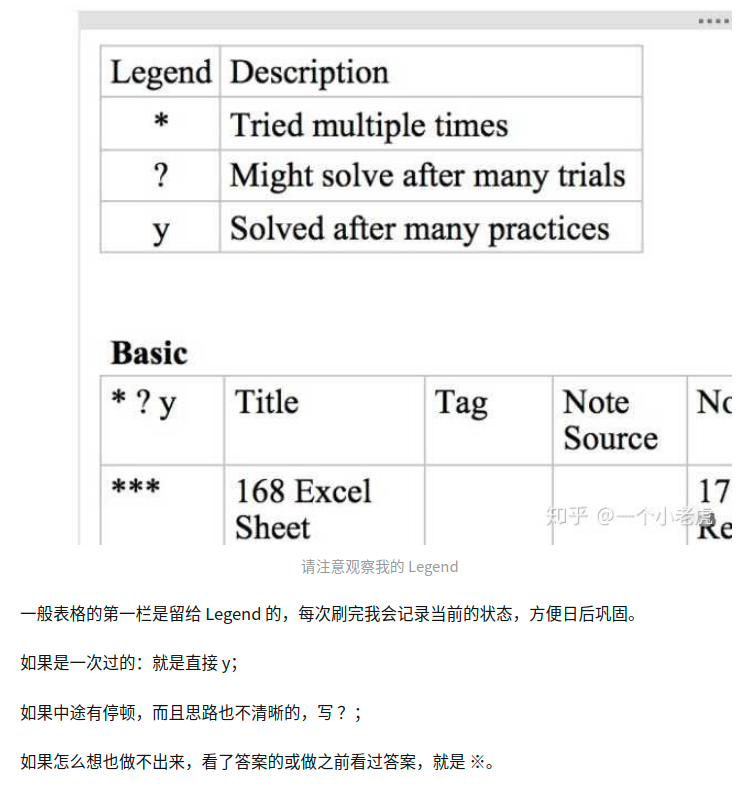

# GitHubPorn的回答
> https://www.zhihu.com/question/379857231
- 刷题两步
  - 第一步有思路，即知道用哪种姿势怎么解题；
  - 第二步是实现，即将你的思路转化为代码。（有了思路后自然而然的事情）

- 一开始别追求一题多解
- 一看到不会的，别马上搜答案。看别人的思路，不要去看别人的代码实现，真正有意义的是别人的思路，通过别人的思路来自己实现出现，这才是最应该做的。
- 题目不过是在某类解决办法方面做加法减法。
- 其实这个**不用刻意去追求一题多解的能力**，刷的专题多了，碰到的题目多了，自然而然你碰到一道题的时候脑袋里就会有想法，觉的可以这样做，也可以那样做，这个时候你就可以对比不同的时间复杂度和空间复杂度，选择当前的最优解法。

- **作总结**
- 分专题刷

- 在刷题的过程中，争取做到三件事：
  1. 当写出 AC 的代码时，思考为什么自己可以做到
  2. 当写出 AC 的代码时，思考能不能优化一些
  3. 是否用到了题目给出的所有条件

# 一个小老虎的回答
> https://www.zhihu.com/question/379857231

- 按类型刷
- 艾宾浩斯记忆曲线，不断重复刷过的题

<div align="center" style="zoom:60%"></div>

# labuladong
- https://labuladong.gitbook.io/algo/mu-lu-ye/xue-xi-shu-ju-jie-gou-he-suan-fa-de-gao-xiao-fang-fa
## 数据结构的存储
- 数据结构的存储方式只有两种：**数组（顺序存储）和链表（链式存储）**
- 散列表、栈、队列、堆、树、图等等各种数据结构，那些都属于「上层建筑」，而**数组和链表才是「结构基础」**。
  - **「队列」、「栈」**这两种数据结构既可以使用链表也可以使用数组实现。用**数组**实现，就要处理扩容缩容的问题；用**链表**实现，没有这个问题，但需要更多的内存空间存储节点指针。
  - **「图」** 的两种表示方法，**邻接表就是链表，邻接矩阵就是二维数组**。邻接矩阵判断连通性迅速，并可以进行矩阵运算解决一些问题，但是如果图比较稀疏的话很耗费空间。邻接表比较节省空间，但是很多操作的效率上肯定比不过邻接矩阵。
  - **「散列表」** 就是通过散列函数把键映射到一个大数组里。而且对于解决散列冲突的方法，**拉链法**需要链表特性，操作简单，但需要额外的空间存储指针；**线性探查法**就需要数组特性，以便连续寻址，不需要指针的存储空间，但操作稍微复杂些。
  - **「树」**，用**数组实现就是「堆」**，因为「堆」是一个完全二叉树，用数组存储不需要节点指针，操作也比较简单；**用链表实现就是很常见的那种「树」**，因为不一定是完全二叉树，所以不适合用数组存储。为此，在这种链表「树」结构之上，又衍生出各种巧妙的设计，比如二叉搜索树、AVL 树、红黑树、区间树、B 树等等，以应对不同的问题。


> 优缺点
```
数组由于是紧凑连续存储,可以随机访问，通过索引快速找到对应元素，而且相对节约存储空间。但正因为连续存储，内存空间必须一次性分配够，所以说数组如果要扩容，需要重新分配一块更大的空间，再把数据全部复制过去，时间复杂度 O(N)；而且你如果想在数组中间进行插入和删除，每次必须搬移后面的所有数据以保持连续，时间复杂度 O(N)。

链表因为元素不连续，而是靠指针指向下一个元素的位置，所以不存在数组的扩容问题；如果知道某一元素的前驱和后驱，操作指针即可删除该元素或者插入新元素，时间复杂度 O(1)。但是正因为存储空间不连续，你无法根据一个索引算出对应元素的地址，所以不能随机访问；而且由于每个元素必须存储指向前后元素位置的指针，会消耗相对更多的储存空间。
```

## 数据结构的基本操作
- 对于任何数据结构，其基本操作无非**遍历 + 访问**，再具体一点就是：**增删查改**。
- **数据结构种类很多，但它们存在的目的都是在不同的应用场景，尽可能高效地增删查改。**
- 遍历 + 访问无非两种形式：**线性的和非线性的**
  - **线性就是 for/while 迭代为代表，非线性就是递归为代表。**

- 所谓框架，就是套路。不管增删查改，这些代码都是永远无法脱离的结构，你可以把这个结构作为大纲，根据具体问题在框架上添加代码就行了。