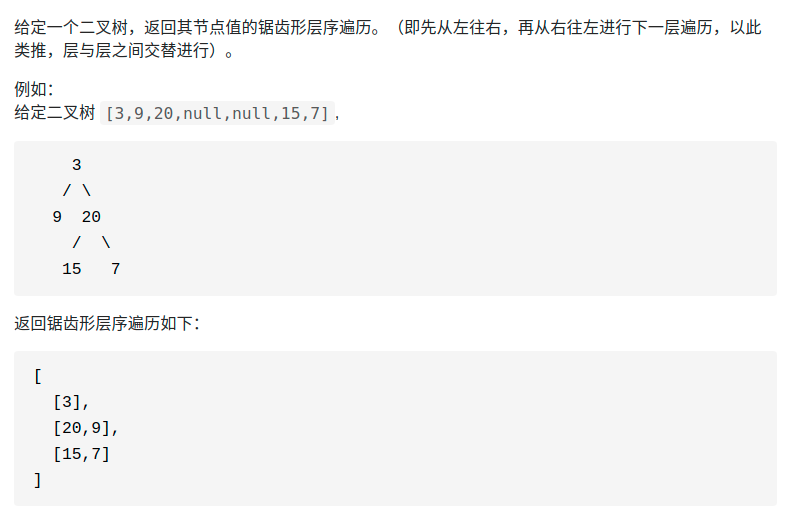

> 难度：简单
- 层序遍历改一下


> 题目
<div align="center" style="zoom:60%"></div>

> 代码

```cpp
class Solution {
public:
    vector<vector<int>> zigzagLevelOrder(TreeNode* root) {
        if(root == nullptr)
            return {};
        vector<vector<int>> res;
        list<TreeNode* > record;
        record.push_back(root);
        res.push_back({root->val});

        int flag = 1;
        while(!record.empty()){
            vector<int> temp;
            temp.clear();
            int num = record.size();
            if(flag == 1){
                flag = 0;
                while(num){
                    auto t = record.front();
                    record.pop_front();
                    if(t->right){
                        temp.push_back(t->right->val);
                        record.push_back(t->right);
                    }

                    if(t->left) {
                        temp.push_back(t->left->val);
                        record.push_back(t->left);
                    }
                    --num;
                }
            }else{
                flag = 1;
                while(num){
                    auto t = record.back();
                    record.pop_back();
                    if(t->left) {
                        temp.push_back(t->left->val);
                        record.push_front(t->left);
                    }

                    if(t->right){
                        temp.push_back(t->right->val);
                        record.push_front(t->right);
                    }
                    --num;
                }
            }
            if(!temp.empty())
                res.push_back(temp);

        }
        return res;
    }
};

```

```
执行用时：4 ms, 在所有 C++ 提交中击败了65.19%的用户
内存消耗：11.9 MB, 在所有 C++ 提交中击败了48.33%的用户
```