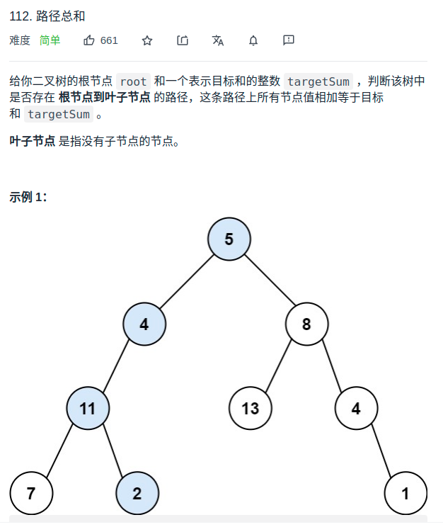

> 难度：简单
- 递归遍历

> 题目

<div align="center" style="zoom:80%"></div>

> 代码

```cpp
class Solution {
public:
    bool hasPathSum(TreeNode* root, int targetSum) {
        if(root == nullptr) return false;
        return dfs(root,targetSum);
    }
    bool dfs(TreeNode* root, int targetSum){
        if(root == nullptr)return false;
        if(targetSum == root->val && root->left == nullptr && root->right == nullptr)
            return true;
        return dfs(root->left, targetSum-root->val) || dfs(root->right, targetSum- root->val);
    }
};
```