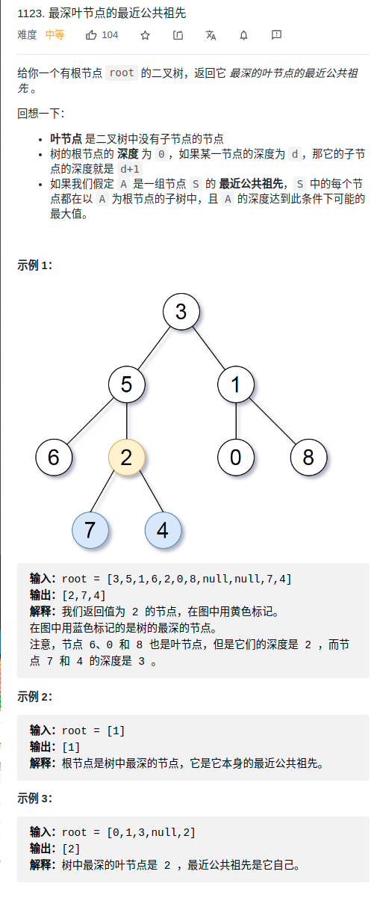

> 难度：中等
- （树的深度如何求）求树的深度，记录当前最大深度
- （如何记录路径）记录当前最大深度的路径
- （如何通过路径找到共同祖先）找最近公共祖先：多条路径中最后一个相同的节点
> 题目
<div align="center" style="zoom:0%"></div>

> 代码

```cpp
class Solution {
public:
    TreeNode* lcaDeepestLeaves(TreeNode* root) {
        dfs(root);
        if(record.size() == 1){
            return record[0].back();
        }
        for(int i = 0; i < record[0].size(); ++i){
            TreeNode* cmpBase = record[0][i];
            int j = 1;
            while( j < record.size()){
                if(cmpBase != record[j][i])
                    break;
                ++j;
            }

            if(record.size() != j)
                return record[0][i-1];
        }
        return record[0].back();
    }
    vector<vector<TreeNode*> > record;
    vector<TreeNode*> path;
    int curH=0, maxH = 0;
    // define: 遍历树，如果是叶子节点，并且是目前最大深度，则记录
    void dfs(TreeNode* root){
        if(!root) return;
        ++curH;
        path.push_back(root);
        dfs(root->left);
        dfs(root->right);
        --curH;

        if(root->left == nullptr && root->right == nullptr){
            // 如果是叶子节点
            if(curH == maxH){
                record.push_back(path);
            }else if(curH > maxH){
                maxH = curH;
                record.clear();
                record.push_back(path);
            }
        }
        path.pop_back();
    }
};
```