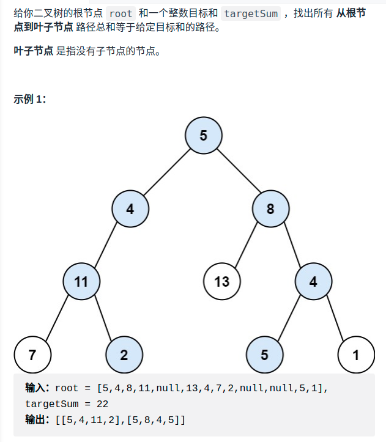

> 难度：简单
- 思路：选一种遍历模式，记录路径。动态更新targetSum（-root->val）

> 题目
<div align="center" style="zoom:80%"></div>

> 代码


```cpp
class Solution {
public:
    vector<int> curRecord;
    vector<vector<int>> res{};
    vector<vector<int>> pathSum(TreeNode* root, int targetSum) {
        if(root == nullptr) return {};
        dfs(root, targetSum);
        return res;
    }
    void dfs(TreeNode* root, int targetSum){
        if(root == nullptr) return;

        curRecord.push_back(root->val);
        dfs(root->left, targetSum - root->val);
        dfs(root->right, targetSum - root->val);

        if(root->left == nullptr && root->right == nullptr && targetSum == root->val){
            res.push_back(curRecord);
        }
        curRecord.pop_back();

    }
};
```