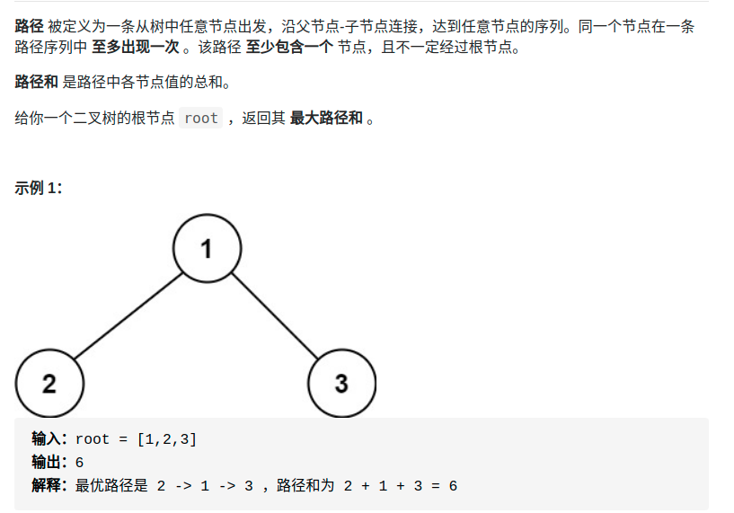

> 难度：中等
- 首先一看这种题目，就是dfs。
- 思考哪种遍历，并且定义dfs
  - dfs定义：如果父节点包含当前节点，则当前节点可以给父节点最多贡献多少
  - 在处理当前节点的时候，需要知道左右两个节点可以给当前节点最多贡献多少（递归），然后再进行判断是否结果更新（后序遍历），**之后返回包含该节点，并且从左右节点中选一个，让贡献值最大（只能选一个，因为不是最终根节点，不能分叉）**

> 题目
<div align="center" style="zoom:60%"></div>

- https://leetcode-cn.com/problems/binary-tree-maximum-path-sum/

> 代码

```cpp
class Solution {
public:
    int res = INT32_MIN;
    // 定义：后序遍历，返回包含该节点最多可以加成多少。注意返回时只能选择左边或者右边
    int dfs(TreeNode* root){
        if(root == nullptr)return 0;
        auto lrtn = dfs(root->left);
        auto rrtn = dfs(root->right);
        int rtn;

        if(lrtn <= 0 && rrtn <= 0)
            rtn = root->val;
        else if(lrtn > 0 && rrtn > 0){
            rtn = lrtn + rrtn + root->val;
        } else if(lrtn > 0){
            rtn = lrtn+ root->val;
        } else if(rrtn > 0){
            rtn = rrtn + root->val;
        }

        if(rtn > res){
            res = rtn;
        }
        if(lrtn > 0 && rrtn > 0){
            rtn -= lrtn < rrtn ? lrtn : rrtn;
        }
        return rtn;

    }
    int maxPathSum(TreeNode* root) {
        dfs(root);
        return res;
    }

};
```