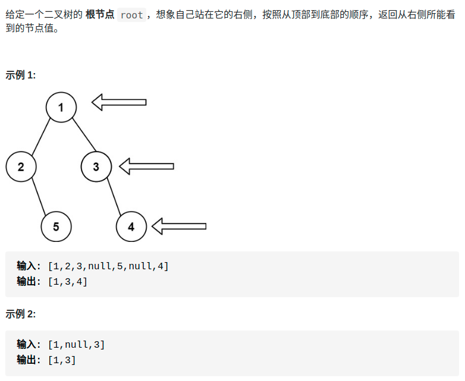

> 难度：简单
- 考树的遍历：递归

> 题目
<div align="center" style="zoom:80%"></div>

> 代码

```cpp

class Solution {
public:

    vector<int> res;
    int count = 0;
    vector<int> rightSideView(TreeNode* root) {
        if(root == nullptr) return {};

        rightView(root, 1);
        return res;
    }
    // 定义：先访问右子树，再访问左子树，如果当前的层数小于当前结果数量，则添加到结果集合
    // level现在的层数
    void rightView(TreeNode* root, int level){
        if(level > count){
            count++;
            res.push_back(root->val);
        }

        if(root->right != nullptr){
            rightView(root->right, level+1);
        }
        if(root->left != nullptr){
            rightView(root->left, level+1);
        }
    }
};
```