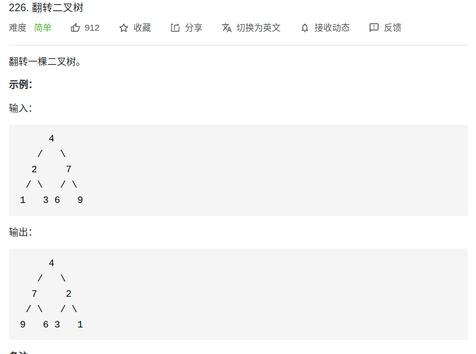

> 难度：简单
- 思路：递归
  - 关键在于翻转整棵树就是交换每个节点的左右子节点。（放在前序或者后序的位置都是可以的）

> 题目

<div align="center" style="zoom:60%"></div>

> 代码

```cpp
struct TreeNode {
    int val;
    TreeNode *left;
    TreeNode *right;
    TreeNode() : val(0), left(nullptr), right(nullptr) {}
    TreeNode(int x) : val(x), left(nullptr), right(nullptr) {}
    TreeNode(int x, TreeNode *left, TreeNode *right) : val(x), left(left), right(right) {}
};
TreeNode* init(){
    TreeNode* head = new TreeNode(4);
    head->left = new TreeNode(2);
    head->right = new TreeNode(7);

    head->left->left = new TreeNode(1);
    head->left->right = new TreeNode(3);
    head->right->left = new TreeNode(6);
    head->right->right = new TreeNode(9);
}
class Solution {
public:
    // 定义：返回翻转后的树的根节点
    TreeNode* invertTree(TreeNode* root) {
        // base case
        if(root == nullptr) return nullptr;
        auto l = invertTree(root->left);
        auto r = invertTree(root->right);

        // 后序遍历
        root->left = r;
        root->right = l;
        return root;
    }
};
```

```
执行用时：4 ms, 在所有 C++ 提交中击败了57.07%的用户
内存消耗：9.4 MB, 在所有 C++ 提交中击败了83.47%的用户
```
