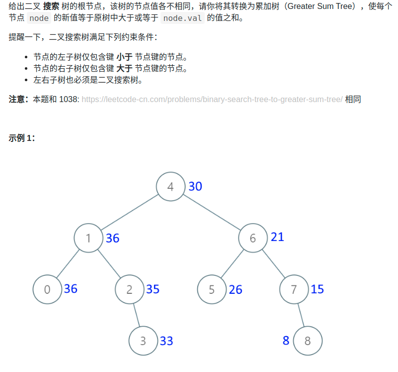

> 难度：简单
- 思路：二叉搜索时树中序遍历有序
  - https://mp.weixin.qq.com/s/ioyqagZLYrvdlZyOMDjrPw


> 题目
<div align="center" style="zoom:80%"></div>


> 代码

```cpp
class Solution {
public:
    int sum = 0;
    TreeNode* convertBST(TreeNode* root) {
        if(root == nullptr) return nullptr;
        convertBST(root->right);

        /** 中序遍历*/
        sum += root->val;
        root->val = sum;
        
        convertBST(root->left);
        return root;
    }
};
```
