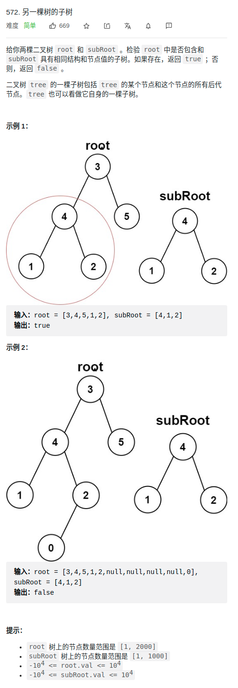

> 难度：简单
- 思路：序列化+后序遍历
  - 将待匹配的子树序列化成s1，之后通过后序遍历和s1匹配

> 题目

<div align="center" style="zoom:80%"></div>


> 代码

```cpp
class Solution {
public:
    static constexpr char null = '#';
    string subStr = "";
    bool isSubtree(TreeNode* root, TreeNode* subRoot) {
        // idea: 后序遍历
        subStr = toString(subRoot);
        return dfs(root) == subStr;

    }

    string toString(TreeNode* root){
        if(root == nullptr) return string(1,null);
        return toString(root->left) + ',' + toString(root->right) + ',' + to_string(root->val);
    }

    // def：如果成功，返回 subStr
    string dfs(TreeNode* root){
        if(root == nullptr) return "#";
        auto lres =  dfs(root->left);
        if(lres == subStr) return subStr;
        auto rres = dfs(root->right);
        if(rres == subStr) return subStr;
        return lres + ',' + rres + ',' + to_string(root->val);
    }

};
```