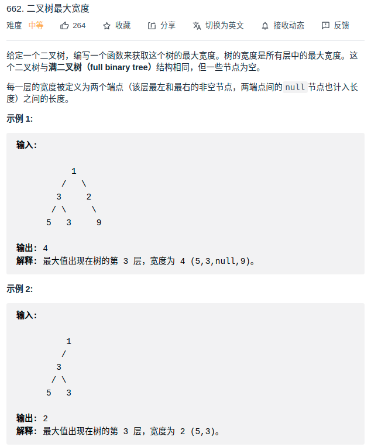

> 难度：中等
- 思路：层序遍历+给节点计数
  - 给每个节点一个 `position` 值，如果我们走向左子树，那么 `position -> position * 2`，如果我们走向右子树，那么 `position -> positon * 2 + 1`。
  - 当我们在看同一层深度的位置值 `L` 和 `R` 的时候，宽度就是 `R - L + 1`。


> 题目

<div align="center" style="zoom:80%"></div>

> 代码

```cpp
class Solution {
public:
    int widthOfBinaryTree(TreeNode* root) {
        if(root == nullptr) return 0;
        int res = 0;
        int pad = 0;
        queue<TreeNode*> que;

        root->val = 1;
        que.push(root);

        while(!que.empty()){
            res = max(res, que.back()->val - que.front()->val + 1);

            int n = que.size();
            pad = que.front()->val; // 重点：将最左边节点，从0开始计数
            while(n){
                auto node = que.front();
                que.pop();
                node->val -= pad;
                if(node->left != nullptr) {
                    node->left->val = node->val * 2 ;
                    que.push(node->left);
                }
                if(node->right != nullptr){
                    node->right->val = node->val * 2 + 1;
                    que.push(node->right);
                }
                --n;
            }
        }
        return res;
    }
};
```