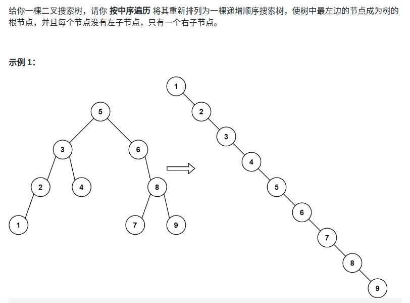

> 难度：简单
- 中序遍历
> 题目
<div align="center" style="zoom:60%"></div>

> 代码

```cpp
class Solution {
public:
    TreeNode* pre = nullptr;
    TreeNode* res = nullptr;
    TreeNode* increasingBST(TreeNode* root) {
        if(root == nullptr) return nullptr;
        increasingBST(root->left);

        if(res == nullptr) res = root;
        root->left = nullptr;
        if(pre != nullptr){
            pre->right = root;
        }

        pre = root;
        increasingBST(root->right);
        return res;
    }
};
```
```
执行用时：0 ms, 在所有 C++ 提交中击败了100.00%的用户
内存消耗：7.3 MB, 在所有 C++ 提交中击败了97.08%的用户
```