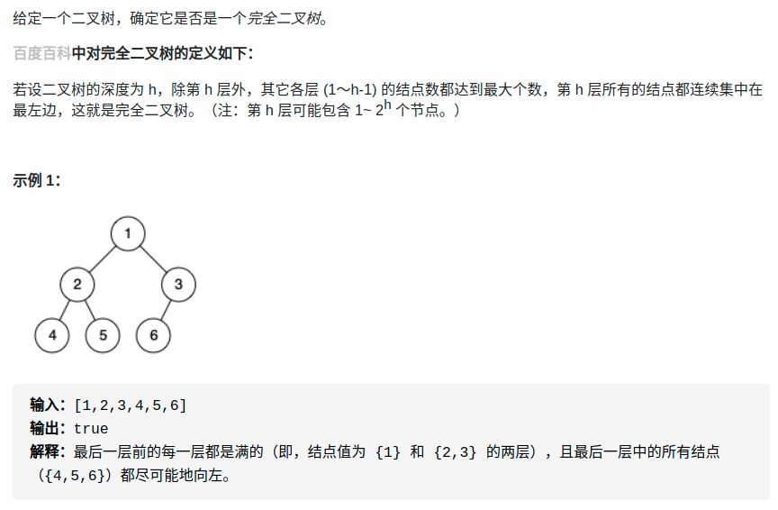

> 难度：简单
- 层序遍历

> 题目
- https://leetcode-cn.com/problems/check-completeness-of-a-binary-tree/
<div align="center" style="zoom:80%"></div>

> 代码

```cpp
class Solution {
public:
    bool isCompleteTree(TreeNode* root) {
        queue<TreeNode*> que;
        bool flag = true;
        que.push(root);

        while(!que.empty()){
            int n = que.size();
            while (n){
                auto t = que.front();
                que.pop();
                if(t->left != nullptr){
                    if(!flag)
                        return false;
                    que.push(t->left);
                }else{
                    flag = false;
                }
                if(t->right != nullptr){
                    if(!flag)
                        return false;
                    que.push(t->right);
                }else{
                    flag = false;
                }
                --n;
            }
        }
        return true;
    }
};
```