- [参考:](#参考)
- [二叉树](#二叉树)
  - [概述：递归使用](#概述递归使用)
    - [递归的秘诀](#递归的秘诀)
  - [练手题目](#练手题目)
    - [leetcode114. 二叉树展开为链表](#leetcode114-二叉树展开为链表)
    - [leetcode116. 填充每个节点的下一个右侧节点指针](#leetcode116-填充每个节点的下一个右侧节点指针)
    - [*leetcode652.寻找重复的子树](#leetcode652寻找重复的子树)
    - [662. 二叉树最大宽度](#662-二叉树最大宽度)
  - [已知前序和中序（后序和中序）构造二叉树](#已知前序和中序后序和中序构造二叉树)
    - [leetcode105.从前序与中序遍历序列构造二叉树](#leetcode105从前序与中序遍历序列构造二叉树)
  - [框架](#框架)
    - [前序遍历框架](#前序遍历框架)
    - [中序遍历框架](#中序遍历框架)
    - [后序遍历框架](#后序遍历框架)
    - [层序遍历框架](#层序遍历框架)
  - [序列化](#序列化)
    - [前序序列化](#前序序列化)
    - [后序序列化](#后序序列化)
    - [层序序列化](#层序序列化)
  - [二叉树的节点数](#二叉树的节点数)
    - [普通二叉树](#普通二叉树)
    - [满二叉树](#满二叉树)
    - [完全二叉树](#完全二叉树)
  - [最近公共祖先LCA](#最近公共祖先lca)
  - [二叉树的深度](#二叉树的深度)
    - [平衡二叉树判断](#平衡二叉树判断)
- [二叉搜索树](#二叉搜索树)
  - [参考](#参考-1)
  - [概述](#概述)
  - [合法性判断](#合法性判断)
  - [遍历](#遍历)
  - [查询](#查询)
  - [*插入](#插入)
  - [删除](#删除)
  - [*给定n个节点，求多少种不同的 BST 结构](#给定n个节点求多少种不同的-bst-结构)
  - [leetcode1373:二叉搜索子树的最大键值和](#leetcode1373二叉搜索子树的最大键值和)

- 注：labuladong的已经完全归纳——20210911
# 参考:
- 手把手带你刷二叉树（第一期）：https://labuladong.gitbook.io/algo/mu-lu-ye-1/mu-lu-ye-1/er-cha-shu-xi-lie-1
- 手把手带你刷二叉树（第二期）：https://mp.weixin.qq.com/s/OlpaDhPDTJlQ5MJ8tsARlA
- 手把手带你刷二叉树（第三期）：https://mp.weixin.qq.com/s/LJbpo49qppIeRs-FbgjsSQ
# 二叉树
## 概述：递归使用

- 递归是基础
### 递归的秘诀
- 写递归算法的关键是要**明确函数的「定义」** 是什么，然后**相信这个定义**，利用这个定义推导最终结果，**绝不要跳入递归的细节**.
- **写树相关的算法，简单说就是，先搞清楚当前 root 节点该做什么，然后根据函数定义递归调用子节点，** 递归调用会让孩子节点做相同的事情。
- **二叉树的问题难点在于，如何把题目的要求细化成每个节点需要做的事情**（leetcode116）

## 练手题目
- 226.翻转二叉树（简单）
- 114.二叉树展开为链表（中等）
- 116.填充每个节点的下一个右侧节点指针（中等）
- 654.最大二叉树（中等）
- 105.从前序与中序遍历序列构造二叉树（中等）
- 106.从中序与后序遍历序列构造二叉树（中等）
- 652.寻找重复的子树（中等）

### leetcode114. 二叉树展开为链表
- https://leetcode-cn.com/problems/flatten-binary-tree-to-linked-list/
<div align="center" style="zoom:60%">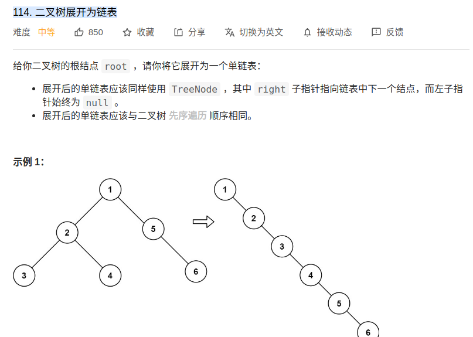</div>

- 思路：
  - 定义递归：`void flatten(TreeNode* root)`
    - 传入一个根节点，将该根节点的树变成一个单链表
    - 内部实现：将左子树变成单链表，将右子树变成单链表====>将右子树的链表接到左子树后面


### leetcode116. 填充每个节点的下一个右侧节点指针
- https://leetcode-cn.com/problems/populating-next-right-pointers-in-each-node/
```cpp
struct Node {
  int val;
  Node *left;
  Node *right;
  Node *next;
}
```
<div align="center" style="zoom:60%">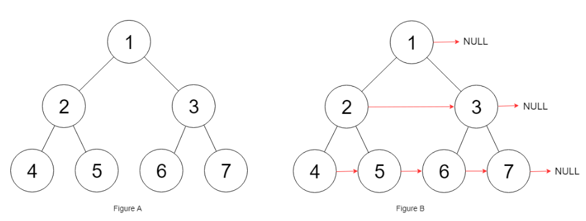</div>

```
输入：root = [1,2,3,4,5,6,7]
输出：[1,#,2,3,#,4,5,6,7,#]
解释：给定二叉树如图 A 所示，你的函数应该填充它的每个 next 指针，以指向其下一个右侧节点，如图 B 所示。序列化的输出按层序遍历排列，同一层节点由 next 指针连接，'#' 标志着每一层的结束。
```

- 思路
  - 递归定义：`void connectTwoNode(Node* node1, Node* node2)`
    - 输入left、right两个根节点,将以他们为根的树之间的next连接好。
    - 内部实现：
      1. 将left和right连接起来
      2. 将以left下左右孩子节点为根的树之间的next连接好（递归）
      3. 将以right下左右孩子节点为根的树之间的next连接好（递归）
      4. 将以left下右孩子节点和right下左孩子节点为根的树之间的next连接好（递归）

### *leetcode652.寻找重复的子树
- 对后序遍历有更深体会
<div align="center" style="zoom:60%"></div>


- 思考过程
  - 先思考，对于某一个节点，它应该做什么
    - 知道以自己为根的树是什么样的——**序列化**
      - 前提：需要知道自己的左右子树是什么样的——**后序遍历**
    - 对比有没有和其他的子树重复
      - 前提：需要知道别人都长什么样子——**`map<string, int>`**,**记录每颗子树出现次数**
  - 序列化的同时收集结果。避免递归中使用递归
```cpp
class Solution {
public:
    // 定义：
    vector<TreeNode*> res;
    map<string, TreeNode*> mst;
    vector<TreeNode*> findDuplicateSubtrees(TreeNode* root) {

        if(root == nullptr) return res;
        traverse(root);
        return res;
    }
    string traverse(TreeNode* root){
        if(root == nullptr) return "#";
        string rtn;
        rtn += traverse(root->left) + ",";
        rtn += traverse(root->right)+ ",";
        rtn += to_string(root->val);
        /** 后序遍历位置*/
        if(mst.find(rtn) == mst.end()) {
            mst[rtn] = root;
        }else{
            if(mst[rtn] != nullptr) {
                res.push_back(mst[rtn]);
                mst[rtn] = nullptr;
            }
        }

        return rtn;
    }
};
```

### 662. 二叉树最大宽度

<div align="center" style="zoom:80%"></div>

- 思路：层序遍历+给节点计数
  - 给每个节点一个 `position` 值，如果我们走向左子树，那么 `position -> position * 2`，如果我们走向右子树，那么 `position -> positon * 2 + 1`。
  - 当我们在看同一层深度的位置值 `L` 和 `R` 的时候，宽度就是 `R - L + 1`。


```cpp
class Solution {
public:
    int widthOfBinaryTree(TreeNode* root) {
        if(root == nullptr) return 0;
        int res = 0;
        int pad = 0;
        queue<TreeNode*> que;

        root->val = 1;
        que.push(root);

        while(!que.empty()){
            res = max(res, que.back()->val - que.front()->val + 1);

            int n = que.size();
            pad = que.front()->val; // 重点：将最左边节点，从0开始计数
            while(n){
                auto node = que.front();
                que.pop();
                node->val -= pad;
                if(node->left != nullptr) {
                    node->left->val = node->val * 2 ;
                    que.push(node->left);
                }
                if(node->right != nullptr){
                    node->right->val = node->val * 2 + 1;
                    que.push(node->right);
                }
                --n;
            }
        }
        return res;
    }
};
```

## 已知前序和中序（后序和中序）构造二叉树
- 105.从前序与中序遍历序列构造二叉树（中等）
- 106.从中序与后序遍历序列构造二叉树（中等）


- 思路：**要想办法确定根节点的值，把根节点做出来，然后递归构造左右子树即可**
- 做二叉树的问题，关键是把题目的要求细化，搞清楚根节点应该做什么，然后剩下的事情抛给前/中/后序的遍历框架就行了

### leetcode105.从前序与中序遍历序列构造二叉树
- 106.从中序与后序遍历序列构造二叉树（中等）
  - 思路一样的

- 思路
  - 递归定义：输入前序和后序的序列以及范围，然后根据该范围返回一颗树。
    - 递归函数：`TreeNode* build(vector<int>& preorder, int preStart, int preEnd,vector<int>& inorder, int inStart, int inEnd)`
    - 步骤（见图）
      1. 传入左子树范围，构造左子树
      2. 传入右子树范围，构造右子树
      3. 根节点连接左右子树
<div align="center" style="zoom:60%">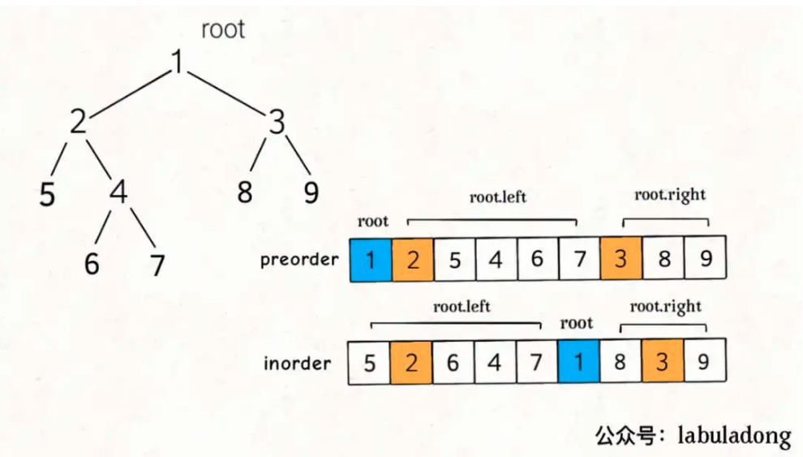</div>

> 模板
- 根据画图，填补`?`的内容
```cpp
/* 主函数 */
TreeNode buildTree(int[] preorder, int[] inorder) {
    return build(preorder, 0, preorder.length - 1,
                 inorder, 0, inorder.length - 1);
}
TreeNode
/* 
   若前序遍历数组为 preorder[preStart..preEnd]，
   后续遍历数组为 postorder[postStart..postEnd]，
   构造二叉树，返回该二叉树的根节点 
*/
TreeNode build(int[] preorder, int preStart, int preEnd, 
               int[] inorder, int inStart, int inEnd) {
    // base case
    if(preStart > preEnd) return nullptr;
    // root 节点对应的值就是前序遍历数组的第一个元素
    int rootVal = preorder[preStart];
    // rootVal 在中序遍历数组中的索引
    int index = 0;
    for (int i = inStart; i <= inEnd; i++) {
        if (inorder[i] == rootVal) {
            index = i;
            break;
        }
    }

    TreeNode root = new TreeNode(rootVal);
    // 递归构造左右子树
    root.left = build(preorder, ?, ?,
                      inorder, ?, ?);

    root.right = build(preorder, ?, ?,
                       inorder, ?, ?);
    return root;
}
```
```cpp
int leftSize = index - inStart;

root.left = build(preorder, preStart + 1, preStart + leftSize,
                  inorder, inStart, index - 1);

root.right = build(preorder, preStart + leftSize + 1, preEnd,
                   inorder, index + 1, inEnd);
```


## 框架
- 非递归代码：https://blog.csdn.net/sgbfblog/article/details/7773103
- 二叉树就那几个框架：https://mp.weixin.qq.com/s?__biz=MzAxODQxMDM0Mw==&mid=2247485871&idx=1&sn=bcb24ea8927995b585629a8b9caeed01&chksm=9bd7f7a7aca07eb1b4c330382a4e0b916ef5a82ca48db28908ab16563e28a376b5ca6805bec2&scene=21#wechat_redirect
- 以二叉树的**序列化**为引子
- **所谓的序列化不过就是把结构化的数据「打平」，其实就是在考察二叉树的遍历方式**。
### 前序遍历框架
> 框架
```cpp
void traverse(TreeNode* root) {
    // base case
    if (root == null) return;

    // 前序遍历的代码
    traverse(root.left);
    traverse(root.right);
}
```

> 非递归
- 思路：大方向为弹栈即访问
  - init：将root入栈
  - while：
    - 弹栈访问。**将右节点入栈，再将左节点入栈**
    - 栈为空退出
```cpp
void preOrderIter(struct node *root)
{
    if (root == NULL) return;
    stack<struct node *> s;
    s.push(root);
    while (!s.empty()) {
        struct node *nd = s.top();
        cout << nd->data << " ";
        s.pop();
        // 重点：先放右节点
        if (nd->right != NULL)
            s.push(nd->right);
        if (nd->left != NULL)
            s.push(nd->left);
    }
    cout << endl;
}
```

### 中序遍历框架
> 框架
```cpp
void traverse(TreeNode root) {
    if (root == null) return;
    traverse(root.left);

    // 中序遍历的代码

    traverse(root.right);

}
```
> 非递归
- 思路：大方向为弹栈即访问
  - init：root指向根节点
  - while：
    - 如果root不为null --> 将root入栈 --> root = root->left
    - 如果root为null --> 出栈即访问（root = s.top()） --->  root = root->right
```cpp
void inOrderIter(struct node *root)
{
    stack<struct node *> s;
    while (root != NULL || !s.empty()) {
        if (root != NULL) {
            s.push(root);
            root = root->left;
        }
        else {
            root = s.top();
            cout << root->data << " ";  //访问完左子树后才访问根结点
            s.pop();
            root = root->right;        //访问右子树
        }
    }
    cout << endl;
}
```


### 后序遍历框架
> 框架
```cpp
void traverse(TreeNode root) {
    if (root == null) return;
    traverse(root.left);
    traverse(root.right);

    // 后序遍历的代码
}
```
> 非递归：双栈
- 特解
```cpp
void postOrderIter(struct node *root)
{
    if (!root) return;

    // output：pop之后就是后序遍历的顺序了
    stack<struct node*> s, output;
    s.push(root);
    while (!s.empty()) {
        struct node *curr = s.top();
        output.push(curr);
        s.pop();

        // 重点：先放左边再放右边
        if (curr->left)
            s.push(curr->left);
        if (curr->right)
            s.push(curr->right);
    }
    
    while (!output.empty()) {
        cout << output.top()->data << " ";
        output.pop();
    }
    cout << endl;
}
```

> 非递归：单栈
- pop+条件成立即访问（上一次访问为右子节点）

```cpp
class Solution {
    List<Integer> ans = new ArrayList<>();
    public List<Integer> postorderTraversal(TreeNode root) {
        Stack<TreeNode> s = new Stack<>();
        TreeNode cur = root;  
        TreeNode pre = null;  // 用于记录上一次访问的节点
        while(cur!=null || !s.isEmpty()) {
            while(cur!=null) {
                s.push(cur);
                cur = cur.left;
            }
            if(!s.isEmpty()) {
                cur = s.pop();
                if(cur.right==null || pre==cur.right) { // 访问节点的条件
                    ans.add(cur.val); // 访问
                    pre = cur; // 这一步是记录上一次访问的节点
                    cur = null; // 此处为了跳过下一次循环的访问左子节点的过程，直接进入栈的弹出阶段，因为但凡在栈中的节点，它们的左子节点都肯定被经过且已放入栈中。
                }
                else { // 不访问节点的条件
                    s.push(cur); // 将已弹出的根节点放回栈中
                    cur = cur.right; // 经过右子节点
                }
            }
        }
        return ans;
    }
}
```

### 层序遍历框架
- 下面是不需要记录当前层级的解法
```cpp
void traverse(TreeNode root) {
    if (root == null) return;
    // 初始化队列，将 root 加入队列
    Queue<TreeNode> q = new LinkedList<>();
    q.pushback(root);

    while (!q.isEmpty()) {
        TreeNode cur = q.popfront();

        /* 层级遍历代码位置 */
        System.out.println(root.val);
        /*****************/

        if (cur.left != null) {
            q.pushback(cur.left);
        }

        if (cur.right != null) {
            q.pushback(cur.right);
        }
    }
}
```
- 记录当前层级的做法
```cpp
void traverse(TreeNode root) {
    if (root == null) return;
    // 初始化队列，将 root 加入队列
    Queue<TreeNode> q = new LinkedList<>();
    q.pushback(root);

    while (!q.isEmpty()) {
        int num = q.size();
        while(num > 0){
            TreeNode cur = q.popfront();

            /* 层级遍历代码位置 */
            System.out.println(root.val);
            /*****************/

            if (cur.left != null) {
                q.pushback(cur.left);
            }

            if (cur.right != null) {
                q.pushback(cur.right);
            }
            --num;
        }
        
    }
}
```


## 序列化
- https://mp.weixin.qq.com/s/DVX2A1ha4xSecEXLxW_UsA
- 297.二叉树的序列化与反序列化:https://leetcode-cn.com/problems/serialize-and-deserialize-binary-tree/

```cpp
class Codec {

    // 把一棵二叉树序列化成字符串
    string serialize(TreeNode* root) {}

    // 把字符串反序列化成二叉树
    TreeNode* deserialize(string data) {}
    // 下面的形式好处理些,可以通过deserialize调用_deserialize
    // TreeNode* _deserialize(list<char>& data)
}
```
- 预定义
  - 空节点：`#`
  - 分隔：`，`

### 前序序列化
<div align="center" style="zoom:60%">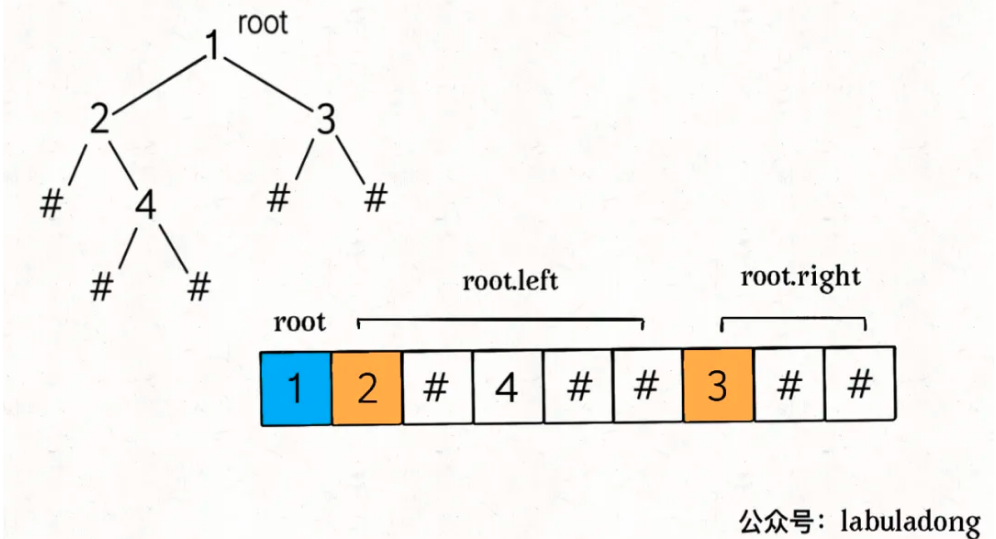</div>

- 序列化：`string serialize(TreeNode* root)`    
  - 递归定义：将root为根的节点序列化为字符串返回。
  - 内部实现：
    1. 先序列化左子树
    2. 再序列化右子树
    3. 根+左串+右串
- 反序列化：`TreeNode* _deserialize(list<string>& data)`
  - 递归定义：通过`data`链表，构建二叉树
  - 内部实现：
    1. 取走`data`链表的第一个，生成根节点
    2. 调用`_deserialize`构造左子树
    3. 调用`_deserialize`构造右子树
    4. 根节点和左子树和右子树连接
 
> 代码
- 序列化
```cpp
String SEP = ",";
String NULL = "#";

/* 主函数，将二叉树序列化为字符串 */
String serialize(TreeNode root) {
    StringBuilder sb = new StringBuilder();
    serialize(root, sb);
    return sb.toString();
}

/* 辅助函数，将二叉树存入 StringBuilder */
void serialize(TreeNode root, StringBuilder sb) {
    if (root == null) {
        sb.append(NULL).append(SEP);
        return;
    }

    /****** 前序遍历位置 ******/
    sb.append(root.val).append(SEP);
    /***********************/

    serialize(root.left, sb);
    serialize(root.right, sb);
}
```
- 反序列化
```cpp
/* 主函数，将字符串反序列化为二叉树结构 */
TreeNode deserialize(String data) {
    // 将字符串转化成列表
    LinkedList<String> nodes = new LinkedList<>();
    for (String s : data.split(SEP)) {
        nodes.addLast(s);
    }
    return deserialize(nodes);
}

/* 辅助函数，通过 nodes 列表构造二叉树 */
TreeNode deserialize(LinkedList<String> nodes) {
    if (nodes.isEmpty()) return null;

    /****** 前序遍历位置 ******/
    // 列表最左侧就是根节点
    String first = nodes.removeFirst();
    if (first.equals(NULL)) return null;
    TreeNode root = new TreeNode(Integer.parseInt(first));
    /***********************/

    root.left = deserialize(nodes);
    root.right = deserialize(nodes);

    return root;
}
```

### 后序序列化
- 序列化：`string serialize(TreeNode* root)`    
  - 递归定义：将root为根的节点序列化为字符串返回。
  - 内部实现：
    1. 先序列化左子树
    2. 再序列化右子树
    3. 左串+右串+根
- 反序列化：`TreeNode* _deserialize(list<string>& data)`
  - 递归定义：通过`data`链表，构建二叉树
  - 内部实现：（先右子树再左子树）
    1. 取走`data`的最后一个，生成根节点
    2. 调用`_deserialize`构造**右子树**
    3. 调用`_deserialize`构造**左子树**
    4. 根节点和左子树和右子树连接


### 层序序列化
<div align="center" style="zoom:60%">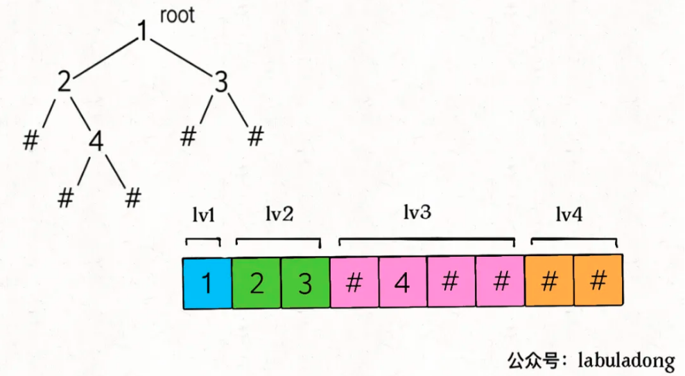</div>

- 序列化：层序遍历框架（队列）
- 反序列化：利用队列（存非null节点），利用一个pos记录再序列化后的链表中的位置

> 代码
```cpp
/* 将字符串反序列化为二叉树结构 */
TreeNode deserialize(String data) {
    if (data.isEmpty()) return null;
    String[] nodes = data.split(SEP);
    // 第一个元素就是 root 的值
    TreeNode root = new TreeNode(Integer.parseInt(nodes[0]));

    // 队列 q 记录父节点，将 root 加入队列
    Queue<TreeNode> q = new LinkedList<>();
    q.offer(root);

    for (int i = 1; i < nodes.length; ) {
        // 队列中存的都是父节点
        TreeNode parent = q.poll();
        // 父节点对应的左侧子节点的值
        String left = nodes[i++];
        if (!left.equals(NULL)) {
            parent.left = new TreeNode(Integer.parseInt(left));
            q.offer(parent.left);
        } else {
            parent.left = null;
        }
        // 父节点对应的右侧子节点的值
        String right = nodes[i++];
        if (!right.equals(NULL)) {
            parent.right = new TreeNode(Integer.parseInt(right));
            q.offer(parent.right);
        } else {
            parent.right = null;
        }
    }
    return root;
}
```

## 二叉树的节点数
- 参考：https://labuladong.gitbook.io/algo/mu-lu-ye-1/mu-lu-ye-1/wan-quan-er-cha-shu-jie-dian-shu
- 一棵完全二叉树的两棵子树，至少有一棵是满二叉树

<div align="center" style="zoom:0%">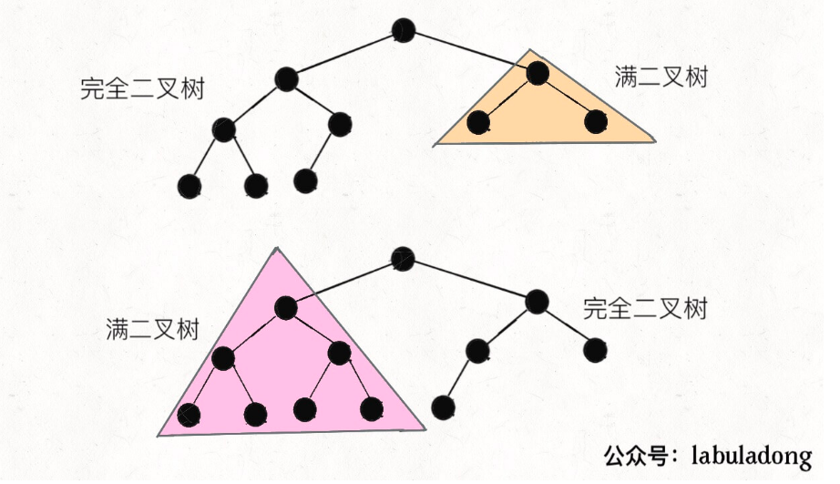</div>


### 普通二叉树
- O(N)
```cpp
class Solution {
public:
    int countNodes(TreeNode* root) {
        // base case
        if(root == nullptr) return 0;

        auto lres = countNodes(root->left);
        auto rres = countNodes(root->right);
        /**后序*/
        return 1 + lres + rres;
    }
};
```


### 满二叉树
O(logN)
```cpp
class Solution {
public:
    int countNodes(TreeNode* root) {
        // base case
        if(root == nullptr) return 0;

        // 左边边
        int hl = 0;
        TreeNode* ln = root;
        while(ln != nullptr){
            ln = ln->left;
            ++hl;
        }
        return pow(2, hr)-1;        
    }
};
```
### 完全二叉树
- O(logN*logN)
```cpp
class Solution {
public:
    int countNodes(TreeNode* root) {
        // base case
        if(root == nullptr) return 0;

        // 左边边
        int hl = 0;
        TreeNode* ln = root;
        while(ln != nullptr){
            ln = ln->left;
            ++hl;
        }
        // 右边边
        int hr = 0;
        TreeNode* rn = root;
        while(rn != nullptr){
            rn = rn->right;
            ++hr;
        }
        // man二叉树
        if(hr == hl){
            return pow(2, hr)-1;
        }

        return countNodes(root->left) + countNodes(root->right) + 1;
    }
};
```
## 最近公共祖先LCA
- https://leetcode-cn.com/problems/lowest-common-ancestor-of-a-binary-tree/
- 参考：https://mp.weixin.qq.com/s/9RKzBcr3I592spAsuMH45g
  - 这个对递归的理解可以加深。
  - **前序遍历可以理解为是从上往下，而后序遍历是从下往上**，这道题选后序遍历

遇到任何递归型的问题，无非就是灵魂三问：
1. 这个函数是干嘛的？
2. 这个函数参数中的变量是什么的是什么？
3. 得到函数的递归结果，你应该干什么？
<div align="center" style="zoom:0%">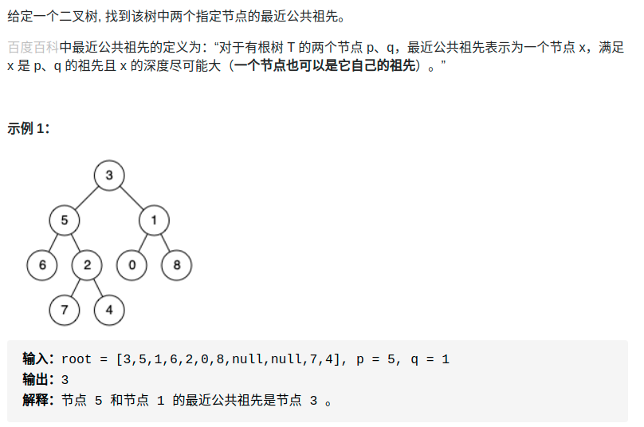</div>

- 思路：
  - 得到p的路线和q的路线——序列化(类似)
  - **从根节点出发第一个不同的就为最近公共祖先**
```cpp
class Solution {
public:
    TreeNode* lowestCommonAncestor(TreeNode* root, TreeNode* p, TreeNode* q) {
        vector<TreeNode*> rcp;
        vector<TreeNode*> rcq;
        bool pres = false, qres =  false;
        find(root, p, rcp, pres);
        find(root, q, rcq, qres);

        // 找最近的
        int posp = rcp.size()-1;
        int posq = rcq.size()-1;
        while(posp >= 0 && posq >= 0){
            if(rcp[posp] == rcq[posq]){
                --posp;
                --posq;
            } else{
                break;
            }
        }
        return rcp[posp+1];
    }

    bool find(TreeNode* root, TreeNode* target, vector<TreeNode*> &record, bool &res){
        // 剪枝
        if(root == nullptr || res) return res;

        if(root->val == target->val) {
            record.push_back(root);
            return true;
        }
        // 剪枝
        res = res || find(root->left, target, record, res) ;
        res = res || find(root->right, target, record, res)  ;
        if(res){
            record.push_back(root);
        }
        return res;
    }
};
```

## 二叉树的深度
<div align="center" style="zoom:80%">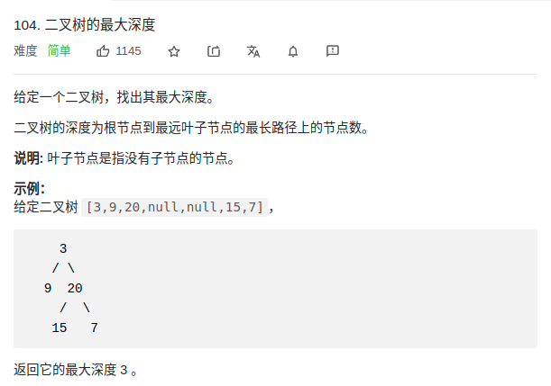</div>

```cpp
class Solution {
public:
    int maxDepth(TreeNode* root) {
        if(root == nullptr) return 0;
        return max(maxDepth(root->left), maxDepth(root->right))+1;
    }
};
```

### 平衡二叉树判断
<div align="center" style="zoom:0%">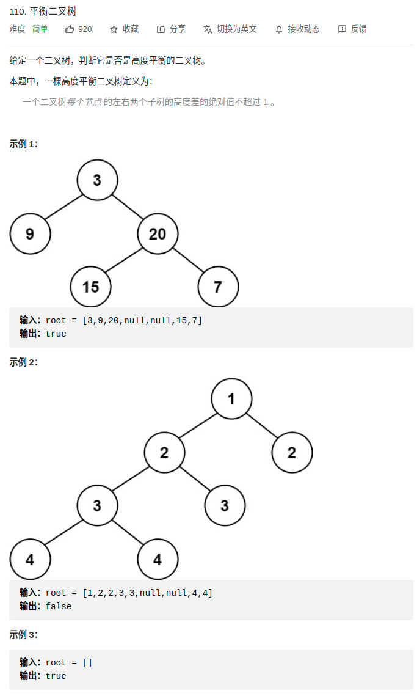</div>

```cpp
class Solution {
public:
    // 返回树的高度，如果不是平衡的返回-1
    int depth(TreeNode* root){
        if(root == nullptr) return 0;
        int leftv = depth(root->left);
        if(leftv == -1) return -1;
        int rightv = depth(root->right);
        if(rightv == -1) return -1;
        if(abs(leftv - rightv) >=2){
            return -1;
        }
        return max(leftv, rightv)+1;
    }
    bool isBalanced(TreeNode* root) {
        
        return depth(root) != -1;
    }
};
```

# 二叉搜索树
## 参考
- 手把手刷二叉搜索树（第一期）：https://mp.weixin.qq.com/s/ioyqagZLYrvdlZyOMDjrPw
- 手把手刷二叉搜索树（第二期）：https://mp.weixin.qq.com/s/SuGAvV9zOi4viaeyjWhzDw
- 手把手刷二叉搜索树（第三期）：https://labuladong.gitbook.io/algo/mu-lu-ye-1/mu-lu-ye-1/bst3
## 概述
- 定义：对于 BST 的每一个节点 `node`，左子树节点的值都比 `node` 的值要小，右子树节点的值都比 `node` 的值大。
- 如果当前节点要做的事情需要通过左右子树的计算结果推导出来，就要用到**后序遍历**。
  - 参考：https://labuladong.gitbook.io/algo/mu-lu-ye-1/mu-lu-ye-1/hou-xu-bian-li
  - 味道：用前序的时候，可能递归中有递归
  - leetcode1373

- **BST 的中序遍历结果是有序的（升序）**
  - leetcode230 :解题的关键，但不是最高效。利用「BST 中序遍历就是升序排序结果」这个性质，每次寻找第k小的元素都要中序遍历一次，最坏的时间复杂度是`O(N)`，`N`是 BST 的节点个数
    - https://leetcode-cn.com/problems/kth-smallest-element-in-a-bst/
    - 要知道 BST 性质是非常牛逼的，像红黑树这种改良的自平衡 BST，增删查改都是`O(logN)`的复杂度，让你算一个第`k`小元素，时间复杂度竟然要`O(N)`，有点低效了。
    - leetcode230也可以有更高效的解法，不过需要在二叉树节点中维护额外信息。**每个节点需要记录，以自己为根的这棵二叉树有多少个节点**。有了`size`字段，外加 BST 节点左小右大的性质，对于每个节点`node`就可以通过`node.left`推导出`node`的排名，从而做到我们刚才说到的对数级算法。
  - leetcode538：也是利用了该性质
    - https://leetcode-cn.com/problems/convert-bst-to-greater-tree/


----
## 合法性判断
- **判断 BST 的合法性**（看似容易，时则有坑）

> 错误代码
```cpp
boolean isValidBST(TreeNode root) {
    if (root == null) return true;
    if (root.left != null && root.val <= root.left.val)
        return false;
    if (root.right != null && root.val >= root.right.val)
        return false;

    return isValidBST(root.left)
        && isValidBST(root.right);
}
```

<div align="center" style="zoom:60%">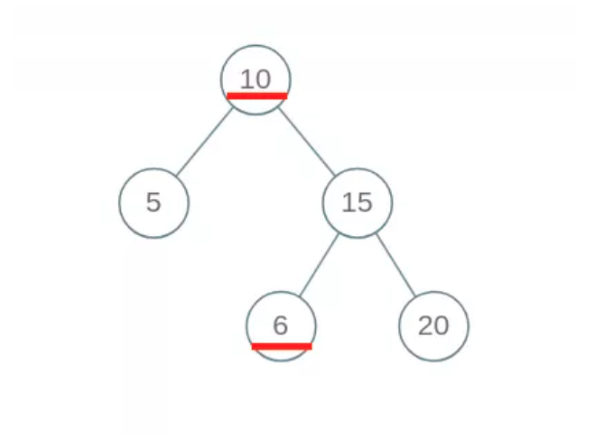</div>

- 出现问题的原因在于，对于每一个节点`root`，代码值检查了它的左右孩子节点是否符合左小右大的原则；但是根据 BST 的定义，`root`的整个左子树都要小于`root.val`，整个右子树都要大于`root.val`。

> 正确代码（前序遍历方式）
- 我们通过使用辅助函数，增加函数参数列表，在参数中携带额外信息，将这种约束传递给子树的所有节点，这也是二叉树算法的一个小技巧吧。
```cpp
boolean isValidBST(TreeNode root) {
    return isValidBST(root, null, null);
}

/* 限定以 root 为根的子树节点必须满足 max.val > root.val > min.val */
boolean isValidBST(TreeNode root, TreeNode min, TreeNode max) {
    // base case
    if (root == null) return true;

    /** 前序遍历位置*/
    // 若 root.val 不符合 max 和 min 的限制，说明不是合法 BST
    if (min != null && root.val <= min.val) return false;
    if (max != null && root.val >= max.val) return false;

    // 判断左右子树
    // 限定左子树的最大值是 root.val，右子树的最小值是 root.val
    return isValidBST(root.left, min, root) 
        && isValidBST(root.right, root, max);
}
```

> 正确代码（后序）
- 自底到上的正确性保证
```cpp
class Solution {
public:

    // 递归定义：如果是BST返回true。
    bool isValidBST(TreeNode *root) {
        if(root == nullptr) return true;
        // 处理左右子树
        auto lres = isValidBST(root->left);
        auto rres = isValidBST(root->right);
        if(!lres || !rres) return false;

        // 处理根
        /**后序处理*/
        int lmax, rmin;
        if(root->left != nullptr){
            lmax = getMax(root->left);
            if(lmax >= root->val) return false;
        }

        if(root->right != nullptr){
            rmin = getMin(root->right);
            if(rmin <= root->val) return false;
        }
        return true;
    }

    int getMax(TreeNode* root){
        auto tn = root;
        while(tn->right != nullptr){
            tn = tn->right;
        }
        return tn->val;
    }
    int getMin(TreeNode* root){
        auto tn = root;
        while(tn->left != nullptr){
            tn = tn->left;
        }
        return tn->val;
    }

};
```

## 遍历
- 遍历框架
```cpp
void BST(TreeNode root, int target) {
    if (root.val == target)
        // 找到目标，做点什么
    if (root.val < target) 
        BST(root.right, target);
    if (root.val > target)
        BST(root.left, target);
}
```

## 查询
```java
boolean isInBST(TreeNode root, int target) {
    if (root == null) return false;
    if (root.val == target)
        return true;
    if (root.val < target) 
        return isInBST(root.right, target);
    if (root.val > target)
        return isInBST(root.left, target);
    // root 该做的事做完了，顺带把框架也完成了，妙
}
```

## *插入
- 对数据结构的操作无非**遍历 + 访问**，**遍历就是「找」，访问就是「改」**。具体到这个问题，插入一个数，就是先找到插入位置，然后进行插入操作。
- 上一个问题，我们总结了 BST 中的遍历框架，就是「找」的问题。直接套框架，加上「改」的操作即可。**一旦涉及「改」，函数就要返回TreeNode类型，并且对递归调用的返回值进行接收**。

> 框架
```cpp
TreeNode insertIntoBST(TreeNode root, int val) {
    // 找到空位置插入新节点
    if (root == null) return new TreeNode(val);
    // if (root.val == val)
    //     BST 中一般不会插入已存在元素
    if (root.val < val) 
        root.right = insertIntoBST(root.right, val);
    if (root.val > val) 
        root.left = insertIntoBST(root.left, val);
    return root;
}
```

## 删除

- 这个问题稍微复杂，跟插入操作类似，**先「找」再「改」**，先把框架写出来再说


```cpp
TreeNode deleteNode(TreeNode root, int key) {
    if (root.val == key) {
        // 找到啦，进行删除
    } else if (root.val > key) {
        // 去左子树找
        root.left = deleteNode(root.left, key);
    } else if (root.val < key) {
        // 去右子树找
        root.right = deleteNode(root.right, key);
    }
    return root;
}
```
- 删除分三种情况
```cpp
class Solution {
public:
    TreeNode* deleteNode(TreeNode* root, int key) {
        if(root == nullptr) return nullptr;
        // 先查后访问
        if(root->val == key){
            // 删除
            // 情况1：叶子节点
            if(root->left == nullptr && root->right == nullptr){
                delete root;
                return nullptr;
            } else if(root->left == nullptr || root->right == nullptr){ // 情况2：只有一个孩子，孩子直接往上顶
                TreeNode* rtn;
                if(root->left != nullptr){
                    return root->left;
                } else if(root->right != nullptr){
                    return root->right;
                }
            } else { // 情况3：有左右孩子。找到左孩子中的最大，或者右孩子中的最小，往上顶
                // 找到做孩子中的最大，然后往上顶后，再找
                
                TreeNode* rtn;
                rtn = getMax(root->left);
                deleteNode(root, rtn->val);
                root->val = rtn->val;
                return root; // 重点：还是返回root，并不是删除，而是将某一值赋给他
            }
        } else if(root->val < key){
            root->right = deleteNode(root->right, key);
        } else {
            root->left = deleteNode(root->left, key);
        }
        return root;
    }
    TreeNode* getMax(TreeNode *root){
        auto rtn = root;
        while(rtn->right != nullptr) rtn = rtn->right;
        return new TreeNode(rtn->val);
    }
};
```

## *给定n个节点，求多少种不同的 BST 结构
> 96.不同的二叉搜索树（Easy）
<div align="center" style="zoom:0%">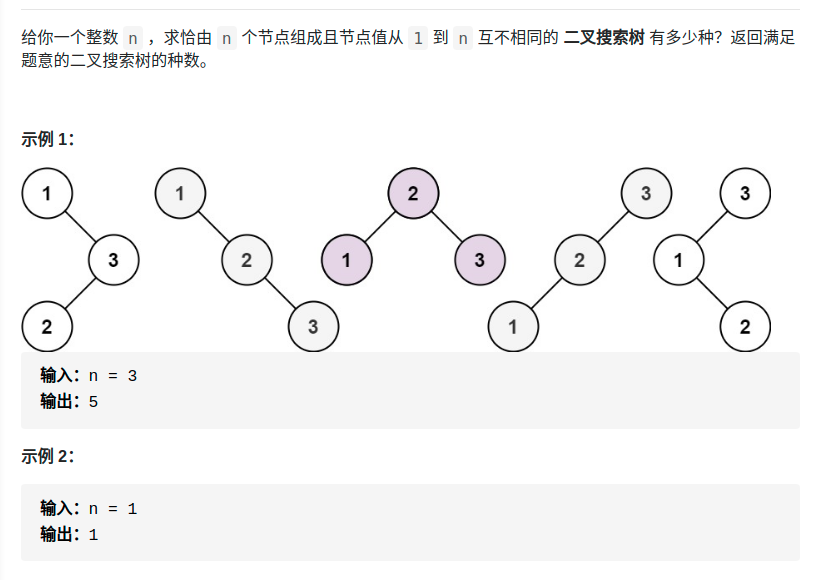</div>

- 只需要求多少种
- 思路：`int count(int lo, int hi)`
  - 选定根（for循环）
  - 遍历左右子树，返回BST结构的种数,记为x,y。
  - x*y为该选定根下的BST种数，为根选定另一个值（循环）

```cpp
class Solution {
public:
    int numTrees(int n) {
        return count(1,n);
    }

    int count(int lo, int hi){
        // 备忘录
        static vector<vector<int> > note(20, vector<int>(20, -1));
        // base case
        if(lo > hi){ return  1;}
        if(note[lo][hi] != -1) return note[lo][hi];
        int res = 0;
        for(int i = lo; i <= hi; ++i){
            auto left = count(lo,i-1);
            auto right = count(i+1, hi);
            res += left * right;
        }
        note[lo][hi] = res;
        return res;

    }
};
```


> 95.不同的二叉搜索树II（Medium）

- 需要记录结果
- 递归定义`vector<TreeNode*> generateTrees(int lo, int hi)`
  - 穷举 root 节点的所有可能。——for(i ->n)
  - 递归构造出左右子树的所有合法 BST。——调用generateTrees。
  - 给 root 节点穷举所有左右子树的组合。——for{for{拼接}}

<div align="center" style="zoom:0%">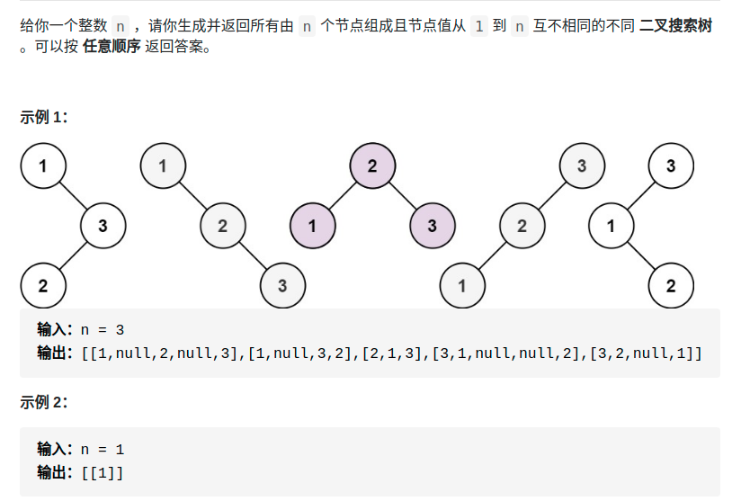</div>

```cpp
class Solution {
public:
    vector<TreeNode*> generateTrees(int n) {
        return generateTrees(1, n);
    }
    // 1.选定根 2.递归左右子树 3.和根合并
    vector<TreeNode*> generateTrees(int lo, int hi) {
        vector<TreeNode*> rtn;
        if( lo > hi) return rtn;
        for(int i = lo; i <= hi; ++i){
            // 选定根i

            // 递归左右
            auto leftRes = generateTrees(lo, i-1);
            auto rightRes = generateTrees(i+1, hi);

            // 合并
            if(leftRes.size() == 0 && rightRes.size() == 0){
                // 叶子节点情况
                auto root = new TreeNode(i);
                rtn.push_back(root);
            }
            else if(leftRes.size() == 0){
                for( auto rr : rightRes){
                    auto root = new TreeNode(i);
                    root->left = nullptr;
                    root->right = rr;
                    rtn.push_back(root);
                }
            } else if(rightRes.size() == 0){
                for( auto lr : leftRes){
                    auto root = new TreeNode(i);
                    root->left = lr;
                    root->right = nullptr;
                    rtn.push_back(root);
                }
            } else{
                for( auto lr : leftRes){
                    for( auto rr : rightRes){
                        auto root = new TreeNode(i);
                        root->left = lr;
                        root->right = rr;
                        rtn.push_back(root);
                    }
                }
            }
        }
        return rtn;
    }
};
```


## leetcode1373:二叉搜索子树的最大键值和
- 思路
  - 需要先判断该树是不是二叉搜索树，两种方法
    - 前序
    - 后序
  - 再计算这棵二叉搜索树的和
    - 先知道左右子树的和，再相加——后序
  - 综上，选择后序遍历
- https://leetcode-cn.com/problems/maximum-sum-bst-in-binary-tree/
```cpp
class Solution {
public:

    static constexpr int FALSE=111111;

    int res = 0;
    // 判断是不是BST ，FALSE表明不是
    int deal(TreeNode* root){
        if(root == nullptr) return 0;
        // 判断左右是不是BST
        auto lres = deal(root->left);
        auto rres = deal(root->right);
        if(lres == FALSE || rres == FALSE) return FALSE;

        // 判断自己是不是BST
        int lmax, rmin;
        if(root->left != nullptr){
            lmax = getMax(root->left);
            if(lmax >= root->val) return FALSE;
        }
        if(root->right != nullptr){
            rmin = getMin(root->right);
            if(rmin <= root->val) return FALSE;
        }

        res = res < root->val + lres + rres ? root->val + lres + rres :res;
        return root->val + lres + rres;
    }
    int getMax(TreeNode *root){
        auto tm = root;
        int rtn;
        while(tm!= nullptr){
            rtn = tm->val;
            tm = tm->right;
        }
        return rtn;
    }

    int getMin(TreeNode *root){
        auto tm = root;
        int rtn;
        while(tm!= nullptr){
            rtn = tm->val;
            tm = tm->left;
        }
        return rtn;
    }

};
```