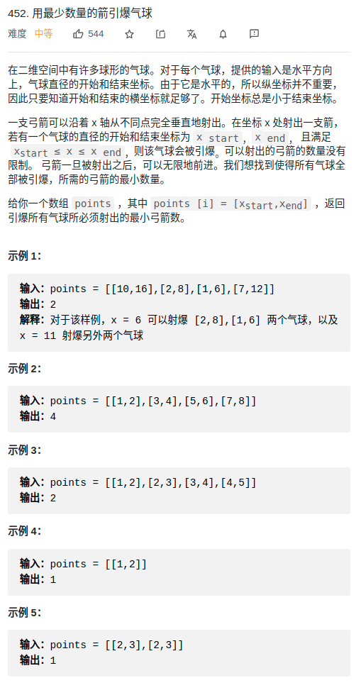

- [字符串](#字符串)
  - [split](#split)
  - [trim](#trim)
- [图](#图)
  - [拓扑排序](#拓扑排序)
  - [环](#环)
- [贪心](#贪心)
- [归并排序](#归并排序)
- [并查集](#并查集)
- [二分法](#二分法)
- [删除被覆盖的区间](#删除被覆盖的区间)
- [全排列](#全排列)
- [常用的位操作](#常用的位操作)
  - [字母转小写](#字母转小写)
  - [字母转大写](#字母转大写)
  - [字母大小写互换](#字母大小写互换)
  - [*消除数字 n 的二进制表示中的最后一个 1](#消除数字-n-的二进制表示中的最后一个-1)
  - [*判断两个数是否异号](#判断两个数是否异号)
# 字符串
## split
```cpp
vector<string> split(string s, string patt){
    vector<string> res;
    while(true){
        s = trim(s);
        auto next = s.find(patt);
        res.push_back(s.substr(0, next));
        if(next == s.npos)
            break;
        else
            s = s.substr(next+1);
    }
    return res;
}
```


## trim
```cpp
string trim(string &s){
    int lo = 0;
    int hi = s.size()-1;
    while(lo < s.size() && s[lo] == ' ' ) ++lo;
    while(hi >= 0 && s[hi] == ' ' ) --hi;
    return s.substr(lo, hi+1-lo);
}
```

# 图
## 拓扑排序
```cpp
class Solution {
public:
    int count = 0;
    vector<int> findOrder(int numCourses, vector<vector<int>>& prerequisites) {
        vector<int> res;
        // 1. 构造图
        // 2. 计算入度
        vector<vector<int>> graph = vector<vector<int>>(numCourses,vector<int>{});
        vector<int> indegree(numCourses,0);
        for(auto p : prerequisites){
            // from to
            graph[p[1]].push_back(p[0]);
            ++indegree[p[0]];
        }

        // 3. bfs
        // init
        queue<int> q;
        for(int i = 0; i < numCourses; ++i){
            if(indegree[i] == 0)
                q.push(i);
        }
        while(!q.empty()){
            int node = q.front();
            q.pop();
            res.push_back(node);
            ++count;
            for(auto n : graph[node]){
                --indegree[n];
                if(indegree[n] == 0)
                    q.push(n);
            }
        }

        // 4. res
        return count == numCourses ? res:vector<int>();
    }
};
```
## 环
```cpp
class Solution {
public:
    vector<bool> record;
    vector<bool> path;
    // 记录图中是否有环
    bool hasCycle = false;
    bool canFinish(int numCourses, vector<vector<int>>& prerequisites) {
        /// 1. 生成图
        vector<vector<int>> graph(numCourses, vector<int>{});
        for(auto &p : prerequisites){
            graph[p[1]].push_back(p[0]);
        }

        /// 2. 判断环，有环return false
        record = vector<bool>(numCourses, false);
        path = vector<bool>(numCourses, false);

        // 因为可能有多个连通量
        for(int i = 0; i < numCourses; ++i)
            traverse(graph, i);
        return !hasCycle;
    }


    // 遍历，如果遇到了当前路径记录的，返回true，表示有环
    void traverse(vector<vector<int> > &graph, int start){
        if(path[start]){
            hasCycle = true;
            return;
        }
        if(record[start] || hasCycle)
            return;

        record[start] = true;
        path[start] = true;
        for(auto n : graph[start]){
            traverse(graph, n);
        }
        path[start] = false;
        return;
    }
};

```
# 贪心
<div align="center" style="zoom:50%"></div>

- 分析：**求必须射出的最小弓箭数 <====> 互相不重叠的区间，最多有多少个**
  - 互补重叠的区间 必须用一枪，其他重叠部门都可以在其他重叠的区间顺便打了
  - 等同上面的解法
- 贪心：
  - 总目标：求得 互相不重叠的区间，最多有多少个
  - 贪心保证：按右边区间升序排序
  - 贪心体现：每次取右边区间最小的，只要和该区间有重合的，都可以一枪打爆


```cpp
 struct ops{
    bool operator()(vector<int> v1,vector<int> v2){
        return v1[1] < v2[1];
    }
};

class Solution {
public:
    int findMinArrowShots(vector<vector<int>>& points) {
        int i = 0;
        int res = 0; // 记录当前未相交集合有多少个，因为最少有多少个气球需要被单独射击 <=====> i = 0;
        // 找出最多的不相交区间，就是答案
        // 1.先排序
        sort(points.begin(),points.end(),ops());
        //
        while( i < points.size() ){
            int j = i+1;
            ++res;
            while( j < points.size() && points[j][0] <= points[i][1] ){
                ++j;
            }
            i = j;
        }
        return res;
    }
};
```

# 归并排序
```cpp
class Solution {
public:
    int lower_;
    int upper_;
    int res = 0;
    vector<int> temp;
    int countRangeSum(vector<int>& nums, int lower, int upper) {
        temp.resize(nums.size()+1);
        lower_ = lower;
        upper_ = upper;
        /// 前缀和数组，总大小是 nums.size()+1
        vector<int> pre(nums.size()+1);
        for(int i = 0; i < nums.size(); ++i){
            pre[i+1] = pre[i] + nums[i];
        }

        sort(pre, 0 , pre.size());
        return res;
    }

    void sort(vector<int>& pre, int lo, int hi){
        if(lo+1 >= hi) return;
        int mid = (lo + hi) /2;
        sort(pre, lo, mid);
        sort(pre, mid, hi);
        mergeAndDeal(pre, lo, mid, mid , hi);
    }

    void mergeAndDeal(vector<int>& pre, int lo1, int hi1, int lo2, int hi2){
        int start = lo2;
        int end = lo2;

        /// 注意分析[0,0]这种情况是怎么一回事，得益于前缀和多出的那一个元素
        /// 额外私料，求取结果
        for(int i = lo1; i < hi1; ++i){
            /// 注意这里是 < 号
            while(start < hi2 && pre[start]-pre[i] < lower_)
                ++start;
            /// 注意这里是 <= 号，要让空间尽可能大
            while(end < hi2 && pre[end] - pre[i] <= upper_)
                ++end;
//            cout << i << " " <<  start << " " << end << endl;
            res += end-start;
        }

        /// 归并套路
        start = lo1;
        int pos = lo1;
        while(lo1 < hi1 || lo2 < hi2){
            if(lo1 >= hi1){
                temp[pos++] = pre[lo2++];
            }else if(lo2 >= hi2){
                temp[pos++] = pre[lo1++];
            }else if(pre[lo1] < pre[lo2]){
                temp[pos++] = pre[lo1++];
            }else{
                temp[pos++] = pre[lo2++];
            }
        }
        pos = start;
        while(pos != hi2){
            pre[pos] = temp[pos];
            pos++;
        }


    }
};
```

# 并查集
```cpp
class UF{
public:
    int count; // 连通分量数量
    // 记录x节点指向的父亲（相当于指针）
    vector<int> parent;
    // 记录x节点为根的树的大小
    vector<int> size;
public:
    UF(int n){
        count = n;
        parent.resize(n);
        size.resize(n);
        for(int i = 0; i < n; ++i){
            parent[i] = i;
            size[i] = 1;
        }
    }

    void Union(int p, int q){
        int proot = Find(p);
        int qroot = Find(q);
        if(proot == qroot)
            return;
        // 将小树接到大树那
        if(size[proot] > size[qroot]){
            parent[qroot] = proot;
            size[proot] += size[qroot];
        }else{
            parent[proot] = qroot;
            size[qroot] += size[proot];
        }
        --count;
    }
    bool IsConnect(int p, int q){
        int proot = Find(p);
        int qroot = Find(q);
        if(proot == qroot)
            return true;
        return false;
    }
    int Find(int x){
        // 压缩树，顺便减少该节点这一路的高度
        while(parent[x] != x){
            size[parent[x]] -= size[x];
            size[parent[parent[x]]] += size[x];
            parent[x] = parent[parent[x]];
            x = parent[x];
        }
        return x;
    }
    int Count(){
        return count;
    };

};
```

# 二分法

```cpp
class Solution {
public:
    // 1. 定义f: 在猴子吃香蕉的速度为k的前提下，保卫至少需要离开H小时，k 越大 f(piles,k) 越小.
    int f(vector<int>& piles, int k){
        int res = 0;
        for(auto a : piles){
            res = res + (a+k-1) / k;
        }
        return res;
    }
    int minEatingSpeed(vector<int>& piles, int h) {
        // 2. 定义边界
        int lo = 1;
        int hi = 0;
        for(auto p : piles){
            hi = hi < p ? p : hi;
        }
        // 3. 考虑二分写法; [lo, hi]，break时 lo+1 == hi
        while(lo <= hi){
            int mid = (lo+hi)/2;
            int hm = f(piles, mid);
            if(hm == h){
                // 需要求得f(piles, mid) == h，最小的k，所以靠左
                hi = mid;
            }else if(hm < h){
                // 如何让hm变大
                hi = mid;
            }else{
                // 如何让hm变小
                lo = mid+1;
            }
        }
        return hi;
    }
};

```
# 删除被覆盖的区间
```cpp
bool cmp(const vector<int>& a, const vector<int>&b){
    if(a[0] == b[0]){
        return b[1] < a[1];
    }
    return a[0] < b[0];
}

class Solution {
public:
    int removeCoveredIntervals(vector<vector<int>>& intervals) {
        sort(intervals.begin(), intervals.end(), cmp);
        int left = intervals[0][0];
        int right = intervals[0][1];
        int res = 0;

        for(int i = 1; i < intervals.size(); ++i){
            // 情况1.覆盖
            if(intervals[i][1] <= right){
                ++res;
            }else if( intervals[i][0] <=right  && intervals[i][1] > right){
                // 情况2.相交，合并
                left = intervals[i][0];
                right = intervals[i][1];
            }else{
                // 情况3.不相交
                left = intervals[i][0];
                right = intervals[i][1];
            }
        }
        return intervals.size()-res;
    }
};
```
# 全排列
```cpp
class Solution {
public:
    vector<vector<int>> permute(vector<int>& nums) {
        int pre,next;
        vector<vector<int>> res;
        sort(nums.begin(), nums.end());
        res.push_back(vector<int>(nums.begin(), nums.end()));


        while(true){
            next = nums.size()-1;
            pre = next-1;
            // 1.从右到左，找到递增的
            while(pre >= 0){
                if(nums[pre] < nums[next]){
                    break;
                }
                --pre;
                --next;
            }
            if(pre < 0)// 一直没找到的情况
                break;

            // 2.找到比该数大最小且最靠右边的一个。eg:0122的情况找最后一个2
            int i = nums.size()-1;
            while(i >= next){
                if(nums[i] > nums[pre])
                    break;
                --i;
            }
            if(i < next)
                break;

            swap(nums[pre], nums[i]);
            // 3.倒叙
            int start,end;
            start = next;
            end = nums.size()-1;
            while(start < end){
                swap(nums[start], nums[end]);
                ++start;
                --end;
            }

            res.push_back(vector<int>(nums.begin(),nums.end()));
        }
        return res;
    }
};
```

# 常用的位操作
- https://labuladong.gitbook.io/algo/mu-lu-ye-3/mu-lu-ye-2/chang-yong-de-wei-cao-zuo

## 字母转小写
```cpp
('a' | ' ') = 'a'
('A' | ' ') = 'a'
```
## 字母转大写
```cpp
('b' & '_') = 'B'
('B' & '_') = 'B'
```
## 字母大小写互换
```cpp
('d' ^ ' ') = 'D'
('D' ^ ' ') = 'd'
```


## *消除数字 n 的二进制表示中的最后一个 1
- `n&(n-1)`

## *判断两个数是否异号
```cpp
int x = -1, y = 2;
bool f = ((x ^ y) < 0); // true

int x = 3, y = 2;
bool f = ((x ^ y) < 0); // false
```