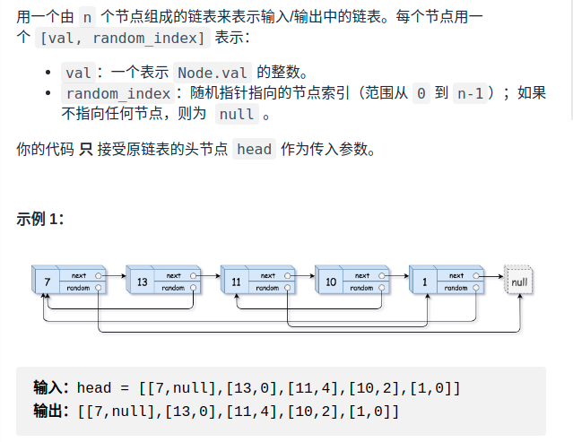

> 难度：中等
- 思路：用一个map存src和copy之间的映射
  - 第一轮先构造拷贝和赋值next
  - 第二轮循环利用map来赋值random

> 题目
- https://leetcode-cn.com/problems/copy-list-with-random-pointer/

<div align="center" style="zoom:80%"></div>

> 代码

```
```