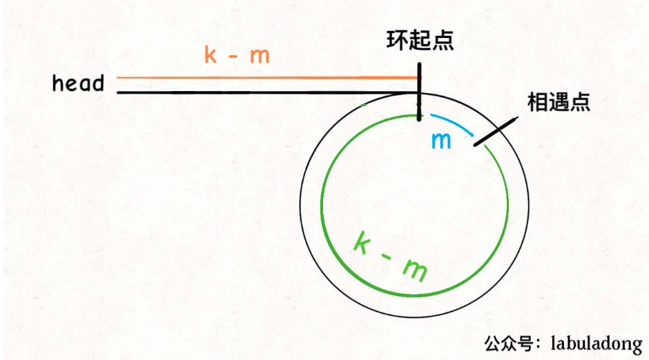

> 难度：中等
- 思路：双指针，快慢指针
  - https://labuladong.gitbook.io/algo/mu-lu-ye-1/mu-lu-ye-3/shuang-zhi-zhen-ji-qiao


- **fast 一定比 slow 多走了 k 步，这多走的 k 步其实就是 fast 指针在环里转圈圈，所以 k 的值就是环长度的「整数倍」**
- 设相遇点距环的起点的距离为 m，那么环的起点距头结点 head 的距离为 k - m，也就是说如果从 head 前进 k - m 步就能到达环起点。
- 巧的是，如果从相遇点继续前进 k - m 步，也恰好到达环起点。你甭管 fast 在环里到底转了几圈，反正走 k 步可以到相遇点，那走 k - m 步一定就是走到环起点了：

<div align="center" style="zoom:60%"></div>

- 只要我们把快慢指针中的任一个重新指向 head，然后两个指针同速前进，k - m 步后就会相遇，相遇之处就是环的起点了
> 题目
- 判断是不是有环，返回环的起点
> 代码

```cpp
class Solution {
public:
    ListNode *detectCycle(ListNode *head) {
        if(head == nullptr) return nullptr;
        ListNode* fast, *slow;
        fast = head;
        slow = head;
        while(fast->next != nullptr && fast->next->next != nullptr){
            fast = fast->next->next;
            slow = slow->next;
            if(fast == slow)
                break;
        }

        slow = head;
        while(fast->next != nullptr && fast->next->next != nullptr){
            if(slow == fast) return slow;
            else{
                slow = slow->next;
                fast = fast->next;
            }
        }
        return nullptr;
    }
};
```

